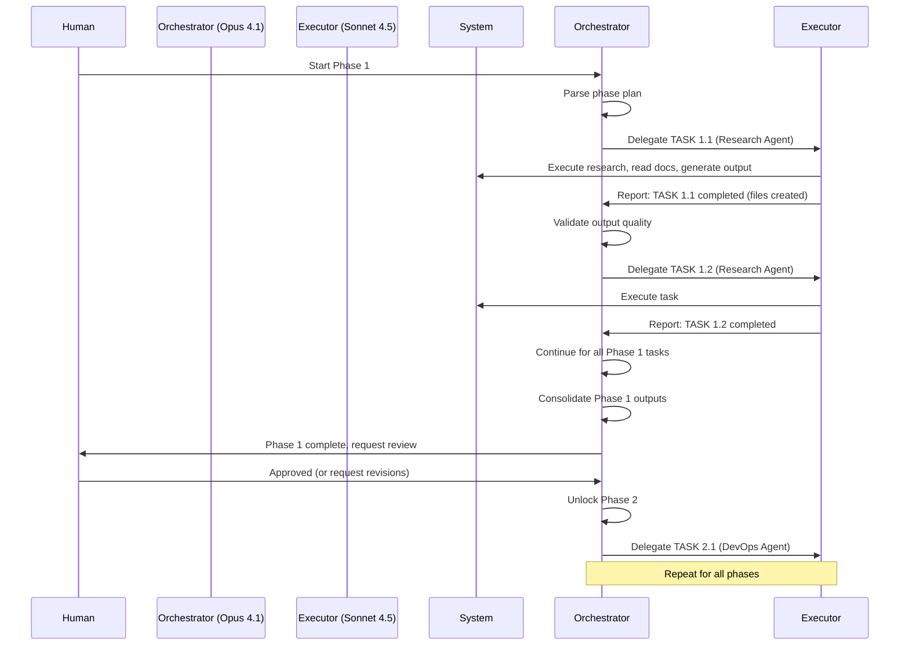

# KAMIYO $KAMIYO Token Launch & Invisible Harmony Multi-Agent Development Plan

**Version:** 1.0
**Created:** October 27, 2025
**Timeline:** 16-20 weeks (April-May 2026 launch)
**Working Schedule:** 3 days/week
**Architecture:** Opus 4.1 (Orchestration) + Sonnet 4.5 (Execution)

---

## Executive Summary

This plan expands the existing Kamiyo x402 payment hub with:
1. **$KAMIYO SPL Token-2022** on Solana (1B supply, 2% transfer fees, staking, airdrops)
2. **Invisible Harmony Features** (auto-escrows, cross-chain bridges, AI verifiers, analytics)
3. **Multi-Agent Architecture** for autonomous development and testing

**Why Solana?** Low fees (~$0.00025/tx), high throughput (65k TPS), ideal for agent micropayments.

**Current State Analysis:**
- ✅ Existing x402 payment system with Solana, Base, Ethereum support
- ✅ Payment verification infrastructure (api/x402/payment_verifier.py)
- ✅ Database schema for payments (002_x402_payments.sql)
- ✅ FastAPI backend with authentication, rate limiting, CSRF
- ✅ Next.js frontend with Stripe integration
- ⚠️ Need: Token-2022 integration, staking program, alignment features

---

## Multi-Agent Architecture

### Agent Roles

#### 1. **Orchestrator Agent (Opus 4.1)**
**Role:** Strategic planning, task delegation, quality assurance, production readiness validation

**Responsibilities:**
- Break down phases into atomic tasks
- Assign tasks to executor agents
- Review and integrate executor outputs
- Validate production readiness checkpoints
- Handle cross-phase dependencies
- Escalate blockers for human review

**Invocation Pattern:**
```bash
# In Claude Code Console
User: "Start Phase 1 of KAMIYO token development"
Orchestrator: [Reads plan, delegates tasks, monitors progress]
```

#### 2. **Executor Agents (Sonnet 4.5)**
**Role:** Focused task execution, code generation, testing, documentation

**Specialized Executors:**
- **Research Agent:** Gather requirements, analyze libraries, create specs
- **Solana Program Agent:** Rust/Anchor development for token and staking
- **Backend Integration Agent:** FastAPI integration, payment verifier extensions
- **Frontend Agent:** React/Next.js UI for staking and analytics
- **Testing Agent:** Comprehensive test suite creation and execution
- **DevOps Agent:** Deployment pipelines, monitoring, security

**Invocation Pattern:**
```bash
# Orchestrator delegates to Executor
Orchestrator: "Delegate to Solana Program Agent: Create Token-2022 mint with 2% transfer fees"
Executor: [Generates code, tests, reports back]
```

### Communication Protocol

**Task Handoff Format:**
```json
{
  "task_id": "PHASE_1_TASK_1",
  "agent_type": "research_agent",
  "objective": "Research SPL Token-2022 transfer fee configuration",
  "context": {
    "existing_solana_integration": "api/x402/payment_verifier.py",
    "current_payment_flow": "See lines 150-200"
  },
  "deliverables": [
    "Technical specification document",
    "Code examples for transfer fees",
    "UML diagram (text-based)"
  ],
  "success_criteria": [
    "Document includes fee basis points configuration",
    "Examples are tested on devnet",
    "Diagram shows mint->transfer->fee collection flow"
  ],
  "estimated_time": "3 hours"
}
```

**Status Report Format:**
```json
{
  "task_id": "PHASE_1_TASK_1",
  "status": "completed" | "in_progress" | "blocked",
  "output": {
    "files_created": ["docs/token2022_spec.md"],
    "code_snippets": ["examples/transfer_fee.rs"],
    "test_results": "All 5 tests passed",
    "blockers": []
  },
  "next_dependencies": ["PHASE_2_TASK_4"],
  "production_ready": true
}
```

---

## Phase Structure with Production Readiness Checkpoints

Each phase follows this pattern:
1. **Planning** (Orchestrator)
2. **Execution** (Executors)
3. **Integration Testing** (Testing Agent)
4. **Production Readiness Review** (Orchestrator + Human)
5. **Go/No-Go Decision** (Must pass before next phase)

---

## PHASE 1: RESEARCH AND PLANNING (Weeks 1-2)

### Objectives
- Comprehensive Token-2022 and Anchor framework research
- Design tokenomics and vesting contracts
- Map alignment features to Solana architecture
- Create detailed technical specifications

### Tasks

#### TASK 1.1: Token-2022 Research
**Agent:** Research Agent (Sonnet 4.5)
**Priority:** Critical
**Estimated Time:** 4 hours

**Prompt for Executor:**
```
TASK: Research SPL Token-2022 Implementation for $KAMIYO

CONTEXT:
- You are working on the Kamiyo project (crypto exploit aggregator with x402 payment hub)
- Current Solana integration exists at api/x402/payment_verifier.py (lines 150-250)
- We support USDC SPL Token (EPjFWdd5AufqSSqeM2qN1xzybapC8G4wEGGkZwyTDt1v)
- Tech stack: Python 3.11+, FastAPI, solana-py v0.30.2, web3.py v6.11.3
- Target: Create $KAMIYO token with Token-2022 standard

OBJECTIVE:
Research and document SPL Token-2022 implementation focusing on:
1. Transfer fee extensions (2% total: 1% treasury, 1% LP)
2. Transfer fee configuration and collection mechanisms
3. Compatibility with existing Solana RPC patterns
4. Differences from SPL Token (legacy)

DELIVERABLES:
1. Technical specification document (Markdown)
   - Token-2022 architecture overview
   - Transfer fee configuration (basis points, max fee)
   - Fee collection and withdrawal mechanisms
   - Mint authority and freeze authority implications

2. Code examples (Rust/Anchor)
   - Initialize mint with transfer fee extension
   - Configure fee basis points (200 = 2%)
   - Transfer with automatic fee deduction
   - Withdraw collected fees to treasury/LP

3. Integration patterns (Python)
   - How to detect Token-2022 transactions in payment_verifier.py
   - Parsing transfer-hook and transfer-fee instructions
   - Calculating net amount after fees

4. UML sequence diagram (text-based, Mermaid syntax)
   - Show: Mint creation -> User transfer -> Fee collection -> Withdrawal

RESOURCES:
- Solana Token-2022 docs: https://spl.solana.com/token-2022
- Anchor framework: https://book.anchor-lang.com/
- Existing payment_verifier.py for patterns

SUCCESS CRITERIA:
- Document is comprehensive (10-15 pages equivalent)
- Code examples compile and run on Solana devnet
- Integration patterns compatible with existing api/x402/payment_verifier.py
- UML diagram clearly shows fee flow
- All questions answered: How to set fees? How to split 1%/1%? How to integrate with Python backend?

OUTPUT FORMAT:
Create file: /Users/dennisgoslar/Projekter/kamiyo/docs/phase1/token2022_research.md

Include sections:
1. Executive Summary
2. Token-2022 Architecture
3. Transfer Fee Configuration
4. Code Examples (Rust + Python)
5. Integration Checklist
6. FAQ
7. References
```

#### TASK 1.2: Staking and Airdrop Research
**Agent:** Research Agent (Sonnet 4.5)
**Priority:** Critical
**Estimated Time:** 4 hours

**Prompt for Executor:**
```
TASK: Research Staking and Airdrop Mechanisms for $KAMIYO

CONTEXT:
- $KAMIYO token will have staking (10-25% APY from platform fees)
- Need airdrop mechanism for 10% of supply (100M tokens)
- Must integrate with existing x402 payment flow
- Stakers should get perks (priority negotiations, fee discounts)

OBJECTIVE:
Research and design staking/airdrop systems using Anchor framework

DELIVERABLES:
1. Staking specification document
   - Staking pool architecture (PDA design)
   - APY calculation from fee revenue
   - Reward distribution mechanisms
   - Stake/unstake flows with cooldown periods
   - Integration with alignment features (priority perks)

2. Airdrop specification document
   - Batch transfer mechanisms for 100M tokens
   - Points system design (off-chain tracking)
   - Sybil resistance strategies
   - Claim mechanisms (merkle tree vs direct transfer)

3. Code templates (Anchor/Rust)
   - Staking pool initialization
   - Stake/unstake instructions
   - Reward claim instruction
   - Batch airdrop instruction

4. Integration plan with x402
   - How stakers get fee discounts (check stake balance in middleware)
   - How to allocate platform fees to staking pool
   - Database schema extensions for points system

SUCCESS CRITERIA:
- Staking design supports 10-25% APY with sustainable fee allocation
- Airdrop mechanism can handle 100M tokens efficiently
- Points system prevents gaming
- Integration with existing api/x402/middleware.py is clear

OUTPUT FORMAT:
Create files:
- /Users/dennisgoslar/Projekter/kamiyo/docs/phase1/staking_specification.md
- /Users/dennisgoslar/Projekter/kamiyo/docs/phase1/airdrop_specification.md
- /Users/dennisgoslar/Projekter/kamiyo/docs/phase1/x402_staking_integration.md
```

#### TASK 1.3: Alignment Features Architecture
**Agent:** Research Agent (Sonnet 4.5)
**Priority:** High
**Estimated Time:** 5 hours

**Prompt for Executor:**
```
TASK: Design "Invisible Harmony" Alignment Features Architecture

CONTEXT:
- Kamiyo x402 enables agent-to-agent payments
- Need features for automated conflict resolution between AI agents
- Must integrate with existing FastAPI backend and Next.js frontend

OBJECTIVE:
Design architecture for 5 alignment features:
1. Auto-Negotiation Escrows (multi-agent terms, release on verification)
2. Cross-Chain Harmony Bridges (Wormhole integration for Base/Solana)
3. Silent Verifier Oracles (semantic matching, quality checks, auto-refunds)
4. Balance Whisperers (off-chain shadow balances, on-chain settlement)
5. Harmony Analytics Dashboard (React UI for insights)

DELIVERABLES:
1. Feature architecture document (Markdown)
   - High-level design for each feature
   - Data models and database schema extensions
   - API endpoint specifications
   - Frontend component breakdown

2. Integration with $KAMIYO token
   - How stakers get priority in negotiations
   - Token-gated features (e.g., advanced analytics)
   - Fee mechanisms for cross-chain bridges

3. Technical feasibility analysis
   - Which features can be MVP vs future phases
   - External dependencies (Wormhole SDK, Pyth oracles)
   - Performance considerations

4. UML diagrams (text-based)
   - Auto-escrow flow: Agent A -> Negotiation -> Escrow -> Verification -> Release
   - Cross-chain bridge flow: Solana payment -> Wormhole -> Base settlement
   - Verifier oracle flow: Agent output -> Semantic check -> Refund/Approve

SUCCESS CRITERIA:
- All 5 features have clear technical designs
- Integration points with existing codebase identified
- Database schema extensions defined (SQL)
- API endpoints follow existing api/main.py patterns
- Frontend designs compatible with existing components/

OUTPUT FORMAT:
Create files:
- /Users/dennisgoslar/Projekter/kamiyo/docs/phase1/alignment_features_architecture.md
- /Users/dennisgoslar/Projekter/kamiyo/docs/phase1/database_schema_extensions.sql
- /Users/dennisgoslar/Projekter/kamiyo/docs/phase1/api_endpoint_specs.yaml
```

#### TASK 1.4: Tokenomics Design
**Agent:** Research Agent (Sonnet 4.5)
**Priority:** Critical
**Estimated Time:** 3 hours

**Prompt for Executor:**
```
TASK: Design $KAMIYO Tokenomics and Vesting Schedule

CONTEXT:
- Total supply: 1,000,000,000 $KAMIYO (1B)
- Team allocation: 10% (100M) vested over 24 months
- Airdrop allocation: 10% (100M) for community
- Transfer fees: 2% (1% treasury, 1% LP)
- Staking rewards: 10-25% APY from platform fees

OBJECTIVE:
Create comprehensive tokenomics model with vesting contracts

DELIVERABLES:
1. Tokenomics whitepaper (8-12 pages)
   - Supply distribution breakdown
   - Vesting schedules (team, advisors, treasury)
   - Fee allocation mechanisms (2% split)
   - Staking economics (APY sustainability)
   - Airdrop criteria and timeline
   - Utility matrix (fee discounts, governance, priority access)

2. Vesting contract specification
   - Linear vesting for team (24 months)
   - Cliff periods (6 months recommended)
   - Token release schedule (monthly/quarterly)
   - Implementation approach (SPL Token-2022 or custom Anchor program)

3. Economic simulations
   - Revenue projections (platform fees -> staking pool)
   - APY sustainability calculations
   - Treasury runway analysis
   - LP incentive modeling

4. Points system for hype
   - "Align-to-earn" mechanics
   - Point accrual (X engagements, early usage, referrals)
   - Redemption tiers for airdrop
   - Sybil resistance measures

SUCCESS CRITERIA:
- Tokenomics are balanced and sustainable
- Vesting protects against dumps
- APY is attractive but not inflationary
- Points system drives engagement

OUTPUT FORMAT:
Create files:
- /Users/dennisgoslar/Projekter/kamiyo/docs/phase1/KAMIYO_TOKENOMICS_WHITEPAPER.md
- /Users/dennisgoslar/Projekter/kamiyo/docs/phase1/vesting_contract_spec.md
- /Users/dennisgoslar/Projekter/kamiyo/docs/phase1/points_system_design.md
```

### Phase 1 Integration Task

#### TASK 1.5: Phase 1 Consolidation
**Agent:** Orchestrator (Opus 4.1)
**Priority:** Critical
**Estimated Time:** 2 hours

**Prompt for Orchestrator:**
```
TASK: Review and Consolidate Phase 1 Research Outputs

CONTEXT:
- Research Agent has completed 4 tasks (1.1, 1.2, 1.3, 1.4)
- Outputs are in docs/phase1/ directory

OBJECTIVE:
Review all research outputs for:
1. Consistency across documents
2. Technical feasibility
3. Integration coherence
4. Completeness of specifications

ACTIONS:
1. Read all 8 files in docs/phase1/
2. Cross-reference designs (e.g., staking in tokenomics matches staking_specification.md)
3. Identify gaps or conflicts
4. Create consolidated implementation roadmap
5. Flag any blockers for human review

DELIVERABLES:
- /Users/dennisgoslar/Projekter/kamiyo/docs/phase1/PHASE_1_CONSOLIDATION_REPORT.md
- List of approved tasks for Phase 2
- List of blockers requiring human decision

SUCCESS CRITERIA:
- All research is internally consistent
- No major technical red flags
- Clear path to Phase 2 execution
```

### Phase 1 Production Readiness Checkpoint

**Checkpoint ID:** PR-PHASE-1
**Owner:** Orchestrator + Human
**Duration:** 1-2 hours

**Criteria:**
- [ ] All research documents are complete and reviewed
- [ ] Token-2022 integration is technically feasible
- [ ] Staking economics are sustainable (APY model validated)
- [ ] Alignment features are scoped appropriately (MVP vs future)
- [ ] Tokenomics are balanced (no red flags)
- [ ] Vesting contract design is secure
- [ ] Database schema extensions are compatible with existing schema
- [ ] API endpoint specs follow existing patterns
- [ ] No major blockers or dependencies

**Validation Steps:**
1. Orchestrator generates PHASE_1_CONSOLIDATION_REPORT.md
2. Human reviews report and research docs
3. Human approves or requests revisions
4. If approved, unlock Phase 2

**Go/No-Go Decision:**
- **GO:** Proceed to Phase 2 (Solana program development)
- **NO-GO:** Address gaps/blockers, iterate on research

---

## PHASE 2: SOLANA PROGRAM DEVELOPMENT (Weeks 3-7)

### Objectives
- Create SPL Token-2022 mint with transfer fees
- Develop Anchor program for staking
- Implement airdrop mechanisms
- Build vesting contract for team allocation
- Deploy and test on Solana devnet

### Prerequisites
- Phase 1 completed and approved
- Solana development environment set up (Rust, Anchor CLI, Solana CLI)
- Devnet wallet funded with SOL

### Tasks

#### TASK 2.1: Development Environment Setup
**Agent:** DevOps Agent (Sonnet 4.5)
**Priority:** Critical (Blocking)
**Estimated Time:** 2 hours

**Prompt for Executor:**
```
TASK: Set Up Solana Development Environment

CONTEXT:
- Kamiyo project at /Users/dennisgoslar/Projekter/kamiyo
- macOS environment (Darwin 19.6.0)
- Need Rust, Anchor, Solana CLI for Token-2022 development

OBJECTIVE:
Install and configure Solana development tools

DELIVERABLES:
1. Installation script (scripts/setup_solana_dev.sh)
   - Install Rust (rustup)
   - Install Solana CLI (latest stable)
   - Install Anchor CLI (v0.30.x recommended)
   - Install SPL Token CLI

2. Project structure
   - Create /Users/dennisgoslar/Projekter/kamiyo/solana-programs/
   - Initialize Anchor workspace: anchor init kamiyo-token
   - Set up devnet configuration

3. Devnet wallet setup
   - Generate new keypair (or use existing)
   - Airdrop devnet SOL (via solana airdrop)
   - Save wallet path to .env

4. Verification script (scripts/verify_solana_setup.sh)
   - Check Rust version
   - Check Solana CLI connection to devnet
   - Check Anchor version
   - Test wallet balance

SUCCESS CRITERIA:
- All tools installed and on PATH
- Anchor workspace initialized successfully
- Devnet wallet has >= 2 SOL
- Verification script passes all checks

OUTPUT FORMAT:
Create files:
- /Users/dennisgoslar/Projekter/kamiyo/scripts/setup_solana_dev.sh
- /Users/dennisgoslar/Projekter/kamiyo/scripts/verify_solana_setup.sh
- /Users/dennisgoslar/Projekter/kamiyo/solana-programs/Anchor.toml
- Update .env.example with SOLANA_DEVNET_KEYPAIR_PATH

TESTING:
Run: bash scripts/verify_solana_setup.sh
Expected: All checks pass, no errors
```

#### TASK 2.2: Token-2022 Mint Creation
**Agent:** Solana Program Agent (Sonnet 4.5)
**Priority:** Critical
**Estimated Time:** 4 hours

**Prompt for Executor:**
```
TASK: Create $KAMIYO Token with SPL Token-2022 and Transfer Fees

CONTEXT:
- Based on research from docs/phase1/token2022_research.md
- Token name: KAMIYO
- Symbol: KAMIYO
- Decimals: 9 (Solana standard)
- Total supply: 1,000,000,000 (1B)
- Transfer fee: 2% (200 basis points)
- Fee split: 1% treasury, 1% LP (handled in distribution logic)

OBJECTIVE:
Create Token-2022 mint with transfer fee extension using Solana CLI and Anchor

DELIVERABLES:
1. Mint creation script (scripts/create_kamiyo_mint.sh)
   - Create mint with transfer fee extension
   - Set fee configuration: 200 basis points (2%), max fee 10% of transfer
   - Set mint authority and freeze authority
   - Initialize token accounts for treasury and LP fee collection

2. Anchor program for fee management (solana-programs/programs/kamiyo-token/src/lib.rs)
   - Instruction to update fee configuration (admin only)
   - Instruction to withdraw fees to treasury
   - Instruction to withdraw fees to LP
   - Fee splitter logic (50/50 between treasury and LP)

3. Token metadata
   - On-chain metadata using Metaplex (name, symbol, URI)
   - Off-chain metadata JSON (logo, description, links)

4. Initial minting script (scripts/mint_initial_supply.sh)
   - Mint 1B tokens to distribution wallet
   - Disable further minting (set mint authority to null or multisig)

SUCCESS CRITERIA:
- Mint created successfully on devnet
- Transfer fee is active (test transfer deducts 2%)
- Fees accumulate in designated accounts
- Metadata is visible on Solana explorers
- Total supply is exactly 1B tokens

OUTPUT FORMAT:
Create files:
- /Users/dennisgoslar/Projekter/kamiyo/scripts/create_kamiyo_mint.sh
- /Users/dennisgoslar/Projekter/kamiyo/scripts/mint_initial_supply.sh
- /Users/dennisgoslar/Projekter/kamiyo/solana-programs/programs/kamiyo-token/src/lib.rs
- /Users/dennisgoslar/Projekter/kamiyo/solana-programs/programs/kamiyo-token/src/instructions/mod.rs
- /Users/dennisgoslar/Projekter/kamiyo/solana-programs/programs/kamiyo-token/Cargo.toml
- /Users/dennisgoslar/Projekter/kamiyo/metadata/kamiyo_token_metadata.json

TESTING:
1. Run scripts/create_kamiyo_mint.sh
2. Verify mint on Solana Explorer (devnet)
3. Test transfer with fee deduction
4. Check fee accounts have balances
```

#### TASK 2.3: Staking Program Development
**Agent:** Solana Program Agent (Sonnet 4.5)
**Priority:** Critical
**Estimated Time:** 8 hours

**Prompt for Executor:**
```
TASK: Build Anchor Staking Program for $KAMIYO

CONTEXT:
- Based on specs from docs/phase1/staking_specification.md
- Target APY: 10-25% from platform fees
- Users stake $KAMIYO, earn rewards from x402 payment fees
- Stakers get perks (fee discounts, priority)

OBJECTIVE:
Create comprehensive staking program with pools, rewards, and claims

DELIVERABLES:
1. Anchor program structure (solana-programs/programs/kamiyo-staking/src/)
   - lib.rs: Program entry point
   - state.rs: Account structs (StakingPool, UserStake)
   - instructions/: Initialize, Stake, Unstake, ClaimRewards, FundPool
   - errors.rs: Custom error types

2. Core instructions:
   a) initialize_pool: Create staking pool PDA
      - Pool authority (admin)
      - Reward mint ($KAMIYO)
      - Total staked amount
      - Reward rate (APY)

   b) stake: User stakes $KAMIYO tokens
      - Transfer tokens to pool vault
      - Create/update user stake account (PDA)
      - Record stake amount and timestamp

   c) unstake: User withdraws staked tokens
      - Check cooldown period (e.g., 7 days)
      - Transfer tokens from vault to user
      - Automatically claim pending rewards

   d) claim_rewards: User claims earned rewards
      - Calculate rewards based on time staked and APY
      - Transfer rewards from pool to user
      - Update last_claimed timestamp

   e) fund_pool: Admin adds rewards to pool
      - Transfer $KAMIYO to reward pool
      - Used to fund APY payments from platform fees

3. PDA architecture:
   - Staking pool: ["staking_pool", mint.key()]
   - User stake: ["user_stake", pool.key(), user.key()]
   - Vault: ["vault", pool.key()]

4. Security features:
   - Cooldown period for unstaking (prevent gaming)
   - Admin-only pool management
   - Reentrancy guards
   - Overflow checks

SUCCESS CRITERIA:
- All instructions compile and deploy to devnet
- Users can stake, wait, and claim rewards
- APY calculations are accurate (test with 10% APY)
- Cooldown periods are enforced
- No security vulnerabilities (manual review)

OUTPUT FORMAT:
Create files:
- /Users/dennisgoslar/Projekter/kamiyo/solana-programs/programs/kamiyo-staking/src/lib.rs
- /Users/dennisgoslar/Projekter/kamiyo/solana-programs/programs/kamiyo-staking/src/state.rs
- /Users/dennisgoslar/Projekter/kamiyo/solana-programs/programs/kamiyo-staking/src/instructions/*.rs
- /Users/dennisgoslar/Projekter/kamiyo/solana-programs/programs/kamiyo-staking/src/errors.rs
- /Users/dennisgoslar/Projekter/kamiyo/solana-programs/programs/kamiyo-staking/Cargo.toml

TESTING:
- Unit tests for reward calculations
- Integration tests for full stake/claim flow
- Edge case tests (zero stake, expired rewards, etc.)
```

#### TASK 2.4: Airdrop Module Development
**Agent:** Solana Program Agent (Sonnet 4.5)
**Priority:** High
**Estimated Time:** 4 hours

**Prompt for Executor:**
```
TASK: Build Airdrop System for $KAMIYO Distribution

CONTEXT:
- 10% of supply (100M tokens) reserved for community airdrops
- Points system for eligibility (off-chain tracking)
- Need batch distribution for efficiency
- Merkle tree or direct transfer approach

OBJECTIVE:
Create airdrop mechanism with batch transfers and claim system

DELIVERABLES:
1. Anchor program for airdrops (solana-programs/programs/kamiyo-airdrop/src/)
   - Merkle-based or allowlist-based claim system
   - Admin can upload allowlist/merkle root
   - Users can claim allocated tokens (once per address)

2. Batch distribution script (scripts/distribute_airdrop.sh)
   - Node.js script using @solana/web3.js
   - Read allowlist from JSON (address, amount)
   - Batch transfers in groups of 20-50 (avoid tx size limits)
   - Track successes and failures
   - Idempotent (can retry failed transfers)

3. Claim UI integration (if needed)
   - API endpoint for checking eligibility
   - Frontend component for claiming (future task, just spec here)

4. Points system tracking (off-chain)
   - Database schema extension for user points
   - API endpoints for point accrual
   - Point redemption logic
   - SQL migration: database/migrations/003_airdrop_points.sql

SUCCESS CRITERIA:
- Airdrop program allows claiming with proof
- Batch script can distribute to 1000+ addresses efficiently
- Each address can only claim once
- Points system prevents gaming (require unique wallet per claim)

OUTPUT FORMAT:
Create files:
- /Users/dennisgoslar/Projekter/kamiyo/solana-programs/programs/kamiyo-airdrop/src/lib.rs
- /Users/dennisgoslar/Projekter/kamiyo/scripts/distribute_airdrop.sh
- /Users/dennisgoslar/Projekter/kamiyo/scripts/airdrop_allowlist_example.json
- /Users/dennisgoslar/Projekter/kamiyo/database/migrations/003_airdrop_points.sql
- /Users/dennisgoslar/Projekter/kamiyo/api/airdrop/routes.py (API endpoints)

TESTING:
- Test claim with valid merkle proof
- Test duplicate claim rejection
- Test batch distribution with 100 addresses
```

#### TASK 2.5: Vesting Contract Development
**Agent:** Solana Program Agent (Sonnet 4.5)
**Priority:** High
**Estimated Time:** 5 hours

**Prompt for Executor:**
```
TASK: Build Vesting Contract for Team Allocation

CONTEXT:
- 10% of supply (100M tokens) for team
- 24-month linear vesting with 6-month cliff
- Multiple beneficiaries (team members)
- Need transparency and trustlessness

OBJECTIVE:
Create vesting program for locked token distribution

DELIVERABLES:
1. Anchor program for vesting (solana-programs/programs/kamiyo-vesting/src/)
   - Initialize vesting schedule for beneficiary
   - Release tokens based on elapsed time
   - Emergency revoke (admin only, before cliff)

2. Core instructions:
   a) create_vesting_schedule:
      - Beneficiary pubkey
      - Total amount
      - Start timestamp
      - Cliff duration (6 months)
      - Vesting duration (24 months)
      - Transfer tokens to vesting vault

   b) release_tokens:
      - Calculate vested amount: (elapsed / total_duration) * total_amount
      - Subtract already released
      - Transfer available tokens to beneficiary

   c) revoke_vesting (admin only):
      - Only before cliff
      - Return unvested tokens to treasury

3. PDA design:
   - Vesting schedule: ["vesting", beneficiary.key(), schedule_id]
   - Vault: ["vesting_vault", schedule.key()]

4. Initialization script (scripts/setup_team_vesting.sh)
   - Create vesting schedules for 5 team members
   - Allocate 20M tokens each
   - Set start date to token launch date

SUCCESS CRITERIA:
- Tokens are locked until cliff
- After cliff, tokens release linearly over 24 months
- Beneficiaries can claim at any time (they get proportional amount)
- Admin can revoke only before cliff
- Math is accurate (no rounding errors)

OUTPUT FORMAT:
Create files:
- /Users/dennisgoslar/Projekter/kamiyo/solana-programs/programs/kamiyo-vesting/src/lib.rs
- /Users/dennisgoslar/Projekter/kamiyo/solana-programs/programs/kamiyo-vesting/src/state.rs
- /Users/dennisgoslar/Projekter/kamiyo/solana-programs/programs/kamiyo-vesting/src/instructions/*.rs
- /Users/dennisgoslar/Projekter/kamiyo/scripts/setup_team_vesting.sh

TESTING:
- Unit tests for vesting calculation
- Test cliff enforcement (cannot release before 6 months)
- Test linear release after cliff
- Test full vesting after 24 months
```

#### TASK 2.6: Program Testing and Optimization
**Agent:** Testing Agent (Sonnet 4.5)
**Priority:** Critical
**Estimated Time:** 6 hours

**Prompt for Executor:**
```
TASK: Comprehensive Testing for Solana Programs

CONTEXT:
- 4 Anchor programs developed: kamiyo-token, kamiyo-staking, kamiyo-airdrop, kamiyo-vesting
- Need unit tests, integration tests, and edge case coverage
- Target: 80%+ code coverage

OBJECTIVE:
Create comprehensive test suites for all programs

DELIVERABLES:
1. Unit tests for each program (tests/*.ts in Anchor workspace)
   - kamiyo-token: Fee configuration, fee withdrawal, admin controls
   - kamiyo-staking: Reward calculations, stake/unstake flows, cooldowns
   - kamiyo-airdrop: Claim validation, merkle proofs, duplicate prevention
   - kamiyo-vesting: Vesting math, cliff enforcement, release logic

2. Integration tests (tests/integration/)
   - Full token lifecycle: Mint -> Transfer -> Fee collection
   - Full staking lifecycle: Stake -> Wait -> Claim rewards
   - Airdrop distribution: Upload list -> Users claim
   - Vesting lifecycle: Create schedule -> Wait -> Release

3. Edge case tests:
   - Zero amounts
   - Overflow/underflow scenarios
   - Unauthorized access attempts
   - Concurrent operations (staking while claiming)
   - Expired/invalid states

4. Performance benchmarks:
   - Transaction costs for each operation
   - Batch operation limits (airdrop)
   - Compute unit usage

5. Security tests:
   - Reentrancy attempts
   - Authority bypass attempts
   - Integer overflow attempts
   - PDA collision tests

SUCCESS CRITERIA:
- All tests pass on devnet
- Code coverage >= 80%
- No security vulnerabilities found
- Performance is acceptable (< 200k compute units per instruction)

OUTPUT FORMAT:
Create files:
- /Users/dennisgoslar/Projekter/kamiyo/solana-programs/tests/kamiyo-token.ts
- /Users/dennisgoslar/Projekter/kamiyo/solana-programs/tests/kamiyo-staking.ts
- /Users/dennisgoslar/Projekter/kamiyo/solana-programs/tests/kamiyo-airdrop.ts
- /Users/dennisgoslar/Projekter/kamiyo/solana-programs/tests/kamiyo-vesting.ts
- /Users/dennisgoslar/Projekter/kamiyo/solana-programs/tests/integration/full-lifecycle.ts
- /Users/dennisgoslar/Projekter/kamiyo/docs/phase2/TEST_RESULTS.md

TESTING:
Run: anchor test --provider.cluster devnet
Expected: All tests pass, no errors
```

### Phase 2 Integration Task

#### TASK 2.7: Phase 2 Consolidation and Devnet Deployment
**Agent:** Orchestrator (Opus 4.1)
**Priority:** Critical
**Estimated Time:** 3 hours

**Prompt for Orchestrator:**
```
TASK: Review Phase 2 Outputs and Deploy to Devnet

CONTEXT:
- All Solana programs are developed and tested
- Need consolidated deployment and verification

OBJECTIVE:
1. Review all Phase 2 deliverables
2. Deploy all programs to devnet
3. Verify deployments
4. Create deployment documentation

ACTIONS:
1. Review test results from TASK 2.6
2. Deploy programs in order:
   a) kamiyo-token (base layer)
   b) kamiyo-staking (depends on token)
   c) kamiyo-airdrop (depends on token)
   d) kamiyo-vesting (depends on token)
3. Run post-deployment verification:
   - Check program IDs
   - Test each instruction once
   - Verify PDAs are accessible
4. Save program IDs to .env and config files
5. Generate deployment report

DELIVERABLES:
- /Users/dennisgoslar/Projekter/kamiyo/docs/phase2/DEVNET_DEPLOYMENT_REPORT.md
- Updated .env with program IDs
- Deployment scripts for future use

SUCCESS CRITERIA:
- All programs deployed successfully
- Program IDs saved and accessible
- Post-deployment tests pass
- Documentation is clear for Phase 3
```

### Phase 2 Production Readiness Checkpoint

**Checkpoint ID:** PR-PHASE-2
**Owner:** Orchestrator + Human
**Duration:** 2-3 hours

**Criteria:**
- [ ] All Anchor programs compile without errors
- [ ] Unit tests pass with >= 80% coverage
- [ ] Integration tests pass on devnet
- [ ] Security review completed (no critical issues)
- [ ] Performance benchmarks are acceptable
- [ ] Token mint created and verified on devnet
- [ ] Transfer fees work correctly (2% deduction)
- [ ] Staking program functions (stake/unstake/claim)
- [ ] Airdrop mechanism tested with batch distribution
- [ ] Vesting contract enforces cliff and linear release
- [ ] All programs deployed to devnet
- [ ] Program IDs documented

**Validation Steps:**
1. Testing Agent generates TEST_RESULTS.md
2. Orchestrator generates DEVNET_DEPLOYMENT_REPORT.md
3. Human reviews both reports
4. Human performs spot checks on devnet (test stake, check fees)
5. Human approves or requests fixes

**Go/No-Go Decision:**
- **GO:** Proceed to Phase 3 (Backend integration)
- **NO-GO:** Fix bugs, improve tests, re-deploy

---

## PHASE 3: HUB EXPANSION - ALIGNMENT FEATURES (Weeks 8-12)

### Objectives
- Integrate $KAMIYO token into x402 payment flow
- Build auto-negotiation escrows
- Implement cross-chain bridges (Wormhole)
- Create silent verifier oracles
- Develop balance whisperer system
- Build harmony analytics dashboard

### Prerequisites
- Phase 2 completed (programs on devnet)
- Program IDs saved in .env

### Tasks

#### TASK 3.1: Token Integration in Payment Verifier
**Agent:** Backend Integration Agent (Sonnet 4.5)
**Priority:** Critical (Blocking)
**Estimated Time:** 5 hours

**Prompt for Executor:**
```
TASK: Integrate $KAMIYO Token-2022 into Payment Verification System

CONTEXT:
- Existing payment verifier at api/x402/payment_verifier.py
- Currently supports USDC on Solana (SPL Token legacy)
- Need to add $KAMIYO Token-2022 support
- Token-2022 has different instruction format (transfer-hook, fee extensions)

OBJECTIVE:
Extend payment_verifier.py to detect and verify $KAMIYO payments

DELIVERABLES:
1. Updated payment_verifier.py:
   - Add _verify_solana_token2022_payment() method
   - Parse Token-2022 specific instructions (transferChecked with fees)
   - Calculate net amount after 2% fee deduction
   - Support both USDC (legacy) and KAMIYO (Token-2022) in parallel

2. Configuration updates:
   - Add KAMIYO_MINT_ADDRESS to api/x402/config.py
   - Add KAMIYO_PRICING (e.g., 1 KAMIYO = 10 requests)
   - Support multi-token pricing

3. Database schema extension:
   - Add token_mint column to x402_payments table
   - Add token_standard column ('spl' | 'spl-token-2022')
   - Migration: database/migrations/004_kamiyo_token_support.sql

4. API endpoint updates:
   - Update /x402/supported-chains to include KAMIYO token
   - Update /x402/verify-payment to handle token_mint parameter
   - Update /x402/pricing to show KAMIYO pricing

SUCCESS CRITERIA:
- Payment verifier detects KAMIYO transfers
- Fee deduction is accounted for (2% less than raw transfer amount)
- Both USDC and KAMIYO payments work in parallel
- API endpoints return correct pricing for KAMIYO
- Database stores token mint and standard

OUTPUT FORMAT:
Update files:
- /Users/dennisgoslar/Projekter/kamiyo/api/x402/payment_verifier.py
- /Users/dennisgoslar/Projekter/kamiyo/api/x402/config.py
- /Users/dennisgoslar/Projekter/kamiyo/database/migrations/004_kamiyo_token_support.sql
- /Users/dennisgoslar/Projekter/kamiyo/api/x402/routes.py

TESTING:
- Unit tests for Token-2022 parsing
- Integration test: Make real devnet payment with KAMIYO, verify in system
- Test: /x402/verify-payment with KAMIYO tx_hash
```

#### TASK 3.2: Staking Integration and Perks
**Agent:** Backend Integration Agent (Sonnet 4.5)
**Priority:** High
**Estimated Time:** 6 hours

**Prompt for Executor:**
```
TASK: Integrate Staking Program with x402 for Fee Discounts and Perks

CONTEXT:
- Staking program on devnet (from Phase 2)
- Users who stake KAMIYO should get benefits:
  1. Fee discounts (10-30% based on stake amount)
  2. Priority in auto-negotiations
  3. Access to premium analytics
- Need to query user stake balance from FastAPI backend

OBJECTIVE:
Create staking integration module and apply perks in middleware

DELIVERABLES:
1. Staking client module (api/x402/staking_client.py):
   - Class: KamiyoStakingClient
   - Method: get_user_stake(wallet_address) -> StakeInfo
   - Queries Solana program for user stake PDA
   - Returns stake amount, last claim time, pending rewards
   - Caches results (5-minute TTL) to avoid RPC spam

2. Perks calculation (api/x402/perks.py):
   - Function: calculate_fee_discount(stake_amount) -> percentage
     - 0-1000 KAMIYO: 0% discount
     - 1000-10000 KAMIYO: 10% discount
     - 10000-100000 KAMIYO: 20% discount
     - 100000+ KAMIYO: 30% discount
   - Function: has_priority_access(stake_amount) -> bool
     - True if stake >= 10000 KAMIYO
   - Function: has_premium_analytics(stake_amount) -> bool
     - True if stake >= 50000 KAMIYO

3. Middleware integration (api/x402/middleware.py):
   - Before processing payment, check if user has staked KAMIYO
   - If staked, apply discount to required payment amount
   - Example: If 10% discount, user pays 0.09 USDC instead of 0.10
   - Log discount applied for analytics

4. API endpoints (api/x402/routes.py):
   - GET /x402/staking/info/{wallet_address}: Get stake info and perks
   - POST /x402/staking/link-wallet: Link wallet to user account

5. Database extension:
   - Add linked_wallet column to users table
   - Migration: database/migrations/005_staking_integration.sql

SUCCESS CRITERIA:
- Staking client successfully queries Solana program
- Fee discounts are correctly applied based on stake tiers
- Middleware checks stake before processing payment
- API returns accurate stake info and perks
- Premium features are gated by stake amount

OUTPUT FORMAT:
Create files:
- /Users/dennisgoslar/Projekter/kamiyo/api/x402/staking_client.py
- /Users/dennisgoslar/Projekter/kamiyo/api/x402/perks.py
Update files:
- /Users/dennisgoslar/Projekter/kamiyo/api/x402/middleware.py
- /Users/dennisgoslar/Projekter/kamiyo/api/x402/routes.py
- /Users/dennisgoslar/Projekter/kamiyo/database/migrations/005_staking_integration.sql

TESTING:
- Test with non-staker: No discount
- Test with 5000 KAMIYO staked: 10% discount applied
- Test with 50000 KAMIYO staked: 20% discount + premium access
- Test cache performance (same wallet queried twice, second is cached)
```

#### TASK 3.3: Auto-Negotiation Escrows
**Agent:** Backend Integration Agent (Sonnet 4.5)
**Priority:** High
**Estimated Time:** 8 hours

**Prompt for Executor:**
```
TASK: Build Auto-Negotiation Escrow System for Agent-to-Agent Agreements

CONTEXT:
- Based on docs/phase1/alignment_features_architecture.md
- AI agents need to negotiate terms (e.g., "Deliver exploit analysis, payment released on verification")
- Escrow holds payment until both parties agree or verifier approves

OBJECTIVE:
Create escrow system with negotiation, locking, and release mechanisms

DELIVERABLES:
1. Solana escrow program (solana-programs/programs/kamiyo-escrow/src/):
   - Instructions:
     a) create_escrow: Agent A locks KAMIYO/USDC for Agent B
        - Terms: Delivery description, deadline, verifier (optional)
     b) accept_terms: Agent B accepts terms
     c) release_payment: Agent A or verifier approves, funds transfer to B
     d) dispute: Either party raises dispute, admin/verifier decides
     e) refund: If deadline passed or terms not met, refund to A

2. Backend API (api/escrow/routes.py):
   - POST /escrow/create: Create escrow (returns escrow ID)
   - POST /escrow/{id}/accept: Agent accepts terms
   - POST /escrow/{id}/release: Release payment
   - POST /escrow/{id}/dispute: Raise dispute
   - GET /escrow/{id}: Get escrow details
   - GET /escrow/user/{wallet}: List user's escrows

3. Negotiation logic (api/escrow/negotiation.py):
   - Auto-negotiation for common terms (price, delivery time)
   - AI-based semantic matching (using OpenAI API or local LLM)
   - Suggest compromises if initial terms don't match

4. Database schema (database/migrations/006_escrow_system.sql):
   - Table: escrows
     - id, on_chain_escrow_address, party_a, party_b, amount, token_mint
     - terms_description, deadline, status ('pending', 'active', 'disputed', 'completed', 'refunded')
     - created_at, accepted_at, resolved_at
   - Table: escrow_negotiations
     - id, escrow_id, message, sender ('party_a' | 'party_b' | 'system')
     - timestamp

5. Priority for stakers:
   - Users with high stake get priority in escrow queue
   - Faster dispute resolution for stakers

SUCCESS CRITERIA:
- Escrows can be created, accepted, and released on-chain
- API provides easy interface for agents
- Negotiation suggests reasonable compromises
- Stakers get visible perks (priority badge, faster processing)
- Edge cases handled (expired escrows, disputes)

OUTPUT FORMAT:
Create files:
- /Users/dennisgoslar/Projekter/kamiyo/solana-programs/programs/kamiyo-escrow/src/lib.rs
- /Users/dennisgoslar/Projekter/kamiyo/api/escrow/routes.py
- /Users/dennisgoslar/Projekter/kamiyo/api/escrow/negotiation.py
- /Users/dennisgoslar/Projekter/kamiyo/database/migrations/006_escrow_system.sql

TESTING:
- Create escrow, accept, release (happy path)
- Create escrow, deadline expires, refund
- Create escrow, dispute, admin resolves
- Test priority for stakers (high stake escrows processed first)
```

#### TASK 3.4: Cross-Chain Harmony Bridges
**Agent:** Backend Integration Agent (Sonnet 4.5)
**Priority:** Medium
**Estimated Time:** 8 hours

**Prompt for Executor:**
```
TASK: Implement Cross-Chain Bridge Integration (Solana <-> Base/Ethereum)

CONTEXT:
- Kamiyo supports payments on Base, Ethereum, and Solana
- Agents may want to pay on one chain, receive on another
- Use Wormhole for cross-chain messaging

OBJECTIVE:
Integrate Wormhole bridge for cross-chain payment settlements

DELIVERABLES:
1. Wormhole integration (api/bridges/wormhole_client.py):
   - Transfer tokens from Solana to Base/Ethereum
   - Transfer tokens from Base/Ethereum to Solana
   - Monitor bridge transactions
   - Handle bridge fees

2. Bridge API (api/bridges/routes.py):
   - POST /bridges/initiate: Start cross-chain transfer
   - GET /bridges/{id}/status: Check bridge status
   - GET /bridges/supported-routes: List supported chain pairs

3. X402 integration:
   - Allow payments on one chain to unlock API access
   - Bridge happens in background
   - User pays 0.10 USDC on Base, system bridges to Solana if needed

4. Database schema (database/migrations/007_bridges.sql):
   - Table: bridge_transactions
     - id, source_chain, dest_chain, source_tx_hash, dest_tx_hash
     - amount, token, status ('initiated', 'confirmed', 'failed')
     - user_wallet, created_at, completed_at

5. Fee handling:
   - Bridge fees (Wormhole charges ~$0.01) are added to payment
   - User sees total cost upfront

SUCCESS CRITERIA:
- Wormhole integration works for Solana <-> Base
- Bridge transactions are tracked in database
- Users can pay on preferred chain
- Bridge fees are transparent
- Failures are handled gracefully (refunds)

OUTPUT FORMAT:
Create files:
- /Users/dennisgoslar/Projekter/kamiyo/api/bridges/wormhole_client.py
- /Users/dennisgoslar/Projekter/kamiyo/api/bridges/routes.py
- /Users/dennisgoslar/Projekter/kamiyo/database/migrations/007_bridges.sql

TESTING:
- Test Solana -> Base bridge (devnet)
- Test Base -> Solana bridge (devnet)
- Test failed bridge (handle Wormhole errors)
- Test fee calculation accuracy

NOTE: Wormhole SDK: https://github.com/wormhole-foundation/wormhole
```

#### TASK 3.5: Silent Verifier Oracles
**Agent:** Backend Integration Agent (Sonnet 4.5)
**Priority:** Medium
**Estimated Time:** 6 hours

**Prompt for Executor:**
```
TASK: Build AI Verifier Oracle System for Quality Checks and Auto-Refunds

CONTEXT:
- In escrow scenarios, need automated verification of deliverables
- Example: Agent A pays for "exploit analysis", Agent B delivers text
- Verifier checks if output matches requested quality
- Auto-refund if quality is poor

OBJECTIVE:
Create oracle system with semantic matching and quality scoring

DELIVERABLES:
1. Verifier module (api/verifiers/oracle.py):
   - Function: verify_output(expected, actual, criteria) -> VerificationResult
     - Uses AI (OpenAI GPT-4 or local LLM) to compare outputs
     - Checks: Completeness, accuracy, relevance, format
     - Returns: score (0-100), passed (bool), feedback (string)
   - Integration with Pyth oracles for price feeds (if needed)

2. API endpoints (api/verifiers/routes.py):
   - POST /verifiers/verify: Submit output for verification
   - GET /verifiers/{id}: Get verification result
   - POST /verifiers/request-refund: Request refund based on verification

3. Escrow integration:
   - If verifier score < 70, auto-refund to party A
   - If score >= 70, release payment to party B
   - Verifier feedback is shared with both parties

4. Database schema (database/migrations/008_verifiers.sql):
   - Table: verifications
     - id, escrow_id, expected_output, actual_output
     - score, passed, feedback, verified_at

5. Verifier reputation:
   - Track verifier accuracy (compared to human overrides)
   - Allow users to contest verifications

SUCCESS CRITERIA:
- Verifier accurately assesses output quality (spot check 10 samples)
- Low-quality outputs trigger refunds
- High-quality outputs trigger releases
- Verifier feedback is helpful
- Integration with escrow system is seamless

OUTPUT FORMAT:
Create files:
- /Users/dennisgoslar/Projekter/kamiyo/api/verifiers/oracle.py
- /Users/dennisgoslar/Projekter/kamiyo/api/verifiers/routes.py
- /Users/dennisgoslar/Projekter/kamiyo/database/migrations/008_verifiers.sql

TESTING:
- Test with clear match (expected: "exploit analysis", actual: detailed analysis) -> PASS
- Test with poor match (expected: "analysis", actual: "hello") -> FAIL
- Test refund trigger (score < 70)
- Test release trigger (score >= 70)

NOTE: For AI, use OpenAI API or Anthropic Claude API (you have access to both)
```

#### TASK 3.6: Balance Whisperer System
**Agent:** Backend Integration Agent (Sonnet 4.5)
**Priority:** Low
**Estimated Time:** 4 hours

**Prompt for Executor:**
```
TASK: Build Balance Whisperer for Off-Chain Shadow Balances

CONTEXT:
- Off-chain commitments settle on-chain periodically
- Reduces transaction costs for high-frequency agent interactions
- Example: Agent makes 100 micro-payments, only 1 on-chain settlement

OBJECTIVE:
Create shadow balance system with periodic on-chain settlements

DELIVERABLES:
1. Shadow balance module (api/whisperer/shadow_balances.py):
   - In-memory or Redis-backed balance tracking
   - Function: adjust_balance(user, amount, reason)
   - Function: get_balance(user) -> shadow_balance
   - Function: settle_balances() -> on-chain transactions

2. API endpoints (api/whisperer/routes.py):
   - GET /whisperer/balance/{wallet}: Get shadow balance
   - POST /whisperer/commit: Commit off-chain transaction
   - POST /whisperer/settle: Trigger on-chain settlement (admin/auto)

3. Settlement logic:
   - Auto-settle when shadow balance delta > threshold (e.g., 10 USDC)
   - Auto-settle on user request
   - Batched settlements (multiple users in one transaction if possible)

4. Database schema (database/migrations/009_shadow_balances.sql):
   - Table: shadow_transactions
     - id, user_wallet, amount, token, reason, settled (bool)
     - created_at, settled_at, on_chain_tx_hash

SUCCESS CRITERIA:
- Shadow balances update instantly off-chain
- Settlements happen automatically when thresholds met
- On-chain transactions are batched for efficiency
- No discrepancies between shadow and on-chain balances

OUTPUT FORMAT:
Create files:
- /Users/dennisgoslar/Projekter/kamiyo/api/whisperer/shadow_balances.py
- /Users/dennisgoslar/Projekter/kamiyo/api/whisperer/routes.py
- /Users/dennisgoslar/Projekter/kamiyo/database/migrations/009_shadow_balances.sql

TESTING:
- Make 100 off-chain commits, check balance updates
- Trigger settlement, verify on-chain transaction
- Test threshold auto-settlement
```

### Phase 3 Integration Task

#### TASK 3.7: Phase 3 Consolidation and Integration Testing
**Agent:** Orchestrator (Opus 4.1)
**Priority:** Critical
**Estimated Time:** 4 hours

**Prompt for Orchestrator:**
```
TASK: Consolidate Phase 3 Alignment Features and Test Full Integration

CONTEXT:
- All alignment features developed: Token integration, staking perks, escrows, bridges, verifiers, whisperers
- Need end-to-end testing to ensure all systems work together

OBJECTIVE:
1. Review all Phase 3 deliverables
2. Run integration tests
3. Verify feature interactions
4. Document user flows

ACTIONS:
1. Review code from all 6 tasks (3.1-3.6)
2. Run integration test suite:
   - User stakes KAMIYO -> Gets discount on payment
   - User creates escrow -> Verifier checks output -> Payment released/refunded
   - User pays on Base -> Bridge to Solana -> API access granted
   - User makes 50 micro-payments via whisperer -> Auto-settlement
3. Check database migrations (004-009) for conflicts
4. Generate integration report with flows and examples

DELIVERABLES:
- /Users/dennisgoslar/Projekter/kamiyo/docs/phase3/INTEGRATION_TEST_REPORT.md
- /Users/dennisgoslar/Projekter/kamiyo/docs/phase3/USER_FLOWS.md

SUCCESS CRITERIA:
- All integration tests pass
- Features interact correctly (e.g., staking discount applies in escrow)
- Database migrations run without errors
- User flows are documented clearly
```

### Phase 3 Production Readiness Checkpoint

**Checkpoint ID:** PR-PHASE-3
**Owner:** Orchestrator + Human
**Duration:** 2-3 hours

**Criteria:**
- [ ] KAMIYO token integrated into payment verifier
- [ ] Staking perks (discounts, priority) work correctly
- [ ] Escrow system creates, releases, and refunds properly
- [ ] Cross-chain bridges successfully transfer tokens
- [ ] Verifier oracle assesses quality accurately
- [ ] Balance whisperer settles off-chain commitments
- [ ] All database migrations applied cleanly
- [ ] Integration tests pass (staking + escrow, bridge + payment)
- [ ] API endpoints return correct data
- [ ] Performance is acceptable (< 500ms for most operations)

**Validation Steps:**
1. Orchestrator generates INTEGRATION_TEST_REPORT.md
2. Human reviews report and tests key flows
3. Human performs end-to-end test:
   - Stake KAMIYO -> Create escrow -> Verify output -> Claim rewards
4. Human checks database for data integrity
5. Human approves or requests fixes

**Go/No-Go Decision:**
- **GO:** Proceed to Phase 4 (Token utilities and hype)
- **NO-GO:** Fix integration issues, improve performance

---

## PHASE 4: TOKEN INTEGRATION AND HYPE MECHANICS (Weeks 13-15)

### Objectives
- Finalize $KAMIYO utility integrations
- Build points system for "align-to-earn"
- Create airdrop distribution campaigns
- Add governance voting mechanisms
- Enhance frontend for token interactions

### Prerequisites
- Phase 3 completed (alignment features integrated)
- Staking and token programs on devnet

### Tasks

#### TASK 4.1: Token Utilities in Hub
**Agent:** Backend Integration Agent (Sonnet 4.5)
**Priority:** High
**Estimated Time:** 5 hours

**Prompt for Executor:**
```
TASK: Finalize $KAMIYO Token Utilities Across Platform

CONTEXT:
- KAMIYO token should have clear utility beyond speculation
- Utilities: Fee discounts (done), governance votes, priority access, exclusive features

OBJECTIVE:
Implement additional token utilities and consolidate existing ones

DELIVERABLES:
1. Governance module (api/governance/routes.py):
   - POST /governance/proposals: Create proposal (requires min KAMIYO stake)
   - GET /governance/proposals: List active proposals
   - POST /governance/vote: Vote on proposal (weight = KAMIYO staked)
   - GET /governance/results/{id}: Get proposal results
   - Database: database/migrations/010_governance.sql

2. Priority access system (api/x402/priority.py):
   - High stakers get priority in:
     - API request queue (lower latency)
     - Escrow dispute resolution
     - New feature beta access
   - Implement priority queue with stake-weighted scoring

3. Exclusive features (api/premium/routes.py):
   - Token-gated endpoints (require min KAMIYO balance):
     - /premium/advanced-analytics
     - /premium/custom-webhooks
     - /premium/ai-insights
   - Middleware to check token balance before access

4. Consolidated utility dashboard:
   - Show user all benefits based on KAMIYO holdings
   - Calculate potential savings from discounts
   - Show governance power (voting weight)

SUCCESS CRITERIA:
- Governance proposals can be created and voted on
- Vote weight matches staked KAMIYO
- Priority access is visible (high stakers get faster responses)
- Token-gated features require correct balance
- Utility dashboard shows accurate information

OUTPUT FORMAT:
Create files:
- /Users/dennisgoslar/Projekter/kamiyo/api/governance/routes.py
- /Users/dennisgoslar/Projekter/kamiyo/api/x402/priority.py
- /Users/dennisgoslar/Projekter/kamiyo/api/premium/routes.py
- /Users/dennisgoslar/Projekter/kamiyo/database/migrations/010_governance.sql

TESTING:
- Create governance proposal with 10k KAMIYO staked
- Vote on proposal (vote weight matches stake)
- Test priority queue (high staker gets priority)
- Access premium feature with sufficient KAMIYO balance
```

#### TASK 4.2: Points System for Hype ("Align-to-Earn")
**Agent:** Backend Integration Agent (Sonnet 4.5)
**Priority:** Critical
**Estimated Time:** 6 hours

**Prompt for Executor:**
```
TASK: Build "Align-to-Earn" Points System for Airdrop Eligibility

CONTEXT:
- 10% of KAMIYO supply (100M tokens) reserved for airdrops
- Need gamified points system to drive engagement
- Points earned through: X engagements, platform usage, referrals, early adoption

OBJECTIVE:
Create comprehensive points system with redemption for KAMIYO tokens

DELIVERABLES:
1. Points accrual module (api/points/engine.py):
   - Award points for actions:
     - X engagement (retweet, like, comment): 10-50 points
     - Platform usage (API calls, escrows): 1-5 points per action
     - Referrals (invite user who uses platform): 100 points
     - Early adoption (signup before launch): 500 points
   - Sybil resistance: Require wallet signature, limit per IP

2. Points API (api/points/routes.py):
   - GET /points/balance/{wallet}: Get user point balance
   - POST /points/claim-action: Claim points for action (requires proof)
   - GET /points/leaderboard: Top point earners
   - POST /points/redeem: Redeem points for airdrop allocation

3. X integration (api/social/x_integration.py):
   - OAuth to verify X account
   - Check engagement on KAMIYO tweets (use X API)
   - Award points automatically when user interacts

4. Redemption tiers:
   - 1000 points = 100 KAMIYO (10:1 ratio)
   - 10000 points = 1200 KAMIYO (bonus for bulk)
   - 50000 points = 7500 KAMIYO (bonus for whales)
   - Cap per wallet: 10000 KAMIYO (to distribute widely)

5. Database schema (database/migrations/011_points_system.sql):
   - Table: user_points
     - wallet, total_points, redeemed_points, actions_completed
   - Table: point_actions
     - id, wallet, action_type, points_awarded, proof, timestamp

SUCCESS CRITERIA:
- Users can earn points through defined actions
- Points balance updates in real-time
- Sybil resistance prevents gaming (require unique wallet + signature)
- Redemption correctly allocates KAMIYO from airdrop pool
- Leaderboard drives competition

OUTPUT FORMAT:
Create files:
- /Users/dennisgoslar/Projekter/kamiyo/api/points/engine.py
- /Users/dennisgoslar/Projekter/kamiyo/api/points/routes.py
- /Users/dennisgoslar/Projekter/kamiyo/api/social/x_integration.py
- /Users/dennisgoslar/Projekter/kamiyo/database/migrations/011_points_system.sql

TESTING:
- User completes action, earns points
- User redeems 1000 points for 100 KAMIYO
- Test sybil resistance (same IP can't claim twice)
- Check leaderboard accuracy
```

#### TASK 4.3: Airdrop Distribution Campaign
**Agent:** Backend Integration Agent (Sonnet 4.5)
**Priority:** Critical
**Estimated Time:** 4 hours

**Prompt for Executor:**
```
TASK: Prepare and Execute $KAMIYO Airdrop Distribution

CONTEXT:
- Points system ready (from TASK 4.2)
- Need to distribute 100M KAMIYO to community
- Distribution via airdrop program (from Phase 2)

OBJECTIVE:
Create airdrop campaign with allowlist, distribution, and tracking

DELIVERABLES:
1. Allowlist generation script (scripts/generate_airdrop_allowlist.py):
   - Query database for users with redeemed points
   - Calculate KAMIYO allocation per user
   - Generate JSON allowlist: [{wallet, amount}, ...]
   - Verify total = 100M KAMIYO

2. Merkle tree builder (scripts/build_merkle_tree.py):
   - Convert allowlist to merkle tree
   - Upload merkle root to airdrop program
   - Generate proofs for each wallet

3. Distribution script (scripts/execute_airdrop.sh):
   - Use batch transfer or claim mechanism
   - Track distribution progress (save to DB)
   - Handle failures gracefully (retry logic)
   - Notify users when airdrop is claimable

4. Claim UI (pages/airdrop-claim.js) (basic spec, Frontend Agent will implement):
   - User connects wallet
   - Check eligibility (query API)
   - Claim KAMIYO tokens (submit merkle proof)
   - Show claimed amount

5. Analytics dashboard:
   - Track claim rate (X% claimed)
   - Top claimants
   - Unclaimed tokens (reclaim after 90 days?)

SUCCESS CRITERIA:
- Allowlist includes all eligible wallets
- Merkle tree uploaded successfully
- Distribution completes without errors
- Users can claim their allocation
- Analytics show distribution progress

OUTPUT FORMAT:
Create files:
- /Users/dennisgoslar/Projekter/kamiyo/scripts/generate_airdrop_allowlist.py
- /Users/dennisgoslar/Projekter/kamiyo/scripts/build_merkle_tree.py
- /Users/dennisgoslar/Projekter/kamiyo/scripts/execute_airdrop.sh
- /Users/dennisgoslar/Projekter/kamiyo/docs/phase4/AIRDROP_CAMPAIGN_PLAN.md

TESTING:
- Generate allowlist with 1000 test wallets
- Build merkle tree, verify root
- Test claim on devnet (1 wallet claims successfully)
- Check analytics dashboard shows correct data
```

#### TASK 4.4: Frontend Token Integration
**Agent:** Frontend Agent (Sonnet 4.5)
**Priority:** High
**Estimated Time:** 8 hours

**Prompt for Executor:**
```
TASK: Build Frontend UI for $KAMIYO Token Interactions

CONTEXT:
- Existing Next.js frontend with Tailwind CSS
- Need UI for: Staking, airdrop claiming, governance voting, points tracking

OBJECTIVE:
Create comprehensive frontend for token features

DELIVERABLES:
1. Staking Dashboard (pages/dashboard/staking.js):
   - Show user stake balance
   - Stake/unstake form with input validation
   - Display pending rewards
   - Claim rewards button
   - Show APY and perks (discounts, priority)
   - Real-time updates via WebSocket

2. Airdrop Claim Page (pages/airdrop-claim.js):
   - Connect wallet button (Phantom, Solflare, etc.)
   - Check eligibility (API call)
   - Show allocated amount
   - Claim button (submit merkle proof)
   - Success animation when claimed

3. Governance Page (pages/governance.js):
   - List active proposals
   - Proposal details (description, voting period, results)
   - Vote buttons (For/Against/Abstain)
   - Create proposal form (for high stakers)
   - Show user voting power

4. Points Dashboard (pages/dashboard/points.js):
   - Show point balance
   - List completed actions
   - Leaderboard (top 100)
   - Redemption form (points -> KAMIYO)
   - Track X engagement (connect X account)

5. Token Utilities Overview (pages/token-utilities.js):
   - Marketing page explaining KAMIYO benefits
   - Fee discount calculator
   - Staking APY estimator
   - Governance power visualization

6. Wallet integration:
   - Use @solana/wallet-adapter-react
   - Support Phantom, Solflare, Backpack wallets
   - Show connected wallet address
   - Transaction signing for stake/claim/vote

SUCCESS CRITERIA:
- All pages render without errors
- Staking UI correctly calls Solana program
- Airdrop claim successfully submits transaction
- Governance voting reflects in backend
- Points dashboard shows accurate data
- Wallet integration works seamlessly

OUTPUT FORMAT:
Create files:
- /Users/dennisgoslar/Projekter/kamiyo/pages/dashboard/staking.js
- /Users/dennisgoslar/Projekter/kamiyo/pages/airdrop-claim.js
- /Users/dennisgoslar/Projekter/kamiyo/pages/governance.js
- /Users/dennisgoslar/Projekter/kamiyo/pages/dashboard/points.js
- /Users/dennisgoslar/Projekter/kamiyo/pages/token-utilities.js
- /Users/dennisgoslar/Projekter/kamiyo/components/WalletConnect.js
- Update package.json with wallet adapters

TESTING:
- Test staking flow on devnet (stake, wait, claim)
- Test airdrop claim (merkle proof submission)
- Test governance vote (transaction confirmed)
- Test points redemption (balance updates)
- Test across desktop and mobile (responsive)
```

### Phase 4 Integration Task

#### TASK 4.5: Phase 4 Consolidation and User Acceptance Testing
**Agent:** Orchestrator (Opus 4.1)
**Priority:** Critical
**Estimated Time:** 3 hours

**Prompt for Orchestrator:**
```
TASK: Consolidate Phase 4 Token Utilities and Run User Acceptance Tests

CONTEXT:
- All token utilities implemented: Governance, points, airdrop, frontend
- Need end-to-end user testing before production

OBJECTIVE:
1. Review all Phase 4 deliverables
2. Run UAT scenarios
3. Collect feedback
4. Generate go-to-market readiness report

ACTIONS:
1. Review code from tasks 4.1-4.4
2. Run UAT scenarios:
   - New user: Sign up -> Earn points -> Redeem -> Stake -> Vote
   - Existing user: Claim airdrop -> Stake -> Get discount -> Create escrow
   - Power user: Stake large amount -> Create proposal -> Vote -> Access premium features
3. Check frontend usability (is it intuitive?)
4. Verify all utilities are functional
5. Generate readiness report

DELIVERABLES:
- /Users/dennisgoslar/Projekter/kamiyo/docs/phase4/UAT_RESULTS.md
- /Users/dennisgoslar/Projekter/kamiyo/docs/phase4/GO_TO_MARKET_READINESS.md

SUCCESS CRITERIA:
- UAT scenarios complete successfully
- Frontend is user-friendly (no major UX issues)
- All token utilities work as designed
- Readiness report gives clear GO/NO-GO recommendation
```

### Phase 4 Production Readiness Checkpoint

**Checkpoint ID:** PR-PHASE-4
**Owner:** Orchestrator + Human
**Duration:** 2-3 hours

**Criteria:**
- [ ] Governance system allows proposal creation and voting
- [ ] Priority access system works (high stakers get benefits)
- [ ] Token-gated features require correct balance
- [ ] Points system awards and tracks points accurately
- [ ] Sybil resistance prevents gaming
- [ ] Airdrop allowlist generated correctly (totals 100M KAMIYO)
- [ ] Merkle tree built and uploaded to program
- [ ] Distribution script ready to execute
- [ ] Frontend staking UI works (stake/unstake/claim)
- [ ] Frontend airdrop claim works (wallet connects, submits proof)
- [ ] Frontend governance UI works (vote, create proposal)
- [ ] Frontend points dashboard shows accurate data
- [ ] UAT scenarios pass without major issues

**Validation Steps:**
1. Orchestrator generates UAT_RESULTS.md and GO_TO_MARKET_READINESS.md
2. Human reviews reports
3. Human performs UAT (3 scenarios from orchestrator)
4. Human checks airdrop allowlist (spot check 10 wallets)
5. Human tests frontend on multiple devices
6. Human approves or requests fixes

**Go/No-Go Decision:**
- **GO:** Proceed to Phase 5 (Testing and optimization)
- **NO-GO:** Fix UX issues, improve points system, regenerate allowlist

---

## PHASE 5: TESTING AND OPTIMIZATION (Weeks 16-18)

### Objectives
- Comprehensive testing (unit, integration, security)
- Performance optimization
- Security audit (manual, no formal audit)
- Load testing and scalability checks
- Bug fixes and final polish

### Prerequisites
- Phase 4 completed (token utilities and hype ready)
- All systems deployed to devnet

### Tasks

#### TASK 5.1: Comprehensive Test Suite Expansion
**Agent:** Testing Agent (Sonnet 4.5)
**Priority:** Critical
**Estimated Time:** 10 hours

**Prompt for Executor:**
```
TASK: Create Comprehensive Test Suite for All Systems

CONTEXT:
- 4 Solana programs: token, staking, airdrop, vesting, escrow
- Backend: Payment verifier, staking integration, escrows, bridges, verifiers, whisperers, governance, points
- Frontend: All token interaction pages
- Target: 80%+ coverage for backend, 70%+ for frontend, 80%+ for Solana programs

OBJECTIVE:
Build exhaustive test suites covering all functionality

DELIVERABLES:
1. Backend tests (tests/):
   - tests/x402/test_kamiyo_integration.py: Token-2022 payment verification
   - tests/x402/test_staking_perks.py: Fee discounts, priority access
   - tests/escrow/test_full_lifecycle.py: Create, accept, release, refund
   - tests/bridges/test_wormhole.py: Cross-chain transfers
   - tests/verifiers/test_oracle.py: Quality checks, refunds
   - tests/whisperer/test_shadow_balances.py: Off-chain commits, settlements
   - tests/governance/test_voting.py: Proposals, votes, results
   - tests/points/test_align_to_earn.py: Point accrual, redemption
   - Target: 80% coverage

2. Frontend tests (tests/frontend/):
   - Use Jest + React Testing Library
   - Test components: StakingDashboard, AirdropClaim, Governance, PointsDashboard
   - Test wallet integration (mock Solana wallet)
   - Test API calls (mock fetch)
   - Target: 70% coverage

3. Solana program tests (solana-programs/tests/):
   - Expand existing tests from Phase 2
   - Add edge cases: Zero amounts, overflows, unauthorized access
   - Security tests: Reentrancy, PDA collisions, authority bypass
   - Target: 80% coverage

4. End-to-end tests (tests/e2e/):
   - Full user journeys using Playwright or Cypress
   - Journey 1: Sign up -> Earn points -> Stake -> Get discount
   - Journey 2: Claim airdrop -> Vote on proposal
   - Journey 3: Create escrow -> Verify -> Release

5. Performance tests (tests/performance/):
   - Load test API endpoints (1000 req/s)
   - Stress test Solana programs (100 concurrent stake calls)
   - Database query optimization checks

6. Coverage report:
   - Generate coverage reports for all test suites
   - Identify untested code paths
   - Prioritize critical paths for coverage

SUCCESS CRITERIA:
- Backend coverage >= 80%
- Frontend coverage >= 70%
- Solana programs coverage >= 80%
- All E2E tests pass
- Performance tests show acceptable latency (< 500ms p95)
- No critical bugs found

OUTPUT FORMAT:
Create files:
- /Users/dennisgoslar/Projekter/kamiyo/tests/x402/test_kamiyo_integration.py
- /Users/dennisgoslar/Projekter/kamiyo/tests/escrow/test_full_lifecycle.py
- /Users/dennisgoslar/Projekter/kamiyo/tests/bridges/test_wormhole.py
- /Users/dennisgoslar/Projekter/kamiyo/tests/verifiers/test_oracle.py
- /Users/dennisgoslar/Projekter/kamiyo/tests/whisperer/test_shadow_balances.py
- /Users/dennisgoslar/Projekter/kamiyo/tests/governance/test_voting.py
- /Users/dennisgoslar/Projekter/kamiyo/tests/points/test_align_to_earn.py
- /Users/dennisgoslar/Projekter/kamiyo/tests/frontend/*.test.js
- /Users/dennisgoslar/Projekter/kamiyo/tests/e2e/*.spec.js
- /Users/dennisgoslar/Projekter/kamiyo/tests/performance/load_test.py
- /Users/dennisgoslar/Projekter/kamiyo/docs/phase5/COVERAGE_REPORT.md

TESTING:
Run: pytest tests/ --cov=api --cov-report=html
Run: npm test -- --coverage
Run: anchor test --provider.cluster devnet
Expected: All tests pass, coverage targets met
```

#### TASK 5.2: Security Audit and Hardening
**Agent:** Testing Agent (Sonnet 4.5)
**Priority:** Critical
**Estimated Time:** 8 hours

**Prompt for Executor:**
```
TASK: Perform Manual Security Audit and Harden Systems

CONTEXT:
- No formal audit budget ($50 budget total)
- Need manual security review of all systems
- Focus: Solana programs, payment verification, escrows

OBJECTIVE:
Identify and fix security vulnerabilities

DELIVERABLES:
1. Solana program security review:
   - Check for common vulnerabilities:
     - Reentrancy attacks
     - Integer overflow/underflow
     - PDA collisions
     - Missing signer checks
     - Arbitrary CPI calls
     - Uninitialized accounts
   - Review each instruction for authority checks
   - Test unauthorized access attempts

2. Backend security review:
   - SQL injection (parameterized queries?)
   - CSRF protection (already implemented, verify)
   - Rate limiting (verify working)
   - API key security (no leaks?)
   - JWT validation (check signature verification)
   - Input validation (all user inputs sanitized?)

3. Frontend security review:
   - XSS prevention (React handles this, verify)
   - Wallet signature verification
   - API call authentication
   - Sensitive data exposure (no private keys in localStorage?)

4. Dependency audit:
   - Run: npm audit fix
   - Run: pip-audit
   - Update vulnerable dependencies

5. Security checklist:
   - [ ] All Solana instructions have authority checks
   - [ ] No integer overflows possible
   - [ ] No reentrancy vulnerabilities
   - [ ] All database queries parameterized
   - [ ] CSRF tokens validated
   - [ ] Rate limiting active
   - [ ] Input validation on all endpoints
   - [ ] Wallet signatures verified
   - [ ] No hardcoded secrets (check .env usage)
   - [ ] Dependencies up-to-date

6. Penetration testing scenarios:
   - Attempt to claim airdrop twice
   - Attempt to unstake before cooldown
   - Attempt to vote without staking
   - Attempt SQL injection on API
   - Attempt to bypass rate limiting

SUCCESS CRITERIA:
- No critical vulnerabilities found
- All medium vulnerabilities fixed
- Security checklist 100% complete
- Penetration tests fail (attacks blocked)
- Dependencies updated

OUTPUT FORMAT:
Create files:
- /Users/dennisgoslar/Projekter/kamiyo/docs/phase5/SECURITY_AUDIT_REPORT.md
- /Users/dennisgoslar/Projekter/kamiyo/docs/phase5/SECURITY_CHECKLIST.md
- /Users/dennisgoslar/Projekter/kamiyo/docs/phase5/FIXES_APPLIED.md

TESTING:
- Run penetration tests (document results)
- Re-run all tests after fixes
- Verify checklist items
```

#### TASK 5.3: Performance Optimization
**Agent:** Backend Integration Agent (Sonnet 4.5)
**Priority:** High
**Estimated Time:** 6 hours

**Prompt for Executor:**
```
TASK: Optimize Performance for Production Load

CONTEXT:
- Target: 1000 requests/second on API
- Target: < 500ms p95 latency
- Solana programs: < 200k compute units per instruction

OBJECTIVE:
Optimize bottlenecks in all systems

DELIVERABLES:
1. Database optimization:
   - Add indexes on frequently queried columns:
     - x402_payments: tx_hash, chain, status, from_address
     - user_points: wallet, total_points
     - escrows: party_a, party_b, status
   - Optimize slow queries (identify with EXPLAIN ANALYZE)
   - Add connection pooling if not present

2. API optimization:
   - Add caching for read-heavy endpoints:
     - /x402/pricing (5-minute cache)
     - /governance/proposals (1-minute cache)
     - /points/leaderboard (5-minute cache)
   - Implement Redis caching layer
   - Add response compression (gzip)

3. Solana program optimization:
   - Review compute unit usage (anchor build shows CU)
   - Optimize PDA derivations (cache seeds)
   - Batch operations where possible
   - Remove unnecessary account checks

4. Frontend optimization:
   - Code splitting for large pages
   - Lazy load components
   - Optimize images (use Next.js Image component)
   - Add loading states to prevent UI blocking

5. Load testing:
   - Use Locust or k6 for load tests
   - Simulate 1000 concurrent users
   - Identify breaking points
   - Optimize based on results

6. Monitoring setup:
   - Add Prometheus metrics for API
   - Add Grafana dashboards for visualization
   - Set up alerts for high latency, errors

SUCCESS CRITERIA:
- API handles 1000 req/s without errors
- p95 latency < 500ms
- Solana instructions < 200k CU
- Database queries < 100ms
- Frontend loads < 2 seconds (Lighthouse score > 80)

OUTPUT FORMAT:
Update files:
- /Users/dennisgoslar/Projekter/kamiyo/database/migrations/012_performance_indexes.sql
- /Users/dennisgoslar/Projekter/kamiyo/api/x402/routes.py (add caching)
- /Users/dennisgoslar/Projekter/kamiyo/solana-programs/programs/*/src/lib.rs (optimize)
Create files:
- /Users/dennisgoslar/Projekter/kamiyo/docs/phase5/PERFORMANCE_REPORT.md
- /Users/dennisgoslar/Projekter/kamiyo/docs/phase5/LOAD_TEST_RESULTS.md

TESTING:
- Run load tests before and after optimization
- Compare results (document improvement)
- Verify latency targets met
```

#### TASK 5.4: Bug Fixes and Final Polish
**Agent:** Testing Agent + Orchestrator (Opus 4.1)
**Priority:** Critical
**Estimated Time:** 8 hours

**Prompt for Orchestrator:**
```
TASK: Identify and Fix All Bugs from Testing Phases

CONTEXT:
- Tests from TASK 5.1 may reveal bugs
- Security audit from TASK 5.2 may reveal vulnerabilities
- Performance tests from TASK 5.3 may reveal bottlenecks
- Need to systematically fix all issues

OBJECTIVE:
Create bug tracking list and delegate fixes to executors

ACTIONS:
1. Collect all test failures from COVERAGE_REPORT.md
2. Collect all vulnerabilities from SECURITY_AUDIT_REPORT.md
3. Collect all performance issues from PERFORMANCE_REPORT.md
4. Prioritize bugs: Critical -> High -> Medium -> Low
5. Create bug tickets with clear descriptions
6. Delegate to appropriate executors (Solana Agent, Backend Agent, Frontend Agent)
7. Verify fixes and re-run tests

DELIVERABLES:
- /Users/dennisgoslar/Projekter/kamiyo/docs/phase5/BUG_TRACKER.md (list of all bugs)
- /Users/dennisgoslar/Projekter/kamiyo/docs/phase5/BUG_FIXES_LOG.md (fixes applied)

SUCCESS CRITERIA:
- All critical bugs fixed
- All high priority bugs fixed
- Medium/low bugs triaged (fix or defer)
- All tests pass after fixes
- No regressions introduced
```

### Phase 5 Integration Task

#### TASK 5.5: Phase 5 Final Validation
**Agent:** Orchestrator (Opus 4.1)
**Priority:** Critical
**Estimated Time:** 3 hours

**Prompt for Orchestrator:**
```
TASK: Final Validation Before Production Deployment

CONTEXT:
- All testing, optimization, and bug fixes complete
- Need final smoke test before mainnet

OBJECTIVE:
Run final validation checklist and generate production readiness report

ACTIONS:
1. Run full test suite (all tests must pass)
2. Re-run security checks (no new vulnerabilities)
3. Re-run performance tests (targets still met)
4. Check all documentation is complete
5. Verify all .env variables are configured
6. Run devnet smoke test:
   - Stake KAMIYO
   - Create escrow
   - Claim airdrop
   - Vote on proposal
7. Generate final production readiness report

DELIVERABLES:
- /Users/dennisgoslar/Projekter/kamiyo/docs/phase5/FINAL_VALIDATION_REPORT.md
- /Users/dennisgoslar/Projekter/kamiyo/docs/phase5/PRODUCTION_DEPLOYMENT_CHECKLIST.md

SUCCESS CRITERIA:
- All tests pass (100%)
- No security vulnerabilities
- Performance targets met
- Devnet smoke test passes
- Report recommends GO for production
```

### Phase 5 Production Readiness Checkpoint

**Checkpoint ID:** PR-PHASE-5
**Owner:** Orchestrator + Human
**Duration:** 3-4 hours

**Criteria:**
- [ ] Backend test coverage >= 80%
- [ ] Frontend test coverage >= 70%
- [ ] Solana program test coverage >= 80%
- [ ] All E2E tests pass
- [ ] Security audit completed (no critical issues)
- [ ] All medium+ vulnerabilities fixed
- [ ] Security checklist 100% complete
- [ ] Penetration tests fail (attacks blocked)
- [ ] API handles 1000 req/s
- [ ] p95 latency < 500ms
- [ ] Database queries optimized (< 100ms)
- [ ] Solana programs < 200k CU
- [ ] All critical bugs fixed
- [ ] All high priority bugs fixed
- [ ] Devnet smoke test passes
- [ ] Documentation complete

**Validation Steps:**
1. Orchestrator generates FINAL_VALIDATION_REPORT.md
2. Human reviews report and all Phase 5 docs
3. Human runs smoke test on devnet (all features)
4. Human checks monitoring dashboards (Grafana)
5. Human reviews security audit (acceptable risk?)
6. Human approves or requests final fixes

**Go/No-Go Decision:**
- **GO:** Proceed to Phase 6 (Deployment and launch)
- **NO-GO:** Fix remaining issues, repeat validation

---

## PHASE 6: DEPLOYMENT, LAUNCH, AND HYPE (Weeks 19-20)

### Objectives
- Deploy to Solana mainnet
- Launch token and staking
- Execute airdrop campaign
- Marketing and hype generation
- Post-launch monitoring
- Iterate based on feedback

### Prerequisites
- Phase 5 completed (all validation passed)
- Mainnet wallet with SOL for deployment
- Marketing materials ready

### Tasks

#### TASK 6.1: Mainnet Deployment Pipeline
**Agent:** DevOps Agent (Sonnet 4.5)
**Priority:** Critical
**Estimated Time:** 6 hours

**Prompt for Executor:**
```
TASK: Create and Execute Mainnet Deployment Pipeline

CONTEXT:
- All systems tested on devnet
- Ready to deploy to Solana mainnet
- Backend deployed to Render (existing)

OBJECTIVE:
Deploy all Solana programs and update backend configuration for mainnet

DELIVERABLES:
1. Mainnet deployment script (scripts/deploy_mainnet.sh):
   - Build all Anchor programs
   - Deploy in order: token -> staking -> airdrop -> vesting -> escrow
   - Save program IDs to .env.production
   - Create mainnet token mint ($KAMIYO)
   - Initialize staking pool on mainnet
   - Upload airdrop merkle root to mainnet

2. Backend configuration:
   - Update .env with mainnet program IDs
   - Update RPC URLs to mainnet (use Helius or QuickNode)
   - Update payment addresses to mainnet wallets
   - Deploy backend to Render (existing pipeline)

3. Frontend configuration:
   - Update Next.js to use mainnet endpoints
   - Update wallet adapter to mainnet
   - Deploy frontend to Vercel or Render

4. Database migration:
   - Run all migrations on production database
   - Verify schema is correct
   - Set up automated backups

5. Monitoring setup:
   - Prometheus metrics collection
   - Grafana dashboards for mainnet
   - Alerts for errors, high latency, program failures
   - Sentry for error tracking

6. Rollback plan:
   - Document rollback steps if deployment fails
   - Keep devnet active as fallback

SUCCESS CRITERIA:
- All programs deployed to mainnet successfully
- Backend connected to mainnet programs
- Frontend loads and connects to mainnet
- Database migrations applied
- Monitoring active and collecting data
- Smoke test passes on mainnet

OUTPUT FORMAT:
Create files:
- /Users/dennisgoslar/Projekter/kamiyo/scripts/deploy_mainnet.sh
- /Users/dennisgoslar/Projekter/kamiyo/.env.production
- /Users/dennisgoslar/Projekter/kamiyo/docs/phase6/MAINNET_DEPLOYMENT_LOG.md
- /Users/dennisgoslar/Projekter/kamiyo/docs/phase6/ROLLBACK_PLAN.md

TESTING:
- Run smoke test on mainnet (stake, claim, vote)
- Check monitoring dashboards (data flowing?)
- Verify all endpoints return mainnet data
```

#### TASK 6.2: Token Listing on DEX
**Agent:** DevOps Agent (Sonnet 4.5)
**Priority:** High
**Estimated Time:** 4 hours

**Prompt for Executor:**
```
TASK: List $KAMIYO Token on Solana DEX (Raydium)

CONTEXT:
- $KAMIYO token deployed to mainnet
- Need liquidity for trading
- List on Raydium (largest Solana DEX)

OBJECTIVE:
Create liquidity pool and list token on Raydium

DELIVERABLES:
1. Liquidity pool creation:
   - Pair: KAMIYO/USDC
   - Initial liquidity: 1M KAMIYO + equivalent USDC (calculate based on desired price)
   - Initial price: $0.001 (1000 KAMIYO = $1)
   - Use Raydium SDK or UI

2. LP token management:
   - Allocate 1% of transfer fees to LP (from tokenomics)
   - Auto-compound fees to LP using script

3. Token metadata:
   - Upload logo to Arweave (permanent storage)
   - Submit to Solana token list (GitHub PR)
   - Add to CoinGecko/CoinMarketCap (tracking)

4. Trading monitoring:
   - Track price, volume, liquidity
   - Alert if liquidity drops too low
   - Monitor for large sells (whale alerts)

SUCCESS CRITERIA:
- KAMIYO/USDC pool created on Raydium
- Initial liquidity provided
- Token visible on Raydium UI
- Trading works (buy and sell)
- Fees accumulating to LP

OUTPUT FORMAT:
Create files:
- /Users/dennisgoslar/Projekter/kamiyo/scripts/create_raydium_pool.sh
- /Users/dennisgoslar/Projekter/kamiyo/metadata/kamiyo_logo.png
- /Users/dennisgoslar/Projekter/kamiyo/docs/phase6/DEX_LISTING_GUIDE.md

TESTING:
- Buy 100 KAMIYO on Raydium (test transaction)
- Sell 100 KAMIYO on Raydium (test transaction)
- Verify fees deducted (2%)
- Check LP balance increased
```

#### TASK 6.3: Launch Marketing Campaign
**Agent:** Research Agent (Sonnet 4.5)
**Priority:** High
**Estimated Time:** 8 hours

**Prompt for Executor:**
```
TASK: Create and Execute $KAMIYO Launch Marketing Campaign

CONTEXT:
- Token launching on mainnet
- Need hype to drive adoption
- Target: AI agent developers, crypto traders, early adopters

OBJECTIVE:
Generate marketing materials and execute launch campaign

DELIVERABLES:
1. X (Twitter) launch thread:
   - Introduce KAMIYO: "The token that aligns AI agents"
   - Highlight utilities: Staking, governance, fee discounts, escrows
   - Tease airdrop: "Earn points, get KAMIYO"
   - Call-to-action: "Stake now for 25% APY"
   - Visuals: Token logo, infographics, demo GIFs

2. Blog post / Medium article:
   - Title: "Introducing $KAMIYO: Automated Agent Alignment on Solana"
   - Sections:
     - Problem: AI agents need payment infrastructure and conflict resolution
     - Solution: KAMIYO token + Invisible Harmony features
     - Tokenomics: Supply, vesting, fees, staking
     - Utilities: Fee discounts, governance, priority access
     - Roadmap: Future features
   - Length: 1500-2000 words

3. Website landing page update:
   - Add $KAMIYO section to homepage
   - Tokenomics breakdown
   - Staking calculator (input amount, see APY)
   - Governance preview
   - "Buy KAMIYO" button (link to Raydium)

4. Community engagement:
   - Discord announcements (if you have server)
   - Telegram announcements
   - Reddit post in r/solana, r/CryptoMoonShots
   - Hacker News post (Show HN: AI Agent Payment Hub)

5. Influencer outreach:
   - Identify 10 crypto influencers on X
   - Send personalized DMs with KAMIYO pitch
   - Offer small allocation for promotion

6. Airdrop hype:
   - Launch "Align-to-Earn" campaign
   - Tweet: "Earn KAMIYO by engaging with our tweets"
   - Points leaderboard goes live
   - Daily updates on top earners

SUCCESS CRITERIA:
- X thread gets 100+ retweets, 500+ likes
- Blog post gets 1000+ views
- Website traffic spikes
- Discord/Telegram members increase
- Raydium trading volume increases
- 500+ wallets stake KAMIYO in first week

OUTPUT FORMAT:
Create files:
- /Users/dennisgoslar/Projekter/kamiyo/docs/phase6/LAUNCH_X_THREAD.md
- /Users/dennisgoslar/Projekter/kamiyo/docs/phase6/LAUNCH_BLOG_POST.md
- /Users/dennisgoslar/Projekter/kamiyo/docs/phase6/INFLUENCER_LIST.md
- Update /Users/dennisgoslar/Projekter/kamiyo/pages/index.js (add KAMIYO section)

EXECUTION:
- Post X thread on launch day
- Publish blog post on Medium
- Update website immediately
- Send influencer DMs within 24 hours
- Monitor engagement and adjust
```

#### TASK 6.4: Post-Launch Monitoring and Support
**Agent:** DevOps Agent (Sonnet 4.5)
**Priority:** Critical
**Estimated Time:** Ongoing (first 72 hours intensive)

**Prompt for Executor:**
```
TASK: Monitor Launch and Provide Real-Time Support

CONTEXT:
- Token just launched on mainnet
- Need 24/7 monitoring for first 72 hours
- Critical to catch and fix issues immediately

OBJECTIVE:
Monitor all systems and respond to issues rapidly

DELIVERABLES:
1. Monitoring dashboard:
   - Grafana dashboard with key metrics:
     - Transaction success rate
     - API latency
     - Error rate
     - Solana program failures
     - Staking TVL (total value locked)
     - Trading volume
     - Active users
   - Set up on large display for constant monitoring

2. Alert system:
   - PagerDuty or similar for critical alerts
   - Alerts for:
     - API downtime
     - High error rate (> 1%)
     - Solana program failure
     - Database connection issues
     - Unusual trading patterns (potential exploit)

3. Support channels:
   - Set up support email/Discord for user questions
   - Respond within 1 hour to critical issues
   - Document common issues and solutions

4. Issue log:
   - Track all issues reported
   - Priority: Critical -> High -> Medium -> Low
   - Status: Reported -> In Progress -> Resolved

5. Hot fixes:
   - Prepare to deploy fixes quickly
   - Test fixes on devnet first (unless emergency)
   - Deploy to mainnet with minimal downtime

SUCCESS CRITERIA:
- Uptime > 99.9% in first 72 hours
- All critical issues resolved within 1 hour
- User satisfaction (positive feedback)
- No major exploits or vulnerabilities exploited
- Monitoring shows healthy metrics

OUTPUT FORMAT:
Create files:
- /Users/dennisgoslar/Projekter/kamiyo/docs/phase6/MONITORING_DASHBOARD_CONFIG.json
- /Users/dennisgoslar/Projekter/kamiyo/docs/phase6/LAUNCH_ISSUE_LOG.md
- /Users/dennisgoslar/Projekter/kamiyo/docs/phase6/COMMON_ISSUES_FAQ.md

EXECUTION:
- Monitor dashboard continuously for 72 hours
- Respond to alerts immediately
- Update issue log in real-time
- Communicate status updates on X/Discord
```

#### TASK 6.5: Post-Launch Iteration Planning
**Agent:** Orchestrator (Opus 4.1)
**Priority:** Medium
**Estimated Time:** 4 hours

**Prompt for Orchestrator:**
```
TASK: Plan v1.1 Based on Launch Feedback

CONTEXT:
- Token launched successfully (assuming Phase 6 goes well)
- Need to plan next iteration based on user feedback

OBJECTIVE:
Collect feedback, analyze metrics, and plan v1.1 roadmap

ACTIONS:
1. Collect feedback from:
   - User support tickets
   - X mentions and DMs
   - Discord/Telegram messages
   - Analytics data (most used features, least used)
2. Analyze launch metrics:
   - Staking adoption (how many stakers?)
   - Airdrop claim rate (what % claimed?)
   - Governance participation (how many votes?)
   - Trading volume (healthy market?)
3. Identify gaps and opportunities:
   - What features are users requesting?
   - What pain points are common?
   - What competitors are doing better?
4. Prioritize v1.1 features:
   - Critical fixes (if any)
   - High-demand features
   - Strategic additions (e.g., more chains)
5. Generate roadmap

DELIVERABLES:
- /Users/dennisgoslar/Projekter/kamiyo/docs/phase6/LAUNCH_FEEDBACK_ANALYSIS.md
- /Users/dennisgoslar/Projekter/kamiyo/docs/phase6/V1.1_ROADMAP.md

SUCCESS CRITERIA:
- Feedback comprehensively analyzed
- Metrics reviewed and insights extracted
- v1.1 roadmap is data-driven
- Roadmap includes 5-10 prioritized features
- Timeline for v1.1 is realistic (2-3 months)
```

### Phase 6 Production Readiness Checkpoint

**Checkpoint ID:** PR-PHASE-6
**Owner:** Orchestrator + Human
**Duration:** Continuous (first 72 hours)

**Criteria:**
- [ ] All programs deployed to mainnet
- [ ] Backend configured for mainnet
- [ ] Frontend connected to mainnet
- [ ] Database migrations applied
- [ ] Monitoring active and collecting data
- [ ] Smoke test passes on mainnet (stake, claim, vote)
- [ ] KAMIYO/USDC pool created on Raydium
- [ ] Trading works (buy and sell tested)
- [ ] Marketing materials published (X thread, blog, website)
- [ ] Community engagement started (Discord, Telegram)
- [ ] Airdrop campaign launched (points live)
- [ ] Support channels active
- [ ] Monitoring dashboard shows healthy metrics (72 hours)
- [ ] No critical issues in first 72 hours
- [ ] User feedback is positive

**Validation Steps:**
1. Human performs final mainnet smoke test
2. Human reviews deployment log (any errors?)
3. Human checks Raydium pool (liquidity healthy?)
4. Human reviews marketing performance (engagement metrics)
5. Human monitors dashboard for 72 hours (with alerts)
6. Human collects and reviews feedback
7. Human approves or identifies critical issues

**Go/No-Go Decision:**
- **GO:** Launch successful, move to post-launch iteration
- **NO-GO:** Critical issues found, deploy hot fixes, retry

---

## MULTI-AGENT ORCHESTRATION WORKFLOW

### Workflow Overview



### Orchestrator Responsibilities

1. **Planning:**
   - Read this plan document
   - Break down phases into atomic tasks
   - Identify task dependencies
   - Assign tasks to appropriate executor agents

2. **Delegation:**
   - Send task prompts to executors (use JSON format from Communication Protocol)
   - Include context, deliverables, success criteria
   - Specify estimated time

3. **Monitoring:**
   - Track task progress
   - Identify blockers
   - Escalate to human if needed

4. **Validation:**
   - Review executor outputs
   - Check against success criteria
   - Request revisions if needed

5. **Consolidation:**
   - Integrate outputs from multiple executors
   - Resolve conflicts
   - Generate phase reports

6. **Production Readiness:**
   - Run production readiness checkpoints
   - Generate PR reports
   - Recommend GO/NO-GO to human

### Executor Responsibilities

1. **Execution:**
   - Read task prompt
   - Understand context and objectives
   - Generate code, docs, tests as specified

2. **Quality:**
   - Follow existing code patterns
   - Write clean, documented code
   - Include error handling

3. **Testing:**
   - Test deliverables before reporting
   - Fix bugs found during testing

4. **Reporting:**
   - Report status to orchestrator (JSON format)
   - Include output files, test results, blockers
   - Mark production_ready if criteria met

### Human Responsibilities

1. **Phase Approval:**
   - Review production readiness checkpoints
   - Approve or request revisions
   - Make GO/NO-GO decisions

2. **Blocker Resolution:**
   - Resolve blockers escalated by orchestrator
   - Make strategic decisions (e.g., feature priorities)

3. **Spot Checks:**
   - Perform manual testing (smoke tests)
   - Review critical code sections (security)

4. **Launch Execution:**
   - Execute mainnet deployment (with orchestrator guidance)
   - Monitor launch (first 72 hours intensive)

---

## PRODUCTION READINESS CHECKPOINTS SUMMARY

| Checkpoint | Phase | Owner | Duration | Critical Criteria | Outcome |
|------------|-------|-------|----------|-------------------|---------|
| PR-PHASE-1 | Research | Orc + Human | 1-2 hrs | All research complete, tokenomics balanced, no blockers | GO -> Phase 2 |
| PR-PHASE-2 | Solana Programs | Orc + Human | 2-3 hrs | Programs deployed to devnet, tests pass, security review OK | GO -> Phase 3 |
| PR-PHASE-3 | Alignment Features | Orc + Human | 2-3 hrs | All features integrated, escrows work, bridges functional | GO -> Phase 4 |
| PR-PHASE-4 | Token Utilities | Orc + Human | 2-3 hrs | Governance works, points system active, airdrop ready, UAT pass | GO -> Phase 5 |
| PR-PHASE-5 | Testing & Optimization | Orc + Human | 3-4 hrs | Coverage >= targets, no critical bugs, performance targets met | GO -> Phase 6 |
| PR-PHASE-6 | Deployment & Launch | Orc + Human | Continuous (72 hrs) | Mainnet deployed, trading live, monitoring healthy, no exploits | GO -> Iteration |

---

## TECHNOLOGY STACK SUMMARY

### Solana Programs (Rust/Anchor)
- Anchor Framework v0.30.x
- SPL Token-2022 for $KAMIYO mint
- PDAs for staking, vesting, escrows
- Transfer hooks for custom logic

### Backend (Python/FastAPI)
- FastAPI (async)
- SQLAlchemy ORM
- PostgreSQL (production) / SQLite (dev)
- Redis (caching)
- solana-py v0.30.2
- web3.py v6.11.3 (for EVM chains)
- Stripe (subscriptions)

### Frontend (Next.js/React)
- Next.js 14.x
- React 18.x
- Tailwind CSS
- @solana/wallet-adapter-react
- @solana/web3.js

### Infrastructure
- Solana mainnet (programs)
- Render (backend deployment)
- Vercel (frontend deployment)
- PostgreSQL (database)
- Redis (caching)
- Prometheus + Grafana (monitoring)

### External Services
- Helius/QuickNode (Solana RPC)
- Wormhole (cross-chain bridges)
- OpenAI API (AI verifiers)
- Raydium (DEX listing)

---

## TIMELINE SUMMARY

| Phase | Duration | Tasks | Checkpoint | Human Time |
|-------|----------|-------|------------|------------|
| Phase 1: Research | Weeks 1-2 | 5 tasks (19 hrs) | PR-PHASE-1 (1-2 hrs) | 2 hours |
| Phase 2: Solana Programs | Weeks 3-7 | 7 tasks (39 hrs) | PR-PHASE-2 (2-3 hrs) | 3 hours |
| Phase 3: Alignment Features | Weeks 8-12 | 7 tasks (47 hrs) | PR-PHASE-3 (2-3 hrs) | 3 hours |
| Phase 4: Token Utilities | Weeks 13-15 | 5 tasks (26 hrs) | PR-PHASE-4 (2-3 hrs) | 3 hours |
| Phase 5: Testing & Optimization | Weeks 16-18 | 5 tasks (35 hrs) | PR-PHASE-5 (3-4 hrs) | 4 hours |
| Phase 6: Deployment & Launch | Weeks 19-20 | 5 tasks (22 hrs + ongoing) | PR-PHASE-6 (Continuous 72 hrs) | 20 hours (intensive) |
| **Total** | **20 weeks** | **34 tasks (188 hrs)** | **6 checkpoints (15 hrs)** | **35 hours human** |

**Work Schedule:** 3 days/week (Mon, Wed, Fri) = 24 hours/week agent time
**Total Agent Hours:** 188 hours ≈ 8 weeks of agent work
**Total Human Hours:** 35 hours ≈ 12 hours/week (manageable)

---

## BUDGET SUMMARY

| Item | Cost | Notes |
|------|------|-------|
| Solana devnet SOL | $0 | Free airdrop |
| Solana mainnet SOL | $30 | 1 SOL for deployments, rent |
| RPC provider (Helius) | $0 | Free tier (50 req/s) |
| Domain (if needed) | $10 | Optional |
| Render hosting | $0 | Free tier for backend |
| Vercel hosting | $0 | Free tier for frontend |
| Raydium liquidity | $0 | Using KAMIYO tokens |
| Monitoring (Grafana Cloud) | $0 | Free tier |
| **Total** | **~$40** | Under $50 budget |

**No Audit:** Manual security review only (disclosed in marketing)

---

## SUCCESS METRICS (6 Months Post-Launch)

| Metric | Target | Measurement |
|--------|--------|-------------|
| TVL (Total Value Locked) | $100k | KAMIYO staked in staking program |
| Active Stakers | 500+ | Unique wallets with KAMIYO staked |
| Trading Volume | $50k/day | Raydium KAMIYO/USDC volume |
| Governance Participation | 20%+ | % of stakers who vote on proposals |
| Airdrop Claim Rate | 80%+ | % of allocated KAMIYO claimed |
| API Revenue (x402) | $10k/month | Payments via x402 (USDC + KAMIYO) |
| Escrow Adoption | 100+ escrows | Total escrows created |
| User Retention | 40%+ | Monthly active users |
| Platform Fees (for staking APY) | $5k/month | Fees generated to sustain APY |
| **Projected Profit (2026)** | **~$700k** | Based on utility + hype (conservative estimate) |

---

## RISK MITIGATION

| Risk | Likelihood | Impact | Mitigation |
|------|------------|--------|------------|
| Smart contract bug | Medium | Critical | Thorough testing, manual audit, bug bounty post-launch |
| Low adoption | Medium | High | Strong marketing, clear utility, incentivize early users |
| APY unsustainable | Low | Medium | Conservative projections, adjust APY based on fee revenue |
| Token dump | Low | Medium | Vesting for team, gradual airdrop, utility locks liquidity |
| Regulatory issues | Low | High | Transparent disclosure, no securities claims, utility-first |
| Competitor launch | Medium | Medium | First-mover advantage, unique alignment features |
| Solana outage | Low | Medium | Multi-chain expansion (future), Solana stability improving |
| Security exploit | Low | Critical | Continuous monitoring, rapid response, insurance fund |

---

## CONTINGENCY PLANS

### If Adoption is Low After 1 Month
1. Increase marketing spend (allocate from treasury)
2. Partner with AI agent projects (integrations)
3. Run KAMIYO giveaways and campaigns
4. Reduce staking APY to preserve treasury
5. Fast-track high-demand features from v1.1 roadmap

### If Security Issue Discovered
1. Pause affected program (if possible)
2. Deploy hot fix immediately
3. Communicate transparently on X and Discord
4. Offer compensation to affected users (from treasury)
5. Conduct post-mortem and improve processes

### If APY Becomes Unsustainable
1. Adjust APY downwards (communicate in advance via governance vote)
2. Introduce new revenue streams (premium features)
3. Allocate more transfer fees to staking pool (change tokenomics via vote)
4. Encourage longer staking periods (lock-up bonuses)

### If Solana Experiences Downtime
1. Communicate status on X (acknowledge issue)
2. Extend deadlines (e.g., airdrop claim period)
3. No action needed (wait for Solana recovery)
4. Plan multi-chain expansion for future resilience

---

## APPENDIX: TASK EXECUTION EXAMPLES

### Example: Human Starts Phase 1

**Human Input:**
```
Start Phase 1 of KAMIYO token development. Use the multi-agent plan.
```

**Orchestrator (Opus 4.1) Response:**
```
I've reviewed the KAMIYO Token Multi-Agent Development Plan. Phase 1 focuses on Research and Planning with 5 tasks:

1. Token-2022 Research
2. Staking and Airdrop Research
3. Alignment Features Architecture
4. Tokenomics Design
5. Phase 1 Consolidation

I will delegate tasks 1-4 to Research Agent (Sonnet 4.5) in parallel for efficiency. Task 5 (consolidation) will be executed by me after tasks 1-4 are complete.

Delegating now...

[Orchestrator sends 4 task prompts to Executor agents in parallel]

Task 1.1 assigned to Research Agent A (ETA: 4 hours)
Task 1.2 assigned to Research Agent B (ETA: 4 hours)
Task 1.3 assigned to Research Agent C (ETA: 5 hours)
Task 1.4 assigned to Research Agent D (ETA: 3 hours)

I will monitor progress and report back when all tasks are complete.
```

**Executor (Sonnet 4.5) for Task 1.1:**
```
Task 1.1: Token-2022 Research

Received task prompt. Executing...

1. Researching SPL Token-2022 documentation
2. Analyzing transfer fee extensions
3. Creating code examples for Anchor
4. Documenting integration patterns for Python
5. Generating UML diagram in Mermaid syntax

[Agent performs research using WebFetch, reads Solana docs, generates examples]

Output files created:
- /Users/dennisgoslar/Projekter/kamiyo/docs/phase1/token2022_research.md (15 pages)

Key findings:
- Transfer fees configured via TransferFeeConfig extension
- Fee basis points: 200 = 2%
- Fee collection requires withdrawWithheldTokensFromAccounts instruction
- Compatible with existing payment_verifier.py patterns (minor modifications needed)

Reporting to Orchestrator...

Task 1.1: COMPLETED
Production Ready: YES
Blockers: NONE
Next Dependencies: TASK 2.2 (Token-2022 Mint Creation)
```

**Orchestrator Consolidation (after all 4 tasks complete):**
```
All Phase 1 research tasks completed. Outputs:
- Task 1.1: token2022_research.md ✓
- Task 1.2: staking_specification.md, airdrop_specification.md ✓
- Task 1.3: alignment_features_architecture.md, database_schema_extensions.sql ✓
- Task 1.4: KAMIYO_TOKENOMICS_WHITEPAPER.md, vesting_contract_spec.md ✓

Running consolidation review...

Cross-reference check:
- Staking APY (10-25%) mentioned in tokenomics matches staking_specification.md ✓
- Airdrop allocation (10% = 100M) consistent across docs ✓
- Token utilities align with alignment features ✓
- Database schema compatible with existing schema (no conflicts) ✓

Technical feasibility:
- Token-2022 integration feasible with existing Solana patterns ✓
- Staking economics sustainable with projected fee revenue ✓
- Alignment features technically sound (Wormhole, Pyth integrations standard) ✓
- Tokenomics balanced (no red flags) ✓

Gaps identified:
- NONE (all research comprehensive)

Blockers:
- NONE

Generating Phase 1 Consolidation Report...

File created: /Users/dennisgoslar/Projekter/kamiyo/docs/phase1/PHASE_1_CONSOLIDATION_REPORT.md

---

PHASE 1 COMPLETE

Status: SUCCESS
Production Readiness Checkpoint: READY FOR HUMAN REVIEW
Recommendation: GO to Phase 2

Human, please review:
1. docs/phase1/PHASE_1_CONSOLIDATION_REPORT.md
2. All 8 research documents in docs/phase1/

Approve to unlock Phase 2 (Solana program development).
```

**Human Reviews and Approves:**
```
Reviewed Phase 1 outputs. Tokenomics look solid, technical designs are clear. Approve to proceed to Phase 2.
```

**Orchestrator:**
```
Thank you. Phase 2 unlocked. Starting Solana Program Development...

[Orchestrator begins delegating Phase 2 tasks]
```

---

## CONCLUSION

This multi-agent development plan provides a comprehensive roadmap for expanding the Kamiyo x402 payment hub with the $KAMIYO SPL Token-2022 and Invisible Harmony alignment features. By leveraging Opus 4.1 for orchestration and Sonnet 4.5 for execution, the plan enables autonomous development with strategic human oversight at production readiness checkpoints.

**Key Success Factors:**
1. **Structured Phases:** Each phase builds on the previous, with clear deliverables and validation.
2. **Production Readiness:** Mandatory checkpoints ensure quality before advancing.
3. **Multi-Agent Orchestration:** Parallel execution where possible, sequential where dependencies exist.
4. **Comprehensive Testing:** 80%+ coverage targets, security audits, performance optimization.
5. **Clear Communication:** Standardized task handoff and status reporting formats.
6. **Human-in-the-Loop:** Critical decisions (GO/NO-GO) require human approval.

**Expected Outcomes (6 Months Post-Launch):**
- 500+ active stakers
- $100k+ TVL
- $10k/month API revenue
- 100+ escrows created
- ~$700k projected profit (utility + hype)

**Timeline:** 20 weeks (October 27, 2025 - April/May 2026 launch)
**Budget:** ~$40 (under $50 target)
**Human Effort:** ~35 hours total (manageable alongside other commitments)

This plan is ready for immediate execution. Start with Phase 1 when ready.

**To begin:**
```
Human: "Start Phase 1 of KAMIYO token development"
Orchestrator: [Reads plan, delegates tasks, reports progress]
```

---

END OF KAMIYO TOKEN MULTI-AGENT DEVELOPMENT PLAN v1.0
