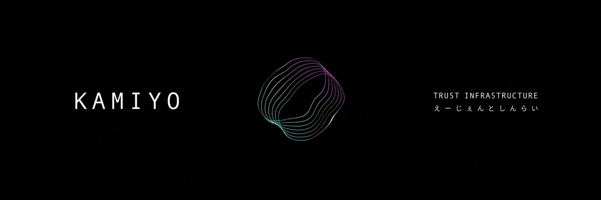

# KAMIYO



Trust infrastructure for autonomous agents on Solana.

Agents transact with stake-backed identities. Disputes go to multi-oracle consensus with private voting.

**[Dashboard](https://protocol.kamiyo.ai)** | **[Solscan](https://solscan.io/account/8sUnNU6WBD2SYapCE12S7LwH1b8zWoniytze7ifWwXCM)**

## Features

- **Agent Identity** - PDA-based identities with stake collateral
- **Escrow Agreements** - Time-locked payments between agents and providers
- **Dispute Resolution** - Multi-oracle consensus with private voting
- **Reputation Tracking** - On-chain trust scores
- **SPL Token Support** - SOL, USDC, USDT

## How It Works

```
Agent                          Provider
  │                               │
  │  1. Create Agreement          │
  ├──────────────────────────────►│
  │     (funds locked)            │
  │                               │
  │  2. Service Delivered         │
  │◄──────────────────────────────┤
  │                               │
  ├─── 3a. Release ──────────────►│  Happy path
  │                               │
  └─── 3b. Dispute ───┐           │  Unhappy path
                      ▼
              ┌──────────────┐
              │   Oracles    │
              │  commit/reveal│
              └──────┬───────┘
                     │
              ┌──────▼───────┐
              │  Settlement  │
              │   0-100%     │
              └──────────────┘
```

### Dispute Resolution

Oracles vote on service quality using commit-reveal:

1. **Commit** - Oracle submits `Poseidon(score, blinding, escrow_id, oracle_pk)` using Halo2. No trusted setup required.
2. **Delay** - 5 minute window prevents vote copying
3. **Reveal** - Oracle reveals score with Groth16 proof verified on-chain via `alt_bn128` syscalls
4. **Settle** - Funds split based on median score

| Quality Score | Agent Refund | Provider Payment |
|--------------|--------------|------------------|
| 80-100% | 0% | 100% |
| 65-79% | 35% | 65% |
| 50-64% | 75% | 25% |
| 0-49% | 100% | 0% |

## Installation

```bash
npm install https://gitpkg.vercel.app/kamiyo-ai/kamiyo-protocol/packages/kamiyo-sdk?main
```

## Quick Start

```typescript
import { KamiyoClient, AgentType } from '@kamiyo/sdk';
import { Connection, Keypair } from '@solana/web3.js';
import BN from 'bn.js';

const connection = new Connection('https://api.mainnet-beta.solana.com');
const wallet = Keypair.generate();
const client = new KamiyoClient({
  connection,
  wallet: {
    publicKey: wallet.publicKey,
    signTransaction: async (tx) => { tx.sign(wallet); return tx; },
    signAllTransactions: async (txs) => { txs.forEach(tx => tx.sign(wallet)); return txs; },
  }
});

// Create agent with 0.5 SOL stake
const tx = await client.createAgent({
  name: 'TradingBot',
  agentType: AgentType.Trading,
  stakeAmount: new BN(500_000_000)
});

// Create payment agreement
await client.createAgreement({
  provider: providerPubkey,
  amount: 100_000_000,
  timeLockSeconds: 86400,
  transactionId: 'order-123'
});

// Release on success, or dispute for arbitration
await client.releaseFunds('order-123', providerPubkey);
// or: await client.markDisputed('order-123');
```

## Architecture

```
┌─────────────────────────────────────────────────────────┐
│                    KAMIYO Program                       │
├─────────────────┬─────────────────┬────────────────────┤
│  Agent Identity │    Escrow       │   Oracle Registry  │
│  - PDA          │  - Create       │   - Register       │
│  - Stake        │  - Release      │   - Commit/Reveal  │
│  - Reputation   │  - Dispute      │   - Verify (ZK)    │
└─────────────────┴─────────────────┴────────────────────┘
```

## Packages

| Package | Description |
|---------|-------------|
| `@kamiyo/sdk` | TypeScript client |
| `@kamiyo/x402-client` | x402 payment client with escrow protection |
| `@kamiyo/actions` | Agent framework actions |
| `@kamiyo/langchain` | LangChain tools |
| `@kamiyo/middleware` | Express middleware for HTTP 402 |
| `@kamiyo/agent-client` | Autonomous agent with auto-dispute |
| `@kamiyo/mcp` | MCP server for Claude/LLM agents |
| `kamiyo-zk` | Halo2 commitments, Groth16 proofs (Rust) |
| `circuits/` | Circom circuits for on-chain verification |

## x402 Integration

KAMIYO provides the trust layer for [x402](https://www.x402.org/) payments:

```typescript
import { X402KAMIYOClient } from '@kamiyo/x402-client';

const client = new X402KAMIYOClient({
  connection,
  wallet,
  programId: KAMIYO_PROGRAM_ID,
  qualityThreshold: 70,  // Auto-dispute below this
  maxPricePerRequest: 0.1,
});

// Request with automatic payment + escrow protection
const response = await client.request('https://api.provider.com/data', {
  useEscrow: true,
  sla: { maxLatencyMs: 5000 },
});

// SLA violation triggers automatic dispute
if (!response.slaResult?.passed) {
  // Funds held in escrow, oracle consensus determines settlement
}
```

x402 handles payments. KAMIYO ensures they were earned.

## API

```typescript
// PDA derivation
getAgentPDA(owner: PublicKey): [PublicKey, number]
getAgreementPDA(agent: PublicKey, txId: string): [PublicKey, number]

// Account fetching
getAgent(pda: PublicKey): Promise<AgentIdentity | null>
getAgreement(pda: PublicKey): Promise<Agreement | null>

// Operations
createAgent(params: CreateAgentParams): Promise<string>
createAgreement(params: CreateAgreementParams): Promise<string>
releaseFunds(txId: string, provider: PublicKey): Promise<string>
markDisputed(txId: string): Promise<string>
```

## Development

```bash
npm install
anchor build
anchor test
npm run build --workspaces
```

## Program Addresses

| Network | Program ID |
|---------|------------|
| Mainnet | `8sUnNU6WBD2SYapCE12S7LwH1b8zWoniytze7ifWwXCM` |
| Devnet | `8sUnNU6WBD2SYapCE12S7LwH1b8zWoniytze7ifWwXCM` |

| Account | Address |
|---------|---------|
| Protocol Config | `E6VhYjktLpT91VJy7bt5VL7DhTurZZKZUEFEgxLdZHna` |
| Treasury | `8xi4TJcPmLqxmhsbCtNoBcu7b8Lfnubr3GY1bkhjuNJF` |
| Oracle Registry | `2sUcFA5kaxq5akJFw7UzAUizfvZsr72FVpeKWmYc5yuf` |

**Fees:**
- Escrow creation: 0.1% (min 5,000 lamports)
- Protocol fee on disputes: 1%
- Oracle reward pool: 1%

## Security

See [SECURITY.md](SECURITY.md).

- 2-of-3 multi-sig for pause/unpause/treasury
- Oracle slashing: 10% per violation
- Agent slashing: 5% for frivolous disputes
- Auto-removal after 3 violations
- 7-day grace period on escrows
- Rent exemption checks on all SOL transfers
- Ed25519 signature verification with instruction iteration
- Token mint validation for SPL escrows
- Protocol fees for both SOL and SPL token disputes

## License

- **Core Program**: [BUSL-1.1](LICENSE)
- **SDK & Packages**: [MIT](packages/kamiyo-sdk/LICENSE)

Commercial license: license@kamiyo.ai

---

[KAMIYO](https://kamiyo.ai)
