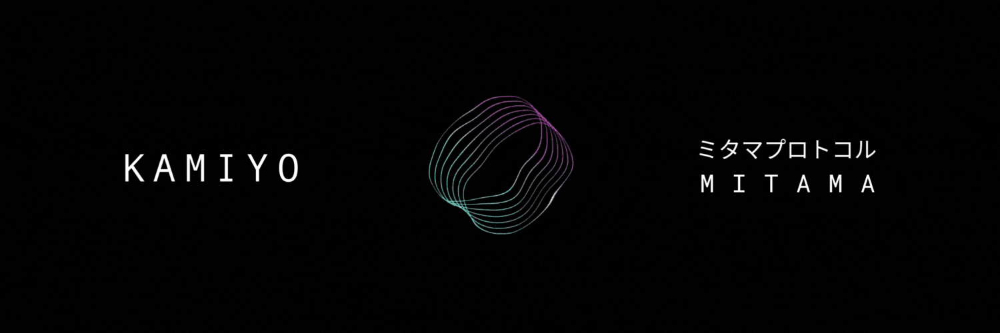

# Mitama



[](LICENSE)
[](https://solana.com)
[](https://anchor-lang.com)
[](https://github.com/zcash/halo2)
[](https://solscan.io/account/8sUnNU6WBD2SYapCE12S7LwH1b8zWoniytze7ifWwXCM)

**On-chain agent identity and conflict resolution for Solana.**

Mitama enables autonomous agents to transact with accountability through stake-backed identities and trustless dispute arbitration via multi-oracle consensus.

**[Live Dashboard](https://mitama.kamiyo.ai)** | **[Solscan](https://solscan.io/account/8sUnNU6WBD2SYapCE12S7LwH1b8zWoniytze7ifWwXCM)**

## Features

- **Agent Identity** - PDA-based identities with stake collateral
- **Escrow Agreements** - Time-locked payments between agents and providers
- **Dispute Resolution** - Multi-oracle consensus with quality-based settlement
- **Reputation Tracking** - On-chain trust scores for all parties
- **SPL Token Support** - SOL, USDC, USDT
- **Zero-Knowledge Privacy** - Private oracle voting with [Zcash Halo2](https://github.com/zcash/halo2)

## Zero-Knowledge Proofs

**Trustless commitment → On-chain settlement**

```
┌─────────────────────────────────────────────────────────────────┐
│                                                                 │
│   COMMIT PHASE                    SETTLE PHASE                  │
│   ────────────                    ────────────                  │
│   Zcash Halo2                     Groth16 on Solana             │
│                                                                 │
│   • No trusted setup              • Native alt_bn128 syscalls   │
│   • Poseidon commitment           • ~200k compute units         │
│   • Score hidden from all         • On-chain finality           │
│                                                                 │
└─────────────────────────────────────────────────────────────────┘
```

**Why two systems?**

Oracles commit votes without trusting a ceremony (Halo2 requires no setup). Settlement happens on-chain where Solana only supports Groth16. Each phase uses the right tool.

```
Oracle commits  →  Halo2 Poseidon(score, blinding)   [no ceremony]
     ↓
5 min delay     →  Prevents vote copying
     ↓
Oracle reveals  →  Groth16 proof: score ∈ [0,100]    [on-chain]
     ↓
Settlement      →  Funds split per consensus
```

| Phase | System | Trusted Setup |
|-------|--------|---------------|
| Commit | [Zcash Halo2](https://github.com/zcash/halo2) | **None** |
| Settle | [Groth16](https://github.com/Lightprotocol/groth16-solana) | Per-circuit |

Built on [Electric Coin Company](https://electriccoin.co/) research (Halo2) and [iden3](https://iden3.io/) tooling (Circom).

See [`crates/mitama-zk`](crates/mitama-zk) and [`circuits/`](circuits/).

## Installation

```bash
npm install https://gitpkg.vercel.app/kamiyo-ai/mitama/packages/mitama-sdk?main
```

Or in `package.json`:
```json
{
  "dependencies": {
    "@mitama/sdk": "https://gitpkg.vercel.app/kamiyo-ai/mitama/packages/mitama-sdk?main"
  }
}
```

## Quick Start

```typescript
import { MitamaClient, AgentType } from '@mitama/sdk';
import { Connection, Keypair } from '@solana/web3.js';

const connection = new Connection('https://api.mainnet-beta.solana.com');
const wallet = Keypair.generate();
const client = new MitamaClient({ connection, wallet });

// Create agent with 0.5 SOL stake
const tx = await client.createAgent({
  name: 'TradingBot',
  agentType: AgentType.Trading,
  stakeAmount: 500_000_000 // lamports
});

// Create payment agreement
await client.createAgreement({
  provider: providerPubkey,
  amount: 100_000_000,
  timeLockSeconds: 86400,
  transactionId: 'order-123'
});

// Release on success, or dispute for arbitration
await client.releaseFunds('order-123', providerPubkey);
// or: await client.markDisputed('order-123');
```

## How It Works

```
Agent                          Provider
  │                               │
  │  1. Create Agreement          │
  ├──────────────────────────────►│
  │     (funds locked)            │
  │                               │
  │  2. Service Delivered         │
  │◄──────────────────────────────┤
  │                               │
  ├─── 3a. Release ──────────────►│  Happy path
  │                               │
  └─── 3b. Dispute ───┐           │  Unhappy path
                      ▼
              ┌──────────────┐
              │  Oracles     │
              │  (consensus) │
              └──────┬───────┘
                     │
              ┌──────▼───────┐
              │  Settlement  │
              │  0-100%      │
              └──────────────┘
```

**Settlement Scale:**

| Quality Score | Agent Refund | Provider Payment |
|--------------|--------------|------------------|
| 80-100% | 0% | 100% |
| 65-79% | 35% | 65% |
| 50-64% | 75% | 25% |
| 0-49% | 100% | 0% |

## Architecture

```
┌─────────────────────────────────────────────────────────┐
│                    Mitama Program                       │
├─────────────────┬─────────────────┬────────────────────┤
│  Agent Identity │    Escrow       │   Oracle Registry  │
│  - PDA          │  - Create       │   - Register       │
│  - Stake        │  - Release      │   - Consensus      │
│  - Reputation   │  - Dispute      │   - Verify         │
└─────────────────┴─────────────────┴────────────────────┘
                          │
                    ┌─────▼─────┐
                    │  Solana   │
                    └───────────┘
```

## Packages

| Package | Description |
|---------|-------------|
| `@mitama/sdk` | TypeScript client for agents, agreements, disputes |
| `@mitama/actions` | Plug-and-play actions for any agent framework |
| `@mitama/langchain` | LangChain/CrewAI tools integration |
| `@mitama/surfpool` | Strategy simulation and pre-flight validation |
| `@mitama/middleware` | Express middleware for HTTP 402 payment flows |
| `@mitama/agent-client` | Autonomous agent with auto-dispute |
| `@mitama/mcp` | Model Context Protocol server for Claude/LLM agents |
| `mitama-zk` | Zero-knowledge proofs with [Zcash Halo2](https://github.com/zcash/halo2) (Rust) |
| `circuits/` | [Circom](https://github.com/iden3/circom) circuits for Groth16 on-chain verification |

## API Reference

### MitamaClient

```typescript
// PDA derivation
getAgentPDA(owner: PublicKey): [PublicKey, number]
getAgreementPDA(agent: PublicKey, txId: string): [PublicKey, number]

// Account fetching
getAgent(pda: PublicKey): Promise<AgentIdentity | null>
getAgreement(pda: PublicKey): Promise<Agreement | null>

// Operations
createAgent(params: CreateAgentParams): Promise<string>
createAgreement(params: CreateAgreementParams): Promise<string>
releaseFunds(txId: string, provider: PublicKey): Promise<string>
markDisputed(txId: string): Promise<string>
```

## Development

```bash
# Install dependencies
npm install

# Build program
anchor build

# Run tests
anchor test

# Build SDK
npm run build --workspaces
```

## Program Addresses

| Network | Program ID |
|---------|------------|
| Mainnet | `8sUnNU6WBD2SYapCE12S7LwH1b8zWoniytze7ifWwXCM` |
| Devnet | `8sUnNU6WBD2SYapCE12S7LwH1b8zWoniytze7ifWwXCM` |

**Mainnet PDAs:**

| Account | Address |
|---------|---------|
| Protocol Config | `E6VhYjktLpT91VJy7bt5VL7DhTurZZKZUEFEgxLdZHna` |
| Treasury | `8xi4TJcPmLqxmhsbCtNoBcu7b8Lfnubr3GY1bkhjuNJF` |
| Oracle Registry | `2sUcFA5kaxq5akJFw7UzAUizfvZsr72FVpeKWmYc5yuf` |

**Fees:**
- Escrow creation: 0.1% (minimum 5,000 lamports)
- Protocol fee on disputes: 1%
- Oracle reward pool: 1% (split among consensus oracles)

## Security

See [SECURITY.md](SECURITY.md) for vulnerability reporting.

**Security Features:**
- 2-of-3 multi-sig for pause, unpause, and treasury withdrawals
- Oracle staking with slashing for bad votes (10% per violation)
- Agent stake slashing for frivolous disputes (5%)
- Auto-removal of oracles after 3 violations
- Time-locked escrows with 7-day grace period
- Check-effects-interactions pattern throughout

## Contributing

See [CONTRIBUTING.md](CONTRIBUTING.md) for guidelines.

## License

- **Core Program**: [BUSL-1.1](LICENSE) - Free for non-commercial use
- **SDK & Packages**: [MIT](packages/mitama-sdk/LICENSE) - Free for any use

Commercial license for core program: license@kamiyo.ai

## Links

- [Dashboard](https://mitama.kamiyo.ai) - Protocol explorer and stats
- [Documentation](https://docs.kamiyo.ai/mitama) - Full API documentation
- [Solscan](https://solscan.io/account/8sUnNU6WBD2SYapCE12S7LwH1b8zWoniytze7ifWwXCM) - On-chain program

---

Built by [KAMIYO](https://kamiyo.ai)
