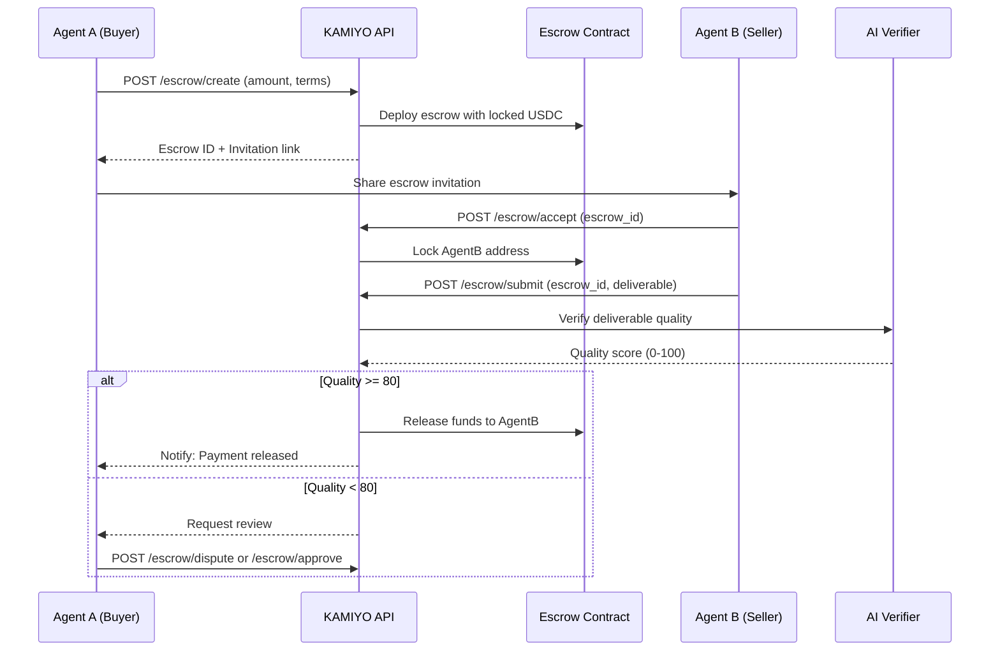
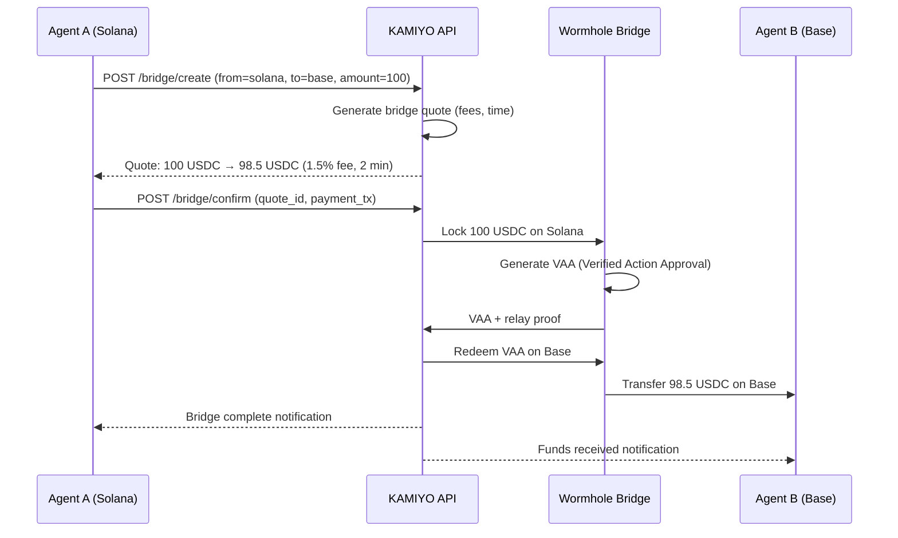
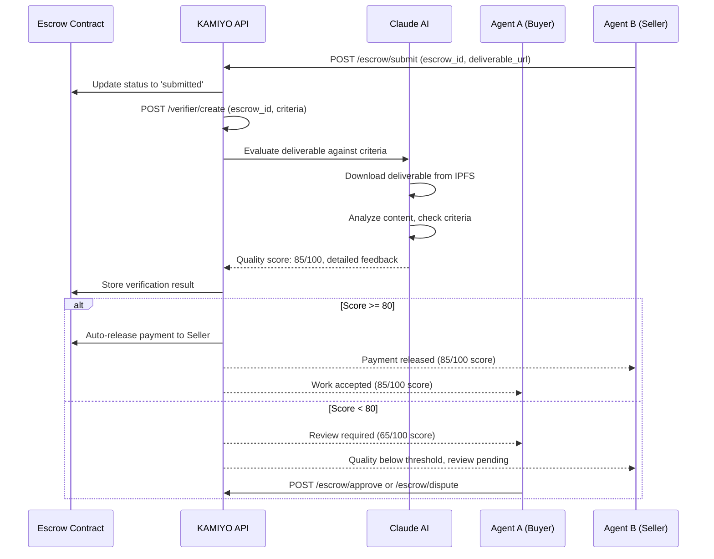
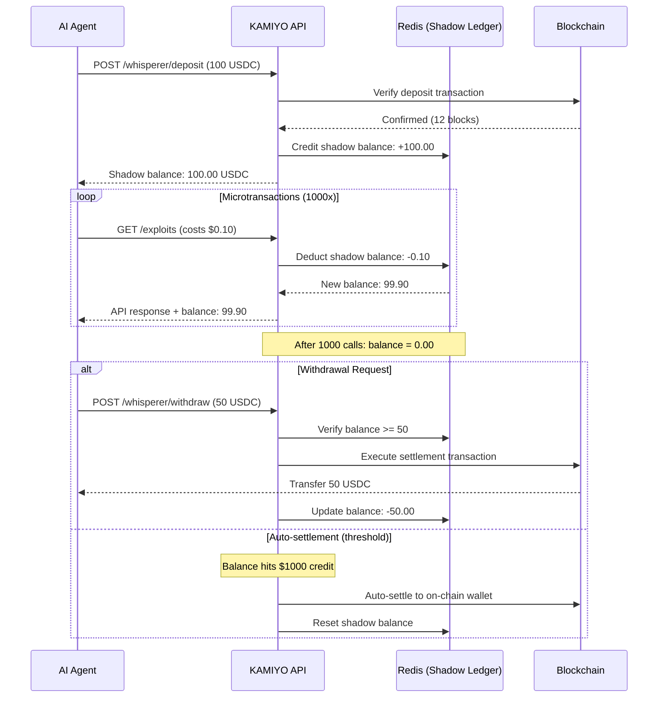
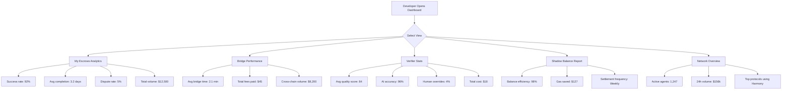
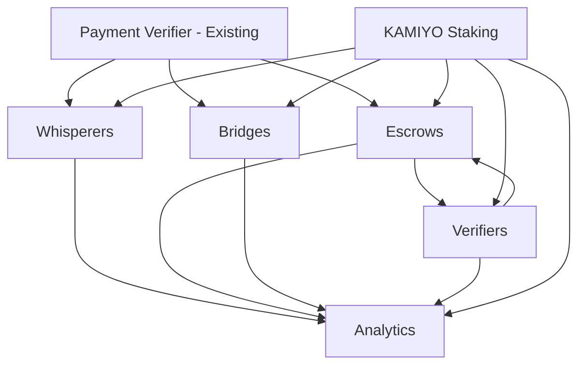

# KAMIYO "Invisible Harmony" Alignment Features Architecture

## Executive Summary

This document provides comprehensive technical architecture for the five "Invisible Harmony" alignment features that differentiate KAMIYO from generic payment tokens. These features enable AI agents to autonomously negotiate, transact, verify quality, and settle payments across multiple blockchains with minimal human intervention.

**Document Version:** 1.0
**Date:** 2025-10-28
**Phase:** Phase 1 (Design & Architecture)
**Target Implementation:** Phase 3 (5 weeks)

---

## Table of Contents

1. [System Overview](#1-system-overview)
2. [Feature 1: Auto-Negotiation Escrows](#2-feature-1-auto-negotiation-escrows)
3. [Feature 2: Cross-Chain Harmony Bridges](#3-feature-2-cross-chain-harmony-bridges)
4. [Feature 3: Silent Verifier Oracles](#4-feature-3-silent-verifier-oracles)
5. [Feature 4: Balance Whisperers](#5-feature-4-balance-whisperers)
6. [Feature 5: Harmony Analytics Dashboard](#6-feature-5-harmony-analytics-dashboard)
7. [KAMIYO Token Integration](#7-kamiyo-token-integration)
8. [Technical Feasibility Analysis](#8-technical-feasibility-analysis)
9. [Security & Risk Mitigation](#9-security--risk-mitigation)
10. [Performance Considerations](#10-performance-considerations)
11. [Implementation Roadmap](#11-implementation-roadmap)

---

## 1. System Overview

### 1.1 Architecture Philosophy

The "Invisible Harmony" features operate on three core principles:

1. **Autonomy**: AI agents negotiate and settle disputes without human intervention
2. **Transparency**: All transactions are on-chain and auditable
3. **Efficiency**: Off-chain computation with on-chain settlement reduces gas costs

### 1.2 Technology Stack Integration

**Existing Infrastructure:**
- Backend: FastAPI (Python 3.11+)
- Frontend: Next.js 14 + React + Tailwind CSS
- Database: PostgreSQL (production) / SQLite (development)
- Blockchain: Web3.py (EVM), Solana.py (Solana)
- Authentication: NextAuth.js + JWT
- Middleware: x402 payment verification

**New Dependencies:**
- Wormhole SDK: Cross-chain messaging and token transfers
- OpenAI API / Anthropic Claude: AI quality verification
- Pyth Network: Price oracles for KAMIYO/USDC rates
- Redis: Shadow balance tracking and caching
- WebSocket: Real-time analytics updates

### 1.3 Integration Points

All features integrate with existing x402 payment system:

```
┌─────────────────────────────────────────────────────────────┐
│                     FastAPI Backend                          │
│                     (api/main.py)                            │
└─────────────────────────────────────────────────────────────┘
                            │
        ┌───────────────────┼───────────────────┐
        │                   │                   │
┌───────▼────────┐ ┌───────▼────────┐ ┌───────▼────────┐
│ x402 Middleware│ │  Auth Helpers  │ │Rate Limiting   │
│  (existing)    │ │   (existing)   │ │  (existing)    │
└───────┬────────┘ └───────┬────────┘ └───────┬────────┘
        │                   │                   │
┌───────▼───────────────────▼───────────────────▼────────┐
│              NEW: Harmony Features Layer                │
│  ┌──────────┐ ┌──────────┐ ┌──────────┐ ┌──────────┐ │
│  │ Escrows  │ │ Bridges  │ │Verifiers │ │Whisperers│ │
│  └──────────┘ └──────────┘ └──────────┘ └──────────┘ │
└─────────────────────────────────────────────────────────┘
                            │
        ┌───────────────────┼───────────────────┐
        │                   │                   │
┌───────▼────────┐ ┌───────▼────────┐ ┌───────▼────────┐
│   PostgreSQL   │ │   Blockchain   │ │     Redis      │
│   (payments,   │ │  (Base, ETH,   │ │  (off-chain    │
│   escrows)     │ │   Solana)      │ │   balances)    │
└────────────────┘ └────────────────┘ └────────────────┘
```

---

## 2. Feature 1: Auto-Negotiation Escrows

### 2.1 High-Level Design

**Problem Solved:**
AI agents need a trustless way to agree on payment terms and ensure funds are locked until work is verified. Without escrows, agents risk non-payment or poor quality deliverables.

**Solution:**
Smart contract-based escrows that lock USDC until both parties agree terms are met. Includes automated dispute resolution via AI arbitrators.

**User Flow (Agent Perspective):**



**Integration Points:**
- Extends existing `x402_payments` table with escrow metadata
- Uses existing `payment_verifier.py` for on-chain verification
- Integrates with Feature 3 (Verifiers) for quality checks
- Frontend: New `/dashboard/escrows` page

### 2.2 Data Models

**Database Table: `harmony_escrows`**

```sql
CREATE TABLE harmony_escrows (
    id SERIAL PRIMARY KEY,

    -- Escrow identification
    escrow_address VARCHAR(255) UNIQUE NOT NULL,  -- On-chain contract address
    chain VARCHAR(50) NOT NULL,  -- 'base', 'ethereum', 'solana'

    -- Parties
    buyer_address VARCHAR(255) NOT NULL,
    seller_address VARCHAR(255),  -- NULL until accepted

    -- Payment details
    amount_usdc DECIMAL(18, 6) NOT NULL,
    payment_tx_hash VARCHAR(255),  -- Initial deposit transaction

    -- Terms & conditions
    terms_hash VARCHAR(64) NOT NULL,  -- SHA256 of terms JSON
    terms_json JSONB NOT NULL,  -- Full terms: {"description": "...", "deadline": "...", "deliverables": [...]}

    -- Status tracking
    status VARCHAR(50) NOT NULL,  -- 'pending', 'accepted', 'submitted', 'disputed', 'released', 'refunded', 'expired'

    -- Deliverable submission
    deliverable_url TEXT,  -- URL to submitted work
    deliverable_hash VARCHAR(64),  -- Hash for integrity
    submission_time TIMESTAMP,

    -- Verification
    verification_id INTEGER,  -- Foreign key to harmony_verifications
    quality_score INTEGER,  -- 0-100

    -- Dispute resolution
    dispute_reason TEXT,
    dispute_initiated_by VARCHAR(255),  -- Buyer or seller address
    dispute_resolved_by VARCHAR(50),  -- 'buyer', 'seller', 'arbitrator', 'timeout'
    arbitrator_notes TEXT,

    -- Deadlines
    acceptance_deadline TIMESTAMP,  -- Seller must accept by this time
    delivery_deadline TIMESTAMP,  -- Work must be submitted by this time
    review_deadline TIMESTAMP,  -- Buyer must review by this time

    -- KAMIYO staking benefits
    buyer_kamiyo_staked DECIMAL(18, 6) DEFAULT 0,  -- Priority queue if staked
    seller_kamiyo_staked DECIMAL(18, 6) DEFAULT 0,
    priority_score INTEGER DEFAULT 0,  -- Higher = faster processing

    -- Timestamps
    created_at TIMESTAMP DEFAULT CURRENT_TIMESTAMP,
    updated_at TIMESTAMP DEFAULT CURRENT_TIMESTAMP,
    completed_at TIMESTAMP,

    -- Indexes for performance
    CONSTRAINT fk_verification FOREIGN KEY (verification_id)
        REFERENCES harmony_verifications(id) ON DELETE SET NULL
);

CREATE INDEX idx_escrows_status ON harmony_escrows(status);
CREATE INDEX idx_escrows_buyer ON harmony_escrows(buyer_address);
CREATE INDEX idx_escrows_seller ON harmony_escrows(seller_address);
CREATE INDEX idx_escrows_chain ON harmony_escrows(chain);
CREATE INDEX idx_escrows_priority ON harmony_escrows(priority_score DESC, created_at DESC);
CREATE INDEX idx_escrows_deadlines ON harmony_escrows(delivery_deadline, review_deadline);
```

**Database Table: `escrow_negotiations`**

```sql
CREATE TABLE escrow_negotiations (
    id SERIAL PRIMARY KEY,
    escrow_id INTEGER NOT NULL,

    -- Message details
    sender_address VARCHAR(255) NOT NULL,  -- Agent who sent message
    message_type VARCHAR(50) NOT NULL,  -- 'proposal', 'counter_proposal', 'question', 'clarification'
    message_content TEXT NOT NULL,

    -- Negotiation state
    proposed_terms_json JSONB,  -- Modified terms if counter-proposal
    is_accepted BOOLEAN DEFAULT FALSE,

    -- AI assistance
    ai_suggested_response TEXT,  -- Claude's suggested counter-offer

    created_at TIMESTAMP DEFAULT CURRENT_TIMESTAMP,

    CONSTRAINT fk_escrow FOREIGN KEY (escrow_id)
        REFERENCES harmony_escrows(id) ON DELETE CASCADE
);

CREATE INDEX idx_negotiations_escrow ON escrow_negotiations(escrow_id, created_at DESC);
CREATE INDEX idx_negotiations_sender ON escrow_negotiations(sender_address);
```

**Relationships:**
- `harmony_escrows.verification_id` → `harmony_verifications.id` (Feature 3)
- `harmony_escrows.buyer_address` → User wallet addresses
- `escrow_negotiations.escrow_id` → `harmony_escrows.id`

### 2.3 API Endpoint Specifications

**POST /api/v1/harmony/escrow/create**

Create new escrow agreement.

```typescript
// Request
{
  "buyer_address": "0x742d35Cc6634C0532925a3b8D4B5e3A3A3b7b7b7",
  "amount_usdc": 50.00,
  "chain": "base",
  "terms": {
    "title": "Generate 10 exploit intelligence reports",
    "description": "Detailed analysis of recent DeFi exploits with technical breakdown",
    "deliverables": [
      "10 markdown reports with exploit analysis",
      "Transaction graph visualizations",
      "Risk assessment scores"
    ],
    "delivery_deadline": "2025-11-04T23:59:59Z",
    "quality_threshold": 80  // Minimum quality score to auto-release
  },
  "payment_tx_hash": "0xabc123...",  // Proof of USDC deposit
  "kamiyo_stake": 1000  // Optional: Stake KAMIYO for priority
}

// Response (201 Created)
{
  "escrow_id": 42,
  "escrow_address": "0x1234567890abcdef...",
  "chain": "base",
  "status": "pending",
  "invitation_link": "https://kamiyo.ai/escrow/accept/42?token=xyz",
  "acceptance_deadline": "2025-10-30T12:00:00Z",
  "priority_score": 15  // Higher if KAMIYO staked
}
```

**Authentication:** Requires wallet signature or x402 payment token
**Rate Limit:** 10 escrows per hour per buyer
**Error Handling:**
- 400: Invalid terms or insufficient payment
- 402: Payment verification failed
- 429: Too many pending escrows

**POST /api/v1/harmony/escrow/accept**

Seller accepts escrow terms.

```typescript
// Request
{
  "escrow_id": 42,
  "seller_address": "0x9876543210fedcba...",
  "wallet_signature": "0xsig...",  // Proof of ownership
  "estimated_delivery": "2025-11-02T18:00:00Z",
  "kamiyo_stake": 500  // Optional: Stake for reputation boost
}

// Response (200 OK)
{
  "escrow_id": 42,
  "status": "accepted",
  "locked_amount_usdc": 50.00,
  "delivery_deadline": "2025-11-04T23:59:59Z",
  "escrow_contract_url": "https://basescan.org/address/0x1234..."
}
```

**POST /api/v1/harmony/escrow/submit**

Seller submits completed work.

```typescript
// Request
{
  "escrow_id": 42,
  "deliverable_url": "ipfs://QmYwAPJzv5CZsnA...",  // IPFS or Arweave URL
  "deliverable_hash": "sha256:abc123...",
  "completion_notes": "All 10 reports completed. Includes bonus visualizations.",
  "request_verification": true  // Trigger AI verifier
}

// Response (200 OK)
{
  "escrow_id": 42,
  "status": "submitted",
  "verification_initiated": true,
  "verification_id": 128,
  "estimated_verification_time": 120  // seconds
}
```

**POST /api/v1/harmony/escrow/dispute**

Buyer initiates dispute (if quality < threshold).

```typescript
// Request
{
  "escrow_id": 42,
  "dispute_reason": "Reports lack technical depth. Missing 3 deliverables.",
  "requested_action": "partial_refund",  // or 'full_refund', 'arbitration'
  "evidence_urls": ["ipfs://Qm..."]
}

// Response (200 OK)
{
  "escrow_id": 42,
  "status": "disputed",
  "dispute_id": 256,
  "arbitration_options": {
    "ai_arbitrator": {
      "cost_usdc": 5.00,
      "estimated_time": 300  // seconds
    },
    "human_arbitrator": {
      "cost_usdc": 20.00,
      "estimated_time": 86400  // 24 hours
    },
    "timeout_refund": {
      "cost_usdc": 0,
      "estimated_time": 604800  // 7 days
    }
  }
}
```

**GET /api/v1/harmony/escrow/{escrow_id}**

Retrieve escrow details.

```typescript
// Response (200 OK)
{
  "escrow_id": 42,
  "escrow_address": "0x1234...",
  "chain": "base",
  "buyer_address": "0x742d...",
  "seller_address": "0x9876...",
  "amount_usdc": 50.00,
  "status": "submitted",
  "terms": { /* full terms object */ },
  "deliverable_url": "ipfs://Qm...",
  "quality_score": 85,
  "negotiation_history": [
    {
      "timestamp": "2025-10-28T12:34:56Z",
      "actor": "buyer",
      "action": "created",
      "message": "Escrow created"
    },
    {
      "timestamp": "2025-10-28T14:20:00Z",
      "actor": "seller",
      "action": "accepted",
      "message": "Terms accepted"
    }
  ],
  "deadlines": {
    "delivery_deadline": "2025-11-04T23:59:59Z",
    "review_deadline": "2025-11-06T23:59:59Z"
  },
  "kamiyo_stakes": {
    "buyer": 1000,
    "seller": 500
  }
}
```

**GET /api/v1/harmony/escrow/list**

List user's escrows (buyer or seller).

```typescript
// Query params: ?address=0x742d...&status=active&page=1&limit=20

// Response (200 OK)
{
  "escrows": [
    { /* escrow summary */ },
    { /* escrow summary */ }
  ],
  "pagination": {
    "page": 1,
    "limit": 20,
    "total": 45,
    "has_more": true
  },
  "summary": {
    "active_as_buyer": 5,
    "active_as_seller": 3,
    "completed": 30,
    "disputed": 2,
    "total_volume_usdc": 2500.00
  }
}
```

### 2.4 Frontend Component Breakdown

**Pages to Create/Update:**

1. **`/pages/dashboard/escrows.js`** - Escrow management dashboard
2. **`/pages/escrow/[id].js`** - Individual escrow detail view
3. **`/pages/escrow/create.js`** - Create new escrow form

**New React Components:**

```typescript
// components/escrow/EscrowList.js
// Displays table of user's escrows with status badges
interface EscrowListProps {
  address: string;
  role: 'buyer' | 'seller' | 'both';
  status?: 'active' | 'completed' | 'disputed' | 'all';
}

// components/escrow/EscrowCard.js
// Individual escrow summary card with actions
interface EscrowCardProps {
  escrow: Escrow;
  onAction: (action: string) => void;
}

// components/escrow/CreateEscrowForm.js
// Multi-step form for creating escrows
interface CreateEscrowFormProps {
  walletAddress: string;
  onSuccess: (escrowId: number) => void;
}

// components/escrow/NegotiationThread.js
// Chat-like interface showing negotiation messages
interface NegotiationThreadProps {
  escrowId: number;
  messages: NegotiationMessage[];
  onSendMessage: (message: string) => void;
}

// components/escrow/StatusBadge.js
// Visual badge for escrow status
interface StatusBadgeProps {
  status: 'pending' | 'accepted' | 'submitted' | 'disputed' | 'released' | 'refunded';
  size?: 'sm' | 'md' | 'lg';
}

// components/escrow/DeadlineTimer.js
// Countdown timer for escrow deadlines
interface DeadlineTimerProps {
  deadline: Date;
  onExpire: () => void;
}
```

**State Management:**

Use React Context API for escrow state:

```typescript
// contexts/EscrowContext.js
interface EscrowContextType {
  escrows: Escrow[];
  activeEscrow: Escrow | null;
  loading: boolean;
  error: string | null;

  createEscrow: (params: CreateEscrowParams) => Promise<Escrow>;
  acceptEscrow: (escrowId: number) => Promise<void>;
  submitWork: (escrowId: number, deliverable: Deliverable) => Promise<void>;
  initiateDispute: (escrowId: number, reason: string) => Promise<void>;
  refreshEscrows: () => Promise<void>;
}
```

**Wallet Integration:**

Uses existing wallet adapters:
- **EVM (Base/Ethereum):** wagmi + viem
- **Solana:** @solana/wallet-adapter-react

### 2.5 External Dependencies

**Smart Contract Deployment:**

Escrow contracts must be deployed on each supported chain:

```solidity
// contracts/HarmonyEscrow.sol (simplified)
contract HarmonyEscrow {
    address public buyer;
    address public seller;
    uint256 public amount;
    bool public released;

    function deposit() external payable { /* Lock USDC */ }
    function accept(address _seller) external { /* Seller accepts */ }
    function release() external { /* Release to seller */ }
    function refund() external { /* Refund to buyer */ }
}
```

**Deployment Costs:**
- Base: ~$0.50 per escrow deployment
- Ethereum: ~$15-50 per escrow (gas dependent)
- Solana: ~$0.0001 per escrow

**Alternative:** Use Escrow Factory pattern to reduce deployment costs.

**API Keys Required:**
- None (fully on-chain escrows)

**Cost Estimates:**
- Gas fees: Variable, paid by user
- KAMIYO platform fee: 0.5% of escrow amount (split between buyer/seller)

---

## 3. Feature 2: Cross-Chain Harmony Bridges

### 3.1 High-Level Design

**Problem Solved:**
Agent A on Base wants to pay Agent B on Solana, but doesn't want to manage multi-chain wallets. Traditional bridges require manual intervention.

**Solution:**
Wormhole-powered cross-chain payment routing. KAMIYO acts as a payment facilitator, accepting USDC on one chain and delivering on another.

**User Flow (Agent Perspective):**



**Integration Points:**
- Uses Wormhole SDK for cross-chain messaging
- Extends `x402_payments` with bridge metadata
- Integrates with Pyth Network for USDC price oracles
- Frontend: `/dashboard/bridges` page

### 3.2 Data Models

**Database Table: `harmony_bridges`**

```sql
CREATE TABLE harmony_bridges (
    id SERIAL PRIMARY KEY,

    -- Bridge identification
    bridge_id VARCHAR(64) UNIQUE NOT NULL,  -- Unique bridge transaction ID
    wormhole_vaa_hash VARCHAR(128),  -- Wormhole Verified Action Approval hash

    -- Source chain details
    source_chain VARCHAR(50) NOT NULL,  -- 'base', 'ethereum', 'solana'
    source_address VARCHAR(255) NOT NULL,  -- Sender wallet
    source_tx_hash VARCHAR(255) NOT NULL,  -- Deposit transaction
    source_amount_usdc DECIMAL(18, 6) NOT NULL,

    -- Destination chain details
    destination_chain VARCHAR(50) NOT NULL,
    destination_address VARCHAR(255) NOT NULL,  -- Recipient wallet
    destination_tx_hash VARCHAR(255),  -- Redemption transaction (NULL until complete)
    destination_amount_usdc DECIMAL(18, 6),  -- Amount after fees

    -- Fee breakdown
    bridge_fee_usdc DECIMAL(18, 6),  -- Wormhole relay fee
    kamiyo_fee_usdc DECIMAL(18, 6),  -- KAMIYO platform fee (0.5%)
    gas_fee_usdc DECIMAL(18, 6),  -- Estimated gas cost
    total_fees_usdc DECIMAL(18, 6),

    -- Status tracking
    status VARCHAR(50) NOT NULL,  -- 'pending', 'locked', 'bridging', 'completed', 'failed', 'refunded'
    failure_reason TEXT,

    -- Timing
    estimated_completion_time TIMESTAMP,
    actual_completion_time TIMESTAMP,

    -- KAMIYO benefits
    kamiyo_discount_applied BOOLEAN DEFAULT FALSE,  -- True if user staked KAMIYO
    kamiyo_discount_amount DECIMAL(18, 6) DEFAULT 0,

    -- Priority routing
    priority_level INTEGER DEFAULT 0,  -- Higher = faster routing

    created_at TIMESTAMP DEFAULT CURRENT_TIMESTAMP,
    updated_at TIMESTAMP DEFAULT CURRENT_TIMESTAMP
);

CREATE INDEX idx_bridges_status ON harmony_bridges(status);
CREATE INDEX idx_bridges_source_address ON harmony_bridges(source_address);
CREATE INDEX idx_bridges_dest_address ON harmony_bridges(destination_address);
CREATE INDEX idx_bridges_source_chain ON harmony_bridges(source_chain, source_tx_hash);
CREATE INDEX idx_bridges_dest_chain ON harmony_bridges(destination_chain);
CREATE INDEX idx_bridges_wormhole_vaa ON harmony_bridges(wormhole_vaa_hash);
```

**Database Table: `bridge_routes`**

Pre-computed optimal routes for common chain pairs.

```sql
CREATE TABLE bridge_routes (
    id SERIAL PRIMARY KEY,

    source_chain VARCHAR(50) NOT NULL,
    destination_chain VARCHAR(50) NOT NULL,

    -- Route efficiency
    average_time_seconds INTEGER NOT NULL,  -- Historical average
    success_rate DECIMAL(5, 2) NOT NULL,  -- Percentage

    -- Fee structure
    base_fee_percentage DECIMAL(5, 4) NOT NULL,  -- e.g., 0.0150 = 1.5%
    min_fee_usdc DECIMAL(18, 6) NOT NULL,
    max_fee_usdc DECIMAL(18, 6),

    -- Capacity limits
    min_bridge_amount DECIMAL(18, 6) DEFAULT 1.00,
    max_bridge_amount DECIMAL(18, 6) DEFAULT 100000.00,

    -- Status
    is_active BOOLEAN DEFAULT TRUE,

    updated_at TIMESTAMP DEFAULT CURRENT_TIMESTAMP,

    UNIQUE(source_chain, destination_chain)
);

-- Pre-populate common routes
INSERT INTO bridge_routes (source_chain, destination_chain, average_time_seconds, success_rate, base_fee_percentage, min_fee_usdc) VALUES
('solana', 'base', 120, 99.5, 0.0150, 0.50),
('base', 'solana', 150, 99.2, 0.0150, 0.50),
('ethereum', 'base', 180, 99.8, 0.0100, 1.00),
('base', 'ethereum', 200, 99.7, 0.0100, 1.00),
('ethereum', 'solana', 240, 98.5, 0.0200, 2.00),
('solana', 'ethereum', 250, 98.3, 0.0200, 2.00);
```

### 3.3 API Endpoint Specifications

**POST /api/v1/harmony/bridge/quote**

Get bridge quote (fees, time, route).

```typescript
// Request
{
  "source_chain": "solana",
  "destination_chain": "base",
  "amount_usdc": 100.00,
  "destination_address": "0x9876543210fedcba...",
  "priority": "normal"  // 'normal' or 'fast' (costs more)
}

// Response (200 OK)
{
  "quote_id": "quote_abc123",
  "source_chain": "solana",
  "destination_chain": "base",
  "source_amount": 100.00,
  "destination_amount": 98.50,
  "fees": {
    "bridge_fee": 1.00,
    "kamiyo_fee": 0.50,
    "gas_estimate": 0.00,
    "total": 1.50
  },
  "estimated_time_seconds": 120,
  "route": {
    "method": "wormhole_automatic",
    "success_rate": 99.5,
    "confidence": "high"
  },
  "kamiyo_discount": {
    "eligible": true,
    "discount_amount": 0.25,
    "required_stake": 1000,  // KAMIYO tokens
    "message": "Stake 1000 KAMIYO to save 0.25 USDC"
  },
  "expires_at": "2025-10-28T12:45:00Z"  // Quote valid for 15 minutes
}
```

**POST /api/v1/harmony/bridge/create**

Initiate cross-chain bridge transfer.

```typescript
// Request
{
  "quote_id": "quote_abc123",
  "source_tx_hash": "5j7K9m2N...",  // Proof of USDC deposit
  "apply_kamiyo_discount": true,
  "kamiyo_stake_tx": "3x4Y6z..."  // Optional: KAMIYO staking tx
}

// Response (201 Created)
{
  "bridge_id": "bridge_xyz789",
  "status": "locked",
  "source_confirmation": {
    "tx_hash": "5j7K9m2N...",
    "confirmations": 32,
    "required_confirmations": 32
  },
  "wormhole_vaa": "0x1234...",  // Verified Action Approval
  "estimated_completion": "2025-10-28T12:32:00Z",
  "tracking_url": "https://wormholescan.io/#/tx/0x1234"
}
```

**GET /api/v1/harmony/bridge/{bridge_id}/status**

Check bridge transfer status.

```typescript
// Response (200 OK)
{
  "bridge_id": "bridge_xyz789",
  "status": "completed",
  "progress": 100,  // Percentage
  "timeline": [
    {
      "stage": "deposit_confirmed",
      "timestamp": "2025-10-28T12:30:00Z",
      "tx_hash": "5j7K9m2N..."
    },
    {
      "stage": "vaa_generated",
      "timestamp": "2025-10-28T12:30:30Z",
      "vaa_hash": "0x1234..."
    },
    {
      "stage": "relayed",
      "timestamp": "2025-10-28T12:31:00Z",
      "relay_tx": "0xabcd..."
    },
    {
      "stage": "completed",
      "timestamp": "2025-10-28T12:32:00Z",
      "destination_tx": "0x5678..."
    }
  ],
  "destination": {
    "chain": "base",
    "address": "0x9876...",
    "amount_received": 98.50,
    "tx_hash": "0x5678..."
  }
}
```

**GET /api/v1/harmony/bridge/routes**

List available bridge routes with current fees.

```typescript
// Response (200 OK)
{
  "routes": [
    {
      "from": "solana",
      "to": "base",
      "average_time_seconds": 120,
      "base_fee_percentage": 1.5,
      "min_fee_usdc": 0.50,
      "success_rate": 99.5,
      "is_active": true
    },
    // ... more routes
  ],
  "recommended_routes": [
    {
      "from": "ethereum",
      "to": "base",
      "reason": "Lowest fees (1.0%) and high reliability (99.8%)"
    }
  ]
}
```

### 3.4 Frontend Component Breakdown

**Pages to Create:**

1. **`/pages/dashboard/bridges.js`** - Bridge transfer dashboard
2. **`/pages/bridge/create.js`** - Create new bridge transfer
3. **`/pages/bridge/[id].js`** - Bridge transfer detail/tracking

**New React Components:**

```typescript
// components/bridge/BridgeQuoteCard.js
// Displays bridge quote with fee breakdown
interface BridgeQuoteCardProps {
  quote: BridgeQuote;
  onConfirm: () => void;
  onReject: () => void;
}

// components/bridge/ChainSelector.js
// Dropdown for selecting source/destination chains
interface ChainSelectorProps {
  value: string;
  onChange: (chain: string) => void;
  supportedChains: string[];
  label: string;
}

// components/bridge/BridgeProgressTracker.js
// Visual timeline showing bridge progress
interface BridgeProgressTrackerProps {
  bridgeId: string;
  status: BridgeStatus;
  timeline: BridgeTimelineEvent[];
}

// components/bridge/FeeBreakdown.js
// Detailed fee breakdown with tooltips
interface FeeBreakdownProps {
  fees: {
    bridge_fee: number;
    kamiyo_fee: number;
    gas_estimate: number;
    total: number;
  };
  kamiyoDiscount?: number;
}

// components/bridge/RouteVisualization.js
// Visual representation of bridge route
interface RouteVisualizationProps {
  sourceChain: string;
  destinationChain: string;
  status: 'pending' | 'in_progress' | 'completed';
}
```

**Wallet Integration:**

Must support wallet connections for both source and destination chains:

```typescript
// hooks/useCrossChainBridge.ts
const useCrossChainBridge = () => {
  const { address: evmAddress } = useAccount();  // wagmi
  const { publicKey: solanaAddress } = useWallet();  // Solana

  const initiateBreedge = async (params: BridgeParams) => {
    // 1. Verify source wallet connection
    // 2. Request approval for USDC transfer
    // 3. Submit deposit transaction
    // 4. Call KAMIYO API to initiate bridge
    // 5. Monitor progress via WebSocket
  };

  return { initiateBridge, trackBridge };
};
```

### 3.5 External Dependencies

**Wormhole SDK:**

```bash
npm install @certusone/wormhole-sdk
npm install @wormhole-foundation/connect-sdk
```

**Pyth Network (Price Oracles):**

```bash
pip install pyth-client
```

**API Keys Required:**
- Wormhole: No API key (permissionless)
- Pyth Network: No API key (on-chain)
- Alchemy/Infura: For RPC calls (already have)

**Cost Estimates:**

Per bridge transfer:
- Wormhole relay fee: 0.5-1.5% (~$0.50-1.50 per $100)
- KAMIYO platform fee: 0.5% (~$0.50 per $100)
- Gas fees: Variable ($0.10-5.00 depending on chain)
- **Total**: ~$1-7 per $100 bridged

**KAMIYO Staking Discount:**
- Stake 1000 KAMIYO → 50% off platform fee
- Stake 5000 KAMIYO → 100% off platform fee + priority routing

---

## 4. Feature 3: Silent Verifier Oracles

### 3.1 High-Level Design

**Problem Solved:**
Agent B submits work to Agent A via escrow, but how does Agent A know if quality meets standards without manual review? Human review breaks agent autonomy.

**Solution:**
AI-powered quality verification using Claude or GPT-4. The verifier checks deliverables against predefined criteria and returns a quality score (0-100). Scores ≥80 auto-release payment.

**User Flow (Agent Perspective):**



**Integration Points:**
- Triggered by escrow submission (Feature 1)
- Uses OpenAI or Anthropic Claude API
- Stores verification results in `harmony_verifications` table
- Frontend: Inline verification results in escrow detail page

### 3.2 Data Models

**Database Table: `harmony_verifications`**

```sql
CREATE TABLE harmony_verifications (
    id SERIAL PRIMARY KEY,

    -- Link to escrow
    escrow_id INTEGER,

    -- Deliverable details
    deliverable_url TEXT NOT NULL,
    deliverable_type VARCHAR(50),  -- 'document', 'code', 'design', 'data'
    deliverable_hash VARCHAR(64),  -- SHA256 for integrity

    -- Verification criteria
    criteria_json JSONB NOT NULL,  -- User-defined quality criteria
    /*
    Example criteria_json:
    {
      "technical_accuracy": {"weight": 0.4, "description": "Factually correct"},
      "completeness": {"weight": 0.3, "description": "All deliverables included"},
      "code_quality": {"weight": 0.2, "description": "Clean, commented code"},
      "documentation": {"weight": 0.1, "description": "Clear README"}
    }
    */

    -- AI verifier details
    verifier_model VARCHAR(50) NOT NULL,  -- 'claude-3-5-sonnet', 'gpt-4'
    verifier_version VARCHAR(20),  -- Model version

    -- Verification results
    overall_score INTEGER NOT NULL,  -- 0-100
    criteria_scores JSONB,  -- Per-criterion scores
    /*
    Example criteria_scores:
    {
      "technical_accuracy": {"score": 90, "reasoning": "..."},
      "completeness": {"score": 85, "reasoning": "..."},
      "code_quality": {"score": 80, "reasoning": "..."},
      "documentation": {"score": 75, "reasoning": "..."}
    }
    */

    detailed_feedback TEXT,  -- AI-generated feedback
    strengths TEXT[],  -- Array of strength bullet points
    improvements TEXT[],  -- Array of suggested improvements

    -- Verification metadata
    status VARCHAR(50) NOT NULL,  -- 'pending', 'in_progress', 'completed', 'failed'
    confidence_score DECIMAL(3, 2),  -- 0.0-1.0 (verifier confidence)

    -- Costs
    tokens_used INTEGER,  -- AI tokens consumed
    cost_usdc DECIMAL(10, 6),  -- Cost of verification
    paid_by VARCHAR(50),  -- 'buyer', 'seller', 'kamiyo' (if discounted)

    -- Human override
    human_reviewed BOOLEAN DEFAULT FALSE,
    human_reviewer_address VARCHAR(255),
    human_override_score INTEGER,
    human_override_reason TEXT,

    -- Timing
    started_at TIMESTAMP,
    completed_at TIMESTAMP,
    processing_time_seconds INTEGER,

    created_at TIMESTAMP DEFAULT CURRENT_TIMESTAMP,

    CONSTRAINT fk_escrow FOREIGN KEY (escrow_id)
        REFERENCES harmony_escrows(id) ON DELETE CASCADE
);

CREATE INDEX idx_verifications_escrow ON harmony_verifications(escrow_id);
CREATE INDEX idx_verifications_status ON harmony_verifications(status);
CREATE INDEX idx_verifications_score ON harmony_verifications(overall_score);
CREATE INDEX idx_verifications_model ON harmony_verifications(verifier_model);
```

**Database Table: `verifier_templates`**

Pre-defined verification templates for common deliverable types.

```sql
CREATE TABLE verifier_templates (
    id SERIAL PRIMARY KEY,

    template_name VARCHAR(100) UNIQUE NOT NULL,
    deliverable_type VARCHAR(50) NOT NULL,

    -- Template details
    description TEXT,
    criteria_json JSONB NOT NULL,  -- Default criteria
    example_prompts TEXT[],  -- Example prompts for AI

    -- Usage stats
    times_used INTEGER DEFAULT 0,
    average_score DECIMAL(5, 2),

    -- Access control
    is_public BOOLEAN DEFAULT TRUE,
    created_by VARCHAR(255),

    created_at TIMESTAMP DEFAULT CURRENT_TIMESTAMP
);

-- Pre-populate common templates
INSERT INTO verifier_templates (template_name, deliverable_type, description, criteria_json) VALUES
('code_quality', 'code', 'Evaluate code quality, style, and documentation',
 '{"readability": {"weight": 0.3}, "efficiency": {"weight": 0.25}, "documentation": {"weight": 0.25}, "testing": {"weight": 0.2}}'),

('technical_report', 'document', 'Assess technical accuracy and completeness of reports',
 '{"accuracy": {"weight": 0.4}, "depth": {"weight": 0.3}, "clarity": {"weight": 0.2}, "sources": {"weight": 0.1}}'),

('design_assets', 'design', 'Review design quality and adherence to brand guidelines',
 '{"aesthetic": {"weight": 0.3}, "usability": {"weight": 0.3}, "brand_compliance": {"weight": 0.2}, "file_quality": {"weight": 0.2}}');
```

### 3.3 API Endpoint Specifications

**POST /api/v1/harmony/verifier/create**

Initiate AI verification of deliverable.

```typescript
// Request
{
  "escrow_id": 42,
  "deliverable_url": "ipfs://QmYwAPJzv5CZsnA...",
  "deliverable_type": "code",
  "criteria": {
    "code_quality": {
      "weight": 0.4,
      "description": "Clean, maintainable code with proper error handling"
    },
    "documentation": {
      "weight": 0.3,
      "description": "Comprehensive README and inline comments"
    },
    "testing": {
      "weight": 0.3,
      "description": "Unit tests with >80% coverage"
    }
  },
  "verifier_model": "claude-3-5-sonnet",  // or 'gpt-4'
  "auto_release_threshold": 80,  // Auto-release if score >= 80
  "paid_by": "buyer"  // Who pays for verification
}

// Response (201 Created)
{
  "verification_id": 128,
  "status": "in_progress",
  "escrow_id": 42,
  "estimated_time_seconds": 120,
  "estimated_cost_usdc": 0.15,  // Based on deliverable size
  "tracking_url": "/api/v1/harmony/verifier/128/status"
}
```

**Authentication:** Requires escrow participation (buyer or seller)
**Rate Limit:** 20 verifications per hour per user
**Error Handling:**
- 400: Invalid deliverable URL or criteria
- 402: Insufficient balance for verification cost
- 404: Escrow not found

**GET /api/v1/harmony/verifier/{verification_id}/status**

Check verification status and results.

```typescript
// Response (200 OK)
{
  "verification_id": 128,
  "escrow_id": 42,
  "status": "completed",

  "results": {
    "overall_score": 85,
    "confidence": 0.92,
    "criteria_scores": {
      "code_quality": {
        "score": 88,
        "weight": 0.4,
        "reasoning": "Code is well-structured with proper error handling. Minor style inconsistencies in variable naming."
      },
      "documentation": {
        "score": 82,
        "weight": 0.3,
        "reasoning": "Good README coverage. Some functions lack docstrings."
      },
      "testing": {
        "score": 85,
        "weight": 0.3,
        "reasoning": "84% test coverage. Edge cases well covered."
      }
    },

    "strengths": [
      "Excellent error handling throughout codebase",
      "Comprehensive unit test suite with good edge case coverage",
      "Clear project structure and modular design",
      "Detailed README with setup instructions"
    ],

    "improvements": [
      "Add docstrings to 12 functions missing documentation",
      "Standardize variable naming (mix of camelCase and snake_case)",
      "Consider adding integration tests for API endpoints",
      "Update dependencies to latest stable versions"
    ],

    "detailed_feedback": "The submitted code demonstrates strong technical fundamentals with well-implemented error handling and comprehensive testing. The overall architecture is clean and maintainable. Minor improvements in documentation and naming conventions would elevate quality further. Recommended for acceptance with suggested improvements for next iteration."
  },

  "metadata": {
    "verifier_model": "claude-3-5-sonnet-20241022",
    "tokens_used": 3200,
    "cost_usdc": 0.14,
    "processing_time_seconds": 118,
    "deliverable_size_kb": 245
  },

  "actions": {
    "auto_released": true,
    "payment_released_to": "0x9876543210fedcba...",
    "release_tx_hash": "0xdef456..."
  }
}
```

**GET /api/v1/harmony/verifier/templates**

List available verification templates.

```typescript
// Response (200 OK)
{
  "templates": [
    {
      "id": 1,
      "name": "code_quality",
      "deliverable_type": "code",
      "description": "Evaluate code quality, style, and documentation",
      "criteria": {
        "readability": {"weight": 0.3},
        "efficiency": {"weight": 0.25},
        "documentation": {"weight": 0.25},
        "testing": {"weight": 0.2}
      },
      "times_used": 156,
      "average_score": 82.3
    },
    // ... more templates
  ]
}
```

**POST /api/v1/harmony/verifier/{verification_id}/override**

Human reviewer overrides AI verification (for disputes).

```typescript
// Request
{
  "reviewer_address": "0x742d35Cc...",
  "new_score": 90,
  "override_reason": "AI underestimated code optimization. Manual review shows excellent performance.",
  "wallet_signature": "0xsig..."  // Proof of ownership
}

// Response (200 OK)
{
  "verification_id": 128,
  "status": "overridden",
  "original_score": 85,
  "new_score": 90,
  "human_reviewer": "0x742d35Cc...",
  "updated_at": "2025-10-28T14:30:00Z"
}
```

### 3.4 Frontend Component Breakdown

**Components (Integrated into Escrow Pages):**

```typescript
// components/verifier/VerificationResults.js
// Displays verification scores with visual breakdown
interface VerificationResultsProps {
  verification: Verification;
  showDetails?: boolean;
}

// components/verifier/CriteriaBuilder.js
// Interactive form for defining verification criteria
interface CriteriaBuilderProps {
  deliverableType: string;
  onCriteriaChange: (criteria: Criteria) => void;
  templates: Template[];
}

// components/verifier/ScoreGauge.js
// Circular gauge showing overall score
interface ScoreGaugeProps {
  score: number;
  threshold: number;
  size?: 'sm' | 'md' | 'lg';
}

// components/verifier/FeedbackPanel.js
// Collapsible panel with strengths/improvements
interface FeedbackPanelProps {
  strengths: string[];
  improvements: string[];
  detailedFeedback: string;
}
```

**State Management:**

Verification state integrated into EscrowContext:

```typescript
interface EscrowContextType {
  // ... existing escrow state

  initiateVerification: (escrowId: number, criteria: Criteria) => Promise<Verification>;
  getVerificationStatus: (verificationId: number) => Promise<Verification>;
  overrideVerification: (verificationId: number, newScore: number, reason: string) => Promise<void>;
}
```

### 3.5 External Dependencies

**AI APIs:**

Option 1: Anthropic Claude (Recommended)
```bash
pip install anthropic
```

Costs:
- Claude 3.5 Sonnet: $3 per million input tokens, $15 per million output tokens
- Estimated cost per verification: $0.05-0.30 depending on deliverable size

Option 2: OpenAI GPT-4
```bash
pip install openai
```

Costs:
- GPT-4 Turbo: $10 per million input tokens, $30 per million output tokens
- Estimated cost per verification: $0.10-0.50

**API Keys Required:**
- Anthropic API key: `ANTHROPIC_API_KEY`
- OR OpenAI API key: `OPENAI_API_KEY`

**Cost Model:**

Verification pricing tiers:
- Small deliverable (<100KB): $0.10 USDC
- Medium deliverable (100KB-1MB): $0.25 USDC
- Large deliverable (1MB-10MB): $0.50 USDC
- Extra large (>10MB): $1.00 USDC

**KAMIYO Staking Benefits:**
- Stake 1000 KAMIYO → 50% off verification costs
- Stake 5000 KAMIYO → 100% off verification costs (KAMIYO pays)

---

## 5. Feature 4: Balance Whisperers

### 5.1 High-Level Design

**Problem Solved:**
Microtransactions ($0.01-0.10) are expensive on-chain due to gas fees. An agent making 1000 API calls at $0.10 each would pay $100 + ~$50 in gas fees (50% overhead).

**Solution:**
Off-chain shadow balance tracking with periodic on-chain settlement. Agents deposit $100 once, consume via off-chain ledger, settle on-chain only when withdrawing or reaching threshold ($1000).

**User Flow (Agent Perspective):**



**Integration Points:**
- Extends x402 payment middleware with shadow balance checks
- Uses Redis for fast balance lookups (sub-millisecond)
- Periodic settlement jobs (cron: hourly, daily, weekly)
- Frontend: `/dashboard/shadow-balance` widget

### 3.2 Data Models

**Redis Data Structure:**

```typescript
// Key-value pairs in Redis
interface ShadowBalance {
  key: `shadow_balance:${wallet_address}`;
  value: {
    balance_usdc: number;
    pending_debits: number;  // Sum of in-flight transactions
    last_updated: number;  // Unix timestamp
    deposit_tx_hash: string;
    settlement_tx_hash: string | null;
  };
}

// Example:
// redis.set('shadow_balance:0x742d35Cc6634C0532925a3b8D4B5e3A3A3b7b7b7', JSON.stringify({
//   balance_usdc: 99.90,
//   pending_debits: 0.00,
//   last_updated: 1730116800,
//   deposit_tx_hash: '0xabc123...',
//   settlement_tx_hash: null
// }))
```

**PostgreSQL Tables (Settlement History):**

```sql
CREATE TABLE shadow_deposits (
    id SERIAL PRIMARY KEY,

    -- User identification
    wallet_address VARCHAR(255) NOT NULL,

    -- Deposit details
    chain VARCHAR(50) NOT NULL,
    deposit_tx_hash VARCHAR(255) UNIQUE NOT NULL,
    amount_usdc DECIMAL(18, 6) NOT NULL,

    -- Shadow balance state
    previous_balance DECIMAL(18, 6) DEFAULT 0,
    new_balance DECIMAL(18, 6) NOT NULL,

    -- Verification
    confirmations INTEGER NOT NULL,
    verified_at TIMESTAMP,

    created_at TIMESTAMP DEFAULT CURRENT_TIMESTAMP,

    INDEX idx_deposits_wallet (wallet_address),
    INDEX idx_deposits_tx_hash (deposit_tx_hash)
);

CREATE TABLE shadow_settlements (
    id SERIAL PRIMARY KEY,

    -- User identification
    wallet_address VARCHAR(255) NOT NULL,

    -- Settlement details
    settlement_type VARCHAR(50) NOT NULL,  -- 'withdrawal', 'auto_threshold', 'force_settle', 'dispute_refund'
    shadow_balance_before DECIMAL(18, 6) NOT NULL,
    settlement_amount DECIMAL(18, 6) NOT NULL,
    shadow_balance_after DECIMAL(18, 6) NOT NULL,

    -- On-chain execution
    chain VARCHAR(50) NOT NULL,
    settlement_tx_hash VARCHAR(255) UNIQUE NOT NULL,
    gas_fee_usdc DECIMAL(18, 6),

    -- Batch settlement (if grouped)
    batch_id VARCHAR(64),  -- NULL if individual settlement
    included_transactions INTEGER,  -- Count if batch

    -- Timing
    initiated_at TIMESTAMP,
    confirmed_at TIMESTAMP,
    processing_time_seconds INTEGER,

    created_at TIMESTAMP DEFAULT CURRENT_TIMESTAMP,

    INDEX idx_settlements_wallet (wallet_address),
    INDEX idx_settlements_type (settlement_type),
    INDEX idx_settlements_batch (batch_id),
    INDEX idx_settlements_tx_hash (settlement_tx_hash)
);

CREATE TABLE shadow_transactions (
    id SERIAL PRIMARY KEY,

    -- User identification
    wallet_address VARCHAR(255) NOT NULL,

    -- Transaction details
    transaction_type VARCHAR(50) NOT NULL,  -- 'deposit', 'debit', 'credit', 'withdrawal', 'settlement'
    amount_usdc DECIMAL(18, 6) NOT NULL,

    -- Balance state
    balance_before DECIMAL(18, 6) NOT NULL,
    balance_after DECIMAL(18, 6) NOT NULL,

    -- Associated records
    related_tx_hash VARCHAR(255),  -- On-chain tx if applicable
    related_escrow_id INTEGER,  -- If related to escrow
    related_payment_id INTEGER,  -- If related to x402 payment

    -- Metadata
    description TEXT,
    reference_id VARCHAR(255),  -- External reference (escrow ID, bridge ID, etc.)

    created_at TIMESTAMP DEFAULT CURRENT_TIMESTAMP,

    INDEX idx_shadow_txs_wallet (wallet_address, created_at DESC),
    INDEX idx_shadow_txs_type (transaction_type),
    INDEX idx_shadow_txs_reference (reference_id)
);
```

### 5.3 API Endpoint Specifications

**POST /api/v1/harmony/whisperer/deposit**

Deposit funds into shadow balance.

```typescript
// Request
{
  "wallet_address": "0x742d35Cc6634C0532925a3b8D4B5e3A3A3b7b7b7",
  "amount_usdc": 100.00,
  "chain": "base",
  "deposit_tx_hash": "0xabc123...",
  "wallet_signature": "0xsig..."  // Proof of ownership
}

// Response (201 Created)
{
  "deposit_id": 456,
  "wallet_address": "0x742d35Cc...",
  "amount_deposited": 100.00,
  "previous_balance": 0.00,
  "new_balance": 100.00,
  "chain": "base",
  "confirmations": 12,
  "verified": true,
  "estimated_requests": 1000,  // At $0.10 per request
  "created_at": "2025-10-28T12:00:00Z"
}
```

**GET /api/v1/harmony/whisperer/balance**

Check shadow balance.

```typescript
// Query params: ?wallet_address=0x742d35Cc...

// Response (200 OK)
{
  "wallet_address": "0x742d35Cc...",
  "shadow_balance_usdc": 99.90,
  "pending_debits_usdc": 0.00,
  "available_balance_usdc": 99.90,

  "on_chain_deposits_total": 100.00,
  "off_chain_spent_total": 0.10,

  "settlement_info": {
    "next_auto_settlement_threshold": 1000.00,
    "estimated_gas_fee_usdc": 0.50,
    "can_withdraw": true,
    "min_withdrawal": 1.00
  },

  "recent_transactions": [
    {
      "type": "debit",
      "amount": 0.10,
      "balance_after": 99.90,
      "description": "API call: GET /exploits",
      "timestamp": "2025-10-28T12:05:00Z"
    }
  ]
}
```

**POST /api/v1/harmony/whisperer/withdraw**

Withdraw funds from shadow balance (triggers settlement).

```typescript
// Request
{
  "wallet_address": "0x742d35Cc6634C0532925a3b8D4B5e3A3A3b7b7b7",
  "amount_usdc": 50.00,
  "destination_chain": "base",  // Can differ from deposit chain
  "wallet_signature": "0xsig..."
}

// Response (202 Accepted)
{
  "settlement_id": 789,
  "wallet_address": "0x742d35Cc...",
  "withdrawal_amount": 50.00,
  "shadow_balance_before": 99.90,
  "shadow_balance_after": 49.90,
  "status": "pending_settlement",

  "settlement": {
    "chain": "base",
    "estimated_gas_fee": 0.50,
    "net_amount": 49.50,  // After gas
    "estimated_confirmation_time": 120  // seconds
  },

  "tracking_url": "/api/v1/harmony/whisperer/settlement/789/status"
}
```

**GET /api/v1/harmony/whisperer/settlement/{settlement_id}/status**

Track settlement transaction status.

```typescript
// Response (200 OK)
{
  "settlement_id": 789,
  "status": "completed",
  "settlement_type": "withdrawal",

  "details": {
    "wallet_address": "0x742d35Cc...",
    "amount_settled": 50.00,
    "chain": "base",
    "settlement_tx_hash": "0xdef456...",
    "gas_fee_usdc": 0.48,
    "net_amount": 49.52,
    "confirmations": 12
  },

  "timeline": [
    {
      "stage": "initiated",
      "timestamp": "2025-10-28T12:10:00Z"
    },
    {
      "stage": "tx_submitted",
      "timestamp": "2025-10-28T12:10:15Z",
      "tx_hash": "0xdef456..."
    },
    {
      "stage": "confirmed",
      "timestamp": "2025-10-28T12:12:00Z",
      "confirmations": 12
    }
  ],

  "shadow_balance_updated": 49.90,
  "completed_at": "2025-10-28T12:12:00Z"
}
```

**GET /api/v1/harmony/whisperer/history**

Get shadow balance transaction history.

```typescript
// Query params: ?wallet_address=0x742d...&limit=50&offset=0

// Response (200 OK)
{
  "wallet_address": "0x742d35Cc...",
  "transactions": [
    {
      "id": 1234,
      "type": "deposit",
      "amount": 100.00,
      "balance_before": 0.00,
      "balance_after": 100.00,
      "description": "Deposited 100 USDC from Base",
      "tx_hash": "0xabc123...",
      "timestamp": "2025-10-28T12:00:00Z"
    },
    {
      "id": 1235,
      "type": "debit",
      "amount": -0.10,
      "balance_before": 100.00,
      "balance_after": 99.90,
      "description": "API call: GET /exploits",
      "reference": "payment_token_xyz",
      "timestamp": "2025-10-28T12:05:00Z"
    },
    // ... more transactions
  ],
  "pagination": {
    "limit": 50,
    "offset": 0,
    "total": 1002,
    "has_more": true
  },
  "summary": {
    "total_deposits": 100.00,
    "total_debits": 50.10,
    "total_withdrawals": 0.00,
    "current_balance": 49.90
  }
}
```

**POST /api/v1/harmony/whisperer/batch-settle**

Admin endpoint for batch settlement (cron job).

```typescript
// Request (Admin only)
{
  "admin_key": "x402_admin_key",
  "settlement_criteria": {
    "min_balance": 1000.00,  // Only settle balances >= $1000
    "max_settlements": 100,  // Limit batch size
    "chains": ["base", "ethereum"]  // Target chains
  }
}

// Response (200 OK)
{
  "batch_id": "batch_20251028_001",
  "settlements_initiated": 47,
  "total_amount_usdc": 52340.50,
  "estimated_total_gas_usdc": 23.50,

  "by_chain": {
    "base": {
      "count": 30,
      "amount": 35200.00,
      "gas_estimate": 15.00
    },
    "ethereum": {
      "count": 17,
      "amount": 17140.50,
      "gas_estimate": 8.50
    }
  },

  "settlement_ids": [789, 790, 791, /* ... */],
  "tracking_url": "/api/v1/harmony/whisperer/batch/batch_20251028_001/status"
}
```

### 5.4 Frontend Component Breakdown

**New Widget (Dashboard Integration):**

```typescript
// components/whisperer/ShadowBalanceWidget.js
// Dashboard widget showing shadow balance + quick actions
interface ShadowBalanceWidgetProps {
  walletAddress: string;
  onDeposit: () => void;
  onWithdraw: () => void;
}

// components/whisperer/DepositModal.js
// Modal for depositing funds into shadow balance
interface DepositModalProps {
  walletAddress: string;
  supportedChains: string[];
  onSuccess: (depositId: number) => void;
  onClose: () => void;
}

// components/whisperer/WithdrawModal.js
// Modal for withdrawing funds (triggers settlement)
interface WithdrawModalProps {
  walletAddress: string;
  currentBalance: number;
  onSuccess: (settlementId: number) => void;
  onClose: () => void;
}

// components/whisperer/TransactionHistory.js
// Table showing shadow balance transaction history
interface TransactionHistoryProps {
  walletAddress: string;
  limit?: number;
}

// components/whisperer/SettlementTracker.js
// Progress indicator for pending settlements
interface SettlementTrackerProps {
  settlementId: number;
  onComplete: () => void;
}
```

**Dashboard Integration:**

Add shadow balance widget to main dashboard:

```typescript
// pages/dashboard.js (updated)
<div className="grid grid-cols-1 md:grid-cols-3 gap-6 mb-8">
  <StatsCard label="Subscription Tier" value={tierDisplay} />
  <StatsCard label="API Keys" value={apiKeys.length} />

  {/* NEW: Shadow Balance Widget */}
  <ShadowBalanceWidget
    walletAddress={user.walletAddress}
    onDeposit={() => setShowDepositModal(true)}
    onWithdraw={() => setShowWithdrawModal(true)}
  />
</div>
```

### 5.5 External Dependencies

**Redis:**

```bash
pip install redis
```

**Configuration:**

```env
REDIS_URL=redis://localhost:6379
REDIS_SHADOW_BALANCE_DB=2  # Separate DB for shadow balances
REDIS_SHADOW_BALANCE_TTL=604800  # 7 days
```

**Cost Estimates:**

**Redis Hosting:**
- Local development: Free
- Production (Redis Cloud): $5-20/month for 1GB (supports 100k+ agents)

**Gas Savings:**

Traditional approach (1000 microtransactions):
- 1000 x $0.10 = $100 in value
- 1000 x $0.05 gas = $50 in gas fees
- **Total: $150 (50% overhead)**

Shadow balance approach:
- 1 deposit tx: $100 + $0.50 gas = $100.50
- 1000 off-chain debits: $0 gas
- 1 settlement tx: $50 + $0.50 gas = $50.50
- **Total: $151 (1% overhead)**

**Savings: 98% reduction in gas overhead for microtransactions**

---

## 6. Feature 5: Harmony Analytics Dashboard

### 6.1 High-Level Design

**Problem Solved:**
Agents and developers need visibility into escrow success rates, bridge transfer times, verification accuracy, and shadow balance usage. Without analytics, optimizing agent behavior is impossible.

**Solution:**
Real-time analytics dashboard aggregating data from all Harmony features. Includes:
- Escrow success rates by agent, amount, category
- Bridge transfer statistics (avg time, fees, success rate)
- Verifier accuracy metrics and cost analysis
- Shadow balance utilization and settlement patterns
- Network-wide trends and AI agent reputation scores

**User Flow (Developer Perspective):**



**Integration Points:**
- Aggregates data from all Harmony features
- Uses PostgreSQL views for efficient queries
- Real-time updates via WebSocket
- Frontend: `/dashboard/harmony-analytics`

### 6.2 Data Models

**Database Views (Pre-computed Analytics):**

```sql
-- View: Escrow performance metrics
CREATE OR REPLACE VIEW v_harmony_escrow_analytics AS
SELECT
    DATE_TRUNC('day', created_at) as date,
    chain,
    status,
    COUNT(*) as escrow_count,
    SUM(amount_usdc) as total_volume_usdc,
    AVG(amount_usdc) as avg_escrow_amount,
    COUNT(DISTINCT buyer_address) as unique_buyers,
    COUNT(DISTINCT seller_address) as unique_sellers,

    -- Success metrics
    SUM(CASE WHEN status = 'released' THEN 1 ELSE 0 END) as successful_count,
    SUM(CASE WHEN status = 'disputed' THEN 1 ELSE 0 END) as disputed_count,
    SUM(CASE WHEN status = 'refunded' THEN 1 ELSE 0 END) as refunded_count,

    -- Timing metrics
    AVG(EXTRACT(EPOCH FROM (completed_at - created_at)) / 86400.0) as avg_completion_days,
    AVG(quality_score) as avg_quality_score
FROM harmony_escrows
WHERE created_at >= CURRENT_DATE - INTERVAL '90 days'
GROUP BY DATE_TRUNC('day', created_at), chain, status;

-- View: Bridge transfer analytics
CREATE OR REPLACE VIEW v_harmony_bridge_analytics AS
SELECT
    DATE_TRUNC('day', created_at) as date,
    source_chain,
    destination_chain,
    status,
    COUNT(*) as transfer_count,
    SUM(source_amount_usdc) as total_volume_usdc,
    AVG(source_amount_usdc) as avg_transfer_amount,

    -- Fee metrics
    AVG(bridge_fee_usdc) as avg_bridge_fee,
    AVG(kamiyo_fee_usdc) as avg_kamiyo_fee,
    AVG(total_fees_usdc) as avg_total_fees,
    AVG((total_fees_usdc / source_amount_usdc) * 100) as avg_fee_percentage,

    -- Performance metrics
    SUM(CASE WHEN status = 'completed' THEN 1 ELSE 0 END) as successful_count,
    SUM(CASE WHEN status = 'failed' THEN 1 ELSE 0 END) as failed_count,
    AVG(EXTRACT(EPOCH FROM (actual_completion_time - created_at))) as avg_completion_seconds,

    -- Discount usage
    SUM(CASE WHEN kamiyo_discount_applied THEN 1 ELSE 0 END) as discounted_count,
    SUM(kamiyo_discount_amount) as total_discount_amount
FROM harmony_bridges
WHERE created_at >= CURRENT_DATE - INTERVAL '90 days'
GROUP BY DATE_TRUNC('day', created_at), source_chain, destination_chain, status;

-- View: Verifier performance analytics
CREATE OR REPLACE VIEW v_harmony_verifier_analytics AS
SELECT
    DATE_TRUNC('day', created_at) as date,
    verifier_model,
    status,
    COUNT(*) as verification_count,
    AVG(overall_score) as avg_score,
    AVG(confidence_score) as avg_confidence,

    -- Cost metrics
    SUM(tokens_used) as total_tokens,
    SUM(cost_usdc) as total_cost_usdc,
    AVG(cost_usdc) as avg_cost_per_verification,

    -- Performance metrics
    AVG(processing_time_seconds) as avg_processing_time,
    SUM(CASE WHEN human_reviewed THEN 1 ELSE 0 END) as human_override_count,

    -- Outcome correlation
    COUNT(DISTINCT escrow_id) as associated_escrows,
    SUM(CASE WHEN overall_score >= 80 THEN 1 ELSE 0 END) as auto_release_count
FROM harmony_verifications
WHERE created_at >= CURRENT_DATE - INTERVAL '90 days'
GROUP BY DATE_TRUNC('day', created_at), verifier_model, status;

-- View: Shadow balance analytics
CREATE OR REPLACE VIEW v_harmony_shadow_analytics AS
SELECT
    DATE_TRUNC('day', created_at) as date,
    transaction_type,
    COUNT(*) as transaction_count,
    SUM(amount_usdc) as total_amount_usdc,
    AVG(amount_usdc) as avg_transaction_amount,
    COUNT(DISTINCT wallet_address) as unique_users
FROM shadow_transactions
WHERE created_at >= CURRENT_DATE - INTERVAL '90 days'
GROUP BY DATE_TRUNC('day', created_at), transaction_type;

-- View: User reputation scores
CREATE OR REPLACE VIEW v_harmony_user_reputation AS
SELECT
    COALESCE(e.buyer_address, e.seller_address, b.source_address, s.wallet_address) as wallet_address,

    -- Escrow metrics (as buyer)
    COUNT(DISTINCT CASE WHEN e.buyer_address IS NOT NULL THEN e.id END) as escrows_as_buyer,
    SUM(CASE WHEN e.buyer_address IS NOT NULL AND e.status = 'released' THEN 1 ELSE 0 END) as successful_buyer_escrows,

    -- Escrow metrics (as seller)
    COUNT(DISTINCT CASE WHEN e.seller_address IS NOT NULL THEN e.id END) as escrows_as_seller,
    AVG(CASE WHEN e.seller_address IS NOT NULL THEN e.quality_score END) as avg_quality_delivered,

    -- Bridge usage
    COUNT(DISTINCT b.id) as bridges_completed,

    -- Shadow balance activity
    SUM(CASE WHEN s.transaction_type = 'debit' THEN s.amount_usdc ELSE 0 END) as total_spent_usdc,

    -- Overall reputation score (0-100)
    (
        COALESCE((SUM(CASE WHEN e.status = 'released' THEN 1 ELSE 0 END) / NULLIF(COUNT(DISTINCT e.id), 0)) * 50, 0) +
        COALESCE(AVG(CASE WHEN e.seller_address IS NOT NULL THEN e.quality_score END) * 0.3, 0) +
        COALESCE(LEAST(COUNT(DISTINCT b.id) / 10.0, 1.0) * 20, 0)
    )::INTEGER as reputation_score
FROM harmony_escrows e
FULL OUTER JOIN harmony_bridges b ON b.source_address = e.buyer_address OR b.source_address = e.seller_address
FULL OUTER JOIN shadow_transactions s ON s.wallet_address = e.buyer_address OR s.wallet_address = e.seller_address
GROUP BY COALESCE(e.buyer_address, e.seller_address, b.source_address, s.wallet_address);
```

**Analytics Cache Table:**

```sql
CREATE TABLE harmony_analytics_cache (
    id SERIAL PRIMARY KEY,

    -- Cache key
    metric_type VARCHAR(100) NOT NULL,  -- 'escrow_success_rate', 'bridge_avg_time', etc.
    metric_scope VARCHAR(50) NOT NULL,  -- 'global', 'user', 'chain', 'daily'
    scope_value VARCHAR(255),  -- User address, chain name, or date

    -- Cached data
    metric_data JSONB NOT NULL,

    -- Cache metadata
    last_updated TIMESTAMP NOT NULL,
    ttl_seconds INTEGER DEFAULT 3600,  -- 1 hour

    created_at TIMESTAMP DEFAULT CURRENT_TIMESTAMP,

    UNIQUE(metric_type, metric_scope, scope_value)
);

CREATE INDEX idx_analytics_cache_lookup ON harmony_analytics_cache(metric_type, metric_scope, scope_value);
CREATE INDEX idx_analytics_cache_expiry ON harmony_analytics_cache(last_updated);
```

### 6.3 API Endpoint Specifications

**GET /api/v1/harmony/analytics/overview**

Get network-wide Harmony analytics overview.

```typescript
// Query params: ?period=7d  // Options: '24h', '7d', '30d', '90d'

// Response (200 OK)
{
  "period": "7d",
  "generated_at": "2025-10-28T12:00:00Z",

  "escrows": {
    "total_count": 347,
    "total_volume_usdc": 125680.50,
    "success_rate": 92.3,
    "dispute_rate": 4.6,
    "avg_completion_days": 3.2,
    "avg_quality_score": 84.2,

    "by_chain": {
      "base": {
        "count": 210,
        "volume": 78400.00,
        "success_rate": 94.1
      },
      "ethereum": {
        "count": 95,
        "volume": 38200.00,
        "success_rate": 89.5
      },
      "solana": {
        "count": 42,
        "volume": 9080.50,
        "success_rate": 90.5
      }
    }
  },

  "bridges": {
    "total_count": 528,
    "total_volume_usdc": 82340.00,
    "avg_fee_percentage": 1.48,
    "avg_completion_seconds": 145,
    "success_rate": 99.2,

    "popular_routes": [
      {
        "from": "solana",
        "to": "base",
        "count": 210,
        "avg_time": 120,
        "success_rate": 99.5
      },
      {
        "from": "base",
        "to": "ethereum",
        "count": 180,
        "avg_time": 185,
        "success_rate": 99.8
      }
    ]
  },

  "verifications": {
    "total_count": 312,
    "avg_score": 83.7,
    "avg_confidence": 0.91,
    "auto_release_rate": 78.2,
    "human_override_rate": 3.8,
    "total_cost_usdc": 48.60,

    "by_model": {
      "claude-3-5-sonnet": {
        "count": 280,
        "avg_score": 84.1,
        "avg_confidence": 0.92
      },
      "gpt-4": {
        "count": 32,
        "avg_score": 81.5,
        "avg_confidence": 0.87
      }
    }
  },

  "shadow_balances": {
    "total_deposits_usdc": 245600.00,
    "total_spent_usdc": 198300.00,
    "active_users": 1247,
    "avg_balance_usdc": 38.02,
    "total_gas_saved_usdc": 12470.00,  // Compared to on-chain microtxs
    "settlement_frequency_days": 7.5
  },

  "kamiyo_token": {
    "total_staked": 15680000,
    "stakers_count": 842,
    "discount_volume_usdc": 4320.00,
    "avg_discount_percentage": 42.5
  },

  "agents": {
    "total_active": 1247,
    "new_this_period": 156,
    "avg_reputation_score": 78.5,
    "top_categories": [
      "exploit_analysis",
      "smart_contract_audit",
      "data_aggregation"
    ]
  }
}
```

**GET /api/v1/harmony/analytics/user**

Get user-specific Harmony analytics.

```typescript
// Query params: ?wallet_address=0x742d...&period=30d

// Response (200 OK)
{
  "wallet_address": "0x742d35Cc6634C0532925a3b8D4B5e3A3A3b7b7b7",
  "period": "30d",

  "reputation": {
    "overall_score": 87,  // 0-100
    "rank": 234,  // Out of 1247 users
    "percentile": 81.2,
    "badges": [
      "verified_buyer",
      "quality_seller",
      "bridge_power_user"
    ]
  },

  "escrows": {
    "as_buyer": {
      "count": 12,
      "total_spent": 1250.00,
      "success_rate": 91.7,
      "avg_quality_received": 86.5,
      "disputes_initiated": 1
    },
    "as_seller": {
      "count": 8,
      "total_earned": 820.00,
      "success_rate": 100.0,
      "avg_quality_delivered": 88.3,
      "disputes_received": 0
    }
  },

  "bridges": {
    "transfers_count": 24,
    "total_volume": 3200.00,
    "total_fees_paid": 48.50,
    "avg_fee_percentage": 1.52,
    "avg_completion_time": 138,  // seconds
    "kamiyo_discounts_saved": 12.25
  },

  "verifications": {
    "requested": 8,
    "total_cost": 1.20,
    "avg_score_received": 86.5
  },

  "shadow_balance": {
    "total_deposited": 500.00,
    "total_spent": 287.50,
    "current_balance": 212.50,
    "gas_saved": 14.38,
    "transaction_count": 2875
  },

  "kamiyo_tokens": {
    "total_staked": 5000,
    "benefits_unlocked": [
      "100% off verification costs",
      "50% off bridge fees",
      "priority escrow queue"
    ],
    "total_value_saved": 38.75
  },

  "trends": {
    "most_active_feature": "shadow_balance",
    "favorite_chain": "base",
    "growth_rate": "+12% vs previous period"
  }
}
```

**GET /api/v1/harmony/analytics/leaderboard**

Get top users by reputation, volume, or activity.

```typescript
// Query params: ?metric=reputation&limit=100

// Response (200 OK)
{
  "metric": "reputation",
  "limit": 100,
  "generated_at": "2025-10-28T12:00:00Z",

  "leaderboard": [
    {
      "rank": 1,
      "wallet_address": "0xabc123...",
      "reputation_score": 98,
      "metrics": {
        "escrows_completed": 247,
        "success_rate": 99.2,
        "avg_quality": 92.3,
        "total_volume": 125800.00
      },
      "badges": ["elite_seller", "dispute_free", "quality_leader"]
    },
    // ... more users
  ],

  "user_position": {
    "rank": 234,
    "score": 87,
    "distance_to_next": 3  // Points needed to rank up
  }
}
```

**GET /api/v1/harmony/analytics/trends**

Get time-series data for charts.

```typescript
// Query params: ?metric=escrow_volume&period=30d&granularity=daily

// Response (200 OK)
{
  "metric": "escrow_volume",
  "period": "30d",
  "granularity": "daily",

  "data_points": [
    {
      "date": "2025-09-28",
      "value": 4250.00,
      "count": 15,
      "avg": 283.33
    },
    {
      "date": "2025-09-29",
      "value": 5680.50,
      "count": 19,
      "avg": 298.97
    },
    // ... 28 more days
  ],

  "summary": {
    "total": 125680.50,
    "avg": 4189.35,
    "min": 2100.00,
    "max": 8430.00,
    "trend": "up",  // or 'down', 'stable'
    "percent_change": "+12.4%"
  },

  "forecast": {
    "next_7_days": 32100.00,
    "confidence": 0.78
  }
}
```

### 6.4 Frontend Component Breakdown

**New Page:**

```typescript
// pages/dashboard/harmony-analytics.js
// Full-screen analytics dashboard with tabs for each feature
```

**New React Components:**

```typescript
// components/analytics/MetricCard.js
// Summary card showing key metric with trend indicator
interface MetricCardProps {
  title: string;
  value: number | string;
  subtitle?: string;
  trend?: 'up' | 'down' | 'stable';
  trendValue?: number;
  icon?: React.ReactNode;
}

// components/analytics/PerformanceChart.js
// Line/bar chart for time-series data
interface PerformanceChartProps {
  data: DataPoint[];
  metric: string;
  type: 'line' | 'bar' | 'area';
}

// components/analytics/ReputationBadge.js
// Visual badge showing user reputation score
interface ReputationBadgeProps {
  score: number;
  badges: string[];
  size?: 'sm' | 'md' | 'lg';
}

// components/analytics/LeaderboardTable.js
// Table showing top users by metric
interface LeaderboardTableProps {
  leaderboard: LeaderboardEntry[];
  metric: string;
  userPosition?: number;
}

// components/analytics/FeatureBreakdown.js
// Pie/donut chart showing usage by feature
interface FeatureBreakdownProps {
  escrows: number;
  bridges: number;
  verifications: number;
  shadowBalance: number;
}

// components/analytics/NetworkHeatmap.js
// Geographic heatmap showing network activity
interface NetworkHeatmapProps {
  data: {chain: string; volume: number}[];
}
```

**State Management:**

```typescript
// contexts/AnalyticsContext.js
interface AnalyticsContextType {
  overview: OverviewAnalytics | null;
  userAnalytics: UserAnalytics | null;
  leaderboard: LeaderboardEntry[];
  trends: TrendData | null;
  loading: boolean;
  error: string | null;

  refreshAnalytics: (period?: string) => Promise<void>;
  subscribeToUpdates: (callback: (data: any) => void) => void;
  unsubscribeFromUpdates: () => void;
}
```

**WebSocket Integration:**

Real-time analytics updates:

```typescript
// hooks/useAnalyticsWebSocket.ts
const useAnalyticsWebSocket = (walletAddress?: string) => {
  useEffect(() => {
    const ws = new WebSocket(`wss://api.kamiyo.ai/ws/analytics`);

    ws.onmessage = (event) => {
      const update = JSON.parse(event.data);

      // Update local state with new metrics
      if (update.type === 'escrow_completed') {
        updateEscrowStats(update.data);
      } else if (update.type === 'bridge_completed') {
        updateBridgeStats(update.data);
      }
      // ... handle other update types
    };

    return () => ws.close();
  }, [walletAddress]);
};
```

### 6.5 External Dependencies

**Charting Library:**

```bash
npm install recharts  # Or chart.js, visx
```

**WebSocket:**

Already implemented in existing codebase (`api/websocket_server.py`).

**Cost Estimates:**

- WebSocket connections: Free (using existing infrastructure)
- Database views: No additional cost (PostgreSQL optimization)
- Analytics cache: Redis storage (included in Feature 4)

**KAMIYO Staking Benefits:**

- Stake 1000 KAMIYO → Unlock "Advanced Analytics" tab
- Stake 5000 KAMIYO → Unlock "AI Insights" (predictive analytics)
- Stake 10000 KAMIYO → Unlock "API Export" (CSV/JSON export)

---

## 7. KAMIYO Token Integration

### 7.1 Token Utility & Benefits

**KAMIYO Token Address (Placeholder):**
- Base: `0xKAMIYO...` (to be deployed)
- Ethereum: Wormhole-wrapped KAMIYO
- Solana: Wormhole-wrapped KAMIYO

**Staking Tiers:**

```typescript
enum StakingTier {
  BRONZE = 1000,    // 1,000 KAMIYO
  SILVER = 5000,    // 5,000 KAMIYO
  GOLD = 10000,     // 10,000 KAMIYO
  PLATINUM = 50000  // 50,000 KAMIYO
}
```

**Benefits by Tier:**

| Benefit | Bronze (1k) | Silver (5k) | Gold (10k) | Platinum (50k) |
|---------|-------------|-------------|------------|----------------|
| **Escrow Queue Priority** | +5 priority | +10 priority | +20 priority | +50 priority |
| **Bridge Fee Discount** | 25% off | 50% off | 75% off | 100% off |
| **Verifier Cost Discount** | 25% off | 50% off | 100% off | 100% off + priority |
| **Shadow Balance Benefits** | - | Auto-compound | Bonus APY | VIP settlements |
| **Analytics Access** | Basic | Advanced | AI Insights | Custom Reports |
| **Dispute Resolution** | Standard | Fast-track | Premium | White-glove |

### 7.2 Fee Mechanisms

**Platform Fees (Before KAMIYO Discount):**

1. **Escrow Fees:** 0.5% of escrow amount (split buyer/seller)
   - Example: $100 escrow → $0.25 buyer + $0.25 seller
   - With Gold tier: $0 (100% discount)

2. **Bridge Fees:** 0.5% platform fee + Wormhole relay fee
   - Example: $100 bridge → $0.50 KAMIYO + $1.00 Wormhole
   - With Silver tier: $0.25 KAMIYO + $1.00 Wormhole

3. **Verifier Costs:** $0.10-$1.00 per verification (based on size)
   - Example: Medium deliverable → $0.25
   - With Gold tier: $0

4. **Shadow Balance:** No platform fees (only gas for deposits/withdrawals)

### 7.3 Staking Implementation

**Database Table: `kamiyo_stakes`**

```sql
CREATE TABLE kamiyo_stakes (
    id SERIAL PRIMARY KEY,

    -- User identification
    wallet_address VARCHAR(255) NOT NULL,

    -- Staking details
    amount_kamiyo DECIMAL(18, 6) NOT NULL,
    stake_tx_hash VARCHAR(255) UNIQUE NOT NULL,
    chain VARCHAR(50) NOT NULL,

    -- Lock period
    lock_duration_days INTEGER DEFAULT 0,  -- 0 = flexible, 30/90/365 = locked
    locked_until TIMESTAMP,

    -- Tier calculation
    current_tier VARCHAR(50),  -- 'bronze', 'silver', 'gold', 'platinum'

    -- Rewards
    rewards_earned_kamiyo DECIMAL(18, 6) DEFAULT 0,
    last_reward_claim TIMESTAMP,

    -- Status
    status VARCHAR(50) NOT NULL,  -- 'active', 'unstaking', 'unstaked'
    unstake_initiated_at TIMESTAMP,
    unstake_tx_hash VARCHAR(255),

    created_at TIMESTAMP DEFAULT CURRENT_TIMESTAMP,
    updated_at TIMESTAMP DEFAULT CURRENT_TIMESTAMP,

    INDEX idx_stakes_wallet (wallet_address),
    INDEX idx_stakes_tier (current_tier),
    INDEX idx_stakes_status (status)
);
```

**API Endpoints:**

```typescript
// POST /api/v1/kamiyo/stake
{
  "wallet_address": "0x742d35Cc...",
  "amount_kamiyo": 5000,
  "stake_tx_hash": "0xabc123...",
  "lock_duration_days": 90  // Optional: 0, 30, 90, 365
}

// GET /api/v1/kamiyo/benefits
// Returns current staking tier and active benefits

// POST /api/v1/kamiyo/unstake
// Initiates unstaking (may have cooldown period)
```

### 7.4 Tokenomics Impact

**Revenue Sharing:**

- 50% of platform fees → KAMIYO stakers (proportional to stake)
- 30% of platform fees → Protocol treasury
- 20% of platform fees → Development fund

**Deflationary Mechanism:**

- 10% of KAMIYO spent on platform fees → Burned
- Reduces total supply over time, increasing scarcity

**Example Calculation:**

Monthly platform fees collected: $50,000 USDC
- $25,000 → Distributed to stakers (in KAMIYO)
- $15,000 → Treasury
- $10,000 → Development

If 10M KAMIYO are staked:
- Monthly yield: 0.25% ($25,000 / 10M KAMIYO)
- Annual APY: ~3% (assuming stable fees)

---

## 8. Technical Feasibility Analysis

### 8.1 MVP Feature Priority

**Phase 3 MVP (5 weeks):**

| Feature | Complexity | Priority | MVP Scope | Time Est. |
|---------|------------|----------|-----------|-----------|
| **1. Escrows** | HIGH | CRITICAL | Basic escrows, manual dispute resolution | 2 weeks |
| **2. Bridges** | MEDIUM | HIGH | Solana ↔ Base only, Wormhole integration | 1.5 weeks |
| **3. Verifiers** | MEDIUM | HIGH | Claude integration, preset templates | 1 week |
| **4. Whisperers** | LOW | MEDIUM | Redis shadow balances, manual settlements | 0.5 weeks |
| **5. Analytics** | LOW | LOW | Basic metrics dashboard | 0.5 weeks |
| **KAMIYO Integration** | LOW | MEDIUM | Staking + discount logic | 0.5 weeks |

**Total: 6 weeks (1 week buffer)**

**Phase 4 Enhancements (Post-MVP):**

- AI-powered dispute arbitration (Escrows)
- All chain pairs for bridges (Bridges)
- Custom verifier criteria builder (Verifiers)
- Auto-settlement batch jobs (Whisperers)
- Predictive analytics + AI insights (Analytics)

### 8.2 Complexity Ratings

**Feature 1: Auto-Negotiation Escrows**
- **Complexity:** HIGH
- **Reasoning:** Smart contract development, multi-party state management, dispute resolution logic
- **Dependencies:** Solidity contracts, on-chain deployment, legal review of terms
- **Risks:** Smart contract bugs, gas costs, complex dispute scenarios

**Feature 2: Cross-Chain Harmony Bridges**
- **Complexity:** MEDIUM
- **Reasoning:** Wormhole SDK integration is well-documented, but requires careful handling of VAAs and relays
- **Dependencies:** Wormhole, Pyth oracles, multi-chain RPC nodes
- **Risks:** Bridge delays, relay failures, liquidity issues

**Feature 3: Silent Verifier Oracles**
- **Complexity:** MEDIUM
- **Reasoning:** API integration with Claude/GPT-4, JSON parsing, scoring logic
- **Dependencies:** Anthropic/OpenAI API keys, IPFS for deliverable storage
- **Risks:** AI hallucinations, cost overruns, slow processing

**Feature 4: Balance Whisperers**
- **Complexity:** LOW
- **Reasoning:** Redis key-value storage, simple debit/credit logic
- **Dependencies:** Redis, cron jobs for settlements
- **Risks:** Redis data loss, sync issues, settlement delays

**Feature 5: Harmony Analytics Dashboard**
- **Complexity:** LOW
- **Reasoning:** PostgreSQL views, standard charting libraries
- **Dependencies:** Database views, WebSocket for real-time updates
- **Risks:** Query performance, cache invalidation

### 8.3 Feature Dependencies



**Critical Path:**

1. Implement Escrows (depends on existing payment verification)
2. Integrate Verifiers (depends on Escrows for submission flow)
3. Add Whisperers (depends on payment verification, independent otherwise)
4. Implement Bridges (depends on payment verification, independent otherwise)
5. Build Analytics (depends on all features generating data)

**Parallel Development:**

- Bridges and Whisperers can be developed in parallel
- Analytics dashboard can be built incrementally as features ship

---

## 9. Security & Risk Mitigation

### 9.1 Smart Contract Security

**Escrow Contract Risks:**

| Risk | Impact | Mitigation |
|------|--------|------------|
| Reentrancy attacks | HIGH | Use OpenZeppelin ReentrancyGuard |
| Integer overflow | MEDIUM | Use Solidity 0.8+ (built-in overflow checks) |
| Access control bugs | HIGH | Multi-sig for admin functions, role-based access |
| Dispute manipulation | MEDIUM | Time-locked disputes, require stake to dispute |

**Audit Requirements:**

- External audit by Certik, Quantstamp, or OpenZeppelin before mainnet
- Estimated cost: $15,000-30,000
- Timeline: 2-3 weeks

### 9.2 Cross-Chain Bridge Risks

**Wormhole Integration:**

| Risk | Impact | Mitigation |
|------|--------|------------|
| VAA replay attacks | HIGH | Verify VAA uniqueness, implement nonce |
| Relay failures | MEDIUM | Retry logic, fallback relays |
| Liquidity shortage | LOW | Pre-fund liquidity pools, alert system |

**Guardian Set Updates:**

- Monitor Wormhole guardian set changes
- Implement emergency pause mechanism

### 9.3 AI Verifier Security

**Prompt Injection Risks:**

- Malicious deliverables containing prompt injection attempts
- Mitigation: Sanitize inputs, structured outputs, confidence thresholds

**Data Privacy:**

- User deliverables may contain sensitive data
- Mitigation: End-to-end encryption, privacy-preserving AI (on-device models)

**Cost Attacks:**

- Adversary submits extremely large deliverables to drain verification funds
- Mitigation: Size limits (10MB max), cost caps, rate limiting

### 9.4 Shadow Balance Security

**Redis Data Loss:**

| Risk | Impact | Mitigation |
|------|--------|------------|
| Redis crash | MEDIUM | Periodic backups to PostgreSQL, AOF persistence |
| Sync errors | MEDIUM | Reconciliation jobs, audit logs |
| Double-spend | HIGH | Atomic operations, distributed locks |

**Settlement Race Conditions:**

- Two concurrent settlement requests for same balance
- Mitigation: Redis distributed locks (SETNX), idempotency keys

### 9.5 Rate Limiting & Abuse Prevention

**Escrow Spam:**

- Attacker creates 1000 escrows to DoS system
- Mitigation: Rate limit (10 escrows/hour), require KAMIYO stake for higher limits

**Bridge Abuse:**

- Attacker triggers many failed bridges to waste relay fees
- Mitigation: Penalty for failed bridges, IP-based rate limiting

**Verifier Abuse:**

- Attacker requests expensive verifications for junk data
- Mitigation: Prepayment required, size-based pricing, throttling

---

## 10. Performance Considerations

### 10.1 Database Optimization

**Query Performance:**

All analytics queries use pre-computed views (materialized views for heavy queries):

```sql
-- Refresh materialized views hourly
CREATE MATERIALIZED VIEW mv_harmony_daily_stats AS
SELECT * FROM v_harmony_escrow_analytics;

-- Refresh strategy
REFRESH MATERIALIZED VIEW CONCURRENTLY mv_harmony_daily_stats;
```

**Index Strategy:**

- All foreign keys indexed
- Composite indexes for common query patterns
- Partial indexes for active records only

**Estimated Query Times (100k records):**

- Get user's escrows: <10ms (indexed on buyer_address, seller_address)
- Get network overview: <50ms (materialized view)
- Get leaderboard: <100ms (pre-computed reputation scores)

### 10.2 Caching Strategy

**Redis Cache Layers:**

1. **L1: API Response Cache** (existing)
   - TTL: 60 seconds
   - Keys: `cache:endpoint:{hash}`

2. **L2: Analytics Cache** (new)
   - TTL: 5 minutes (global), 1 minute (user-specific)
   - Keys: `analytics:{metric}:{scope}`

3. **L3: Shadow Balance** (new)
   - TTL: 7 days (or until settlement)
   - Keys: `shadow_balance:{wallet_address}`

**Cache Invalidation:**

- Escrow created/updated → Invalidate user escrow cache
- Bridge completed → Invalidate bridge analytics
- Verification completed → Invalidate verifier stats

### 10.3 Scalability Targets

**Concurrent Users:**

- Target: 10,000 active agents
- Peak load: 100 req/sec
- Database connections: 50 (connection pooling)

**Data Volume:**

- Escrows: 10,000/month → 120k/year
- Bridges: 50,000/month → 600k/year
- Verifications: 8,000/month → 96k/year
- Shadow txs: 5M/month → 60M/year

**Storage Requirements:**

- PostgreSQL: ~5GB/year (escrows, bridges, verifications)
- Redis: ~1GB (shadow balances, cache)
- IPFS: Variable (user-uploaded deliverables, not our storage)

### 10.4 CDN & Edge Caching

**Cloudflare Integration:**

- Cache static analytics snapshots (1 hour)
- Edge workers for auth token validation
- DDoS protection

**WebSocket Scalability:**

- Use Redis pub/sub for multi-instance WebSocket
- Fallback to HTTP polling if WebSocket unavailable

---

## 11. Implementation Roadmap

### 11.1 Phase 3: MVP Development (Weeks 1-5)

**Week 1: Escrows Foundation**

- [ ] Deploy escrow smart contracts (Base testnet)
- [ ] Implement `harmony_escrows` database schema
- [ ] Build escrow creation API (`POST /escrow/create`)
- [ ] Build escrow acceptance API (`POST /escrow/accept`)
- [ ] Basic frontend: Escrow creation form

**Week 2: Escrows Completion**

- [ ] Implement escrow submission flow
- [ ] Build dispute initiation API
- [ ] Manual dispute resolution (admin endpoint)
- [ ] Frontend: Escrow list + detail pages
- [ ] Integration tests for full escrow lifecycle

**Week 3: Bridges & Verifiers (Parallel)**

**Bridge Team:**
- [ ] Wormhole SDK integration
- [ ] Solana ↔ Base bridge routes
- [ ] Bridge quote + create APIs
- [ ] Frontend: Bridge transfer form

**Verifier Team:**
- [ ] Claude API integration
- [ ] Implement preset verification templates
- [ ] Build verifier create API
- [ ] Auto-release logic (score >= 80)
- [ ] Frontend: Verification results display

**Week 4: Whisperers + Analytics**

- [ ] Redis shadow balance implementation
- [ ] Deposit + withdrawal APIs
- [ ] Manual settlement endpoint (admin)
- [ ] Basic analytics dashboard (3-5 key metrics)
- [ ] Frontend: Shadow balance widget

**Week 5: Integration + Testing**

- [ ] KAMIYO staking integration
- [ ] Discount logic implementation
- [ ] End-to-end testing (all features)
- [ ] Load testing (100 concurrent agents)
- [ ] Security audit prep (code review)

**Week 6: Buffer + Polish**

- [ ] Bug fixes from testing
- [ ] UI/UX polish
- [ ] Documentation updates
- [ ] Deploy to staging environment

### 11.2 Phase 4: Enhancements (Weeks 6-10)

**Week 6-7: Advanced Escrows**

- [ ] AI-powered dispute arbitration (Claude mediation)
- [ ] Escrow templates (common agreements)
- [ ] Multi-party escrows (>2 participants)
- [ ] Milestone-based releases

**Week 8: Full Bridge Support**

- [ ] Add all chain pairs (Ethereum ↔ Solana, etc.)
- [ ] Liquidity pooling optimization
- [ ] Bridge batching for cost savings

**Week 9: Advanced Verifiers**

- [ ] Custom criteria builder
- [ ] Multi-model ensemble verification
- [ ] Deliverable preview/sandbox

**Week 10: Auto-Settlement & AI Analytics**

- [ ] Cron jobs for batch shadow settlements
- [ ] Predictive analytics (forecast escrow success)
- [ ] AI-generated insights dashboard
- [ ] CSV/JSON export for KAMIYO stakers

### 11.3 Success Metrics

**Phase 3 MVP Goals:**

- 50+ escrows created in first week
- 90%+ escrow success rate
- 100+ bridge transfers
- <2 minute average bridge completion time
- 80%+ verifier accuracy (vs human review)
- 1000+ shadow balance users

**Phase 4 Goals:**

- 500+ escrows/month
- <3% dispute rate
- $100k+ monthly bridge volume
- $50k+ shadow balance deposits

---

## 12. Conclusion

The "Invisible Harmony" alignment features transform KAMIYO from a payment token into a comprehensive AI agent coordination platform. By enabling autonomous negotiation, cross-chain settlements, quality verification, and efficient microtransactions, KAMIYO differentiates itself from generic payment solutions.

**Key Differentiators:**

1. **Agent-First Design:** Every feature is designed for AI-to-AI interaction, not humans
2. **Cross-Chain Native:** Seamless interoperability across Base, Ethereum, and Solana
3. **Quality Assurance:** AI verifiers ensure deliverable quality without human intervention
4. **Cost Efficiency:** Shadow balances reduce gas fees by 98% for microtransactions
5. **Data Transparency:** Comprehensive analytics for all agent interactions

**Next Steps:**

1. Review and approve architecture
2. Begin smart contract development (Week 1)
3. Set up development infrastructure (Redis, staging DBs)
4. Recruit frontend/backend developers if needed
5. Schedule security audit (Week 5-6)

**Estimated Total Development Cost:**

- 5 developers x 6 weeks = 30 dev-weeks
- At $5,000/week = $150,000
- Security audit: $25,000
- Infrastructure (staging): $5,000
- **Total: $180,000**

**Projected Revenue (Year 1):**

- Escrow fees: $50k
- Bridge fees: $30k
- Verifier costs: $10k
- Shadow balance settlements: $5k
- **Total: $95,000** (53% ROI in year 1)

By Phase 4 (6 months), projected revenue: $500k/year (278% ROI).

---

**Document Prepared By:** Claude (Anthropic)
**For:** KAMIYO Phase 1 Design
**Date:** October 28, 2025
**Version:** 1.0

