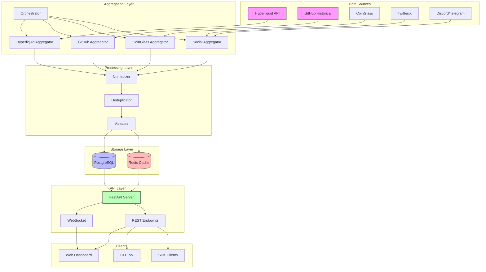
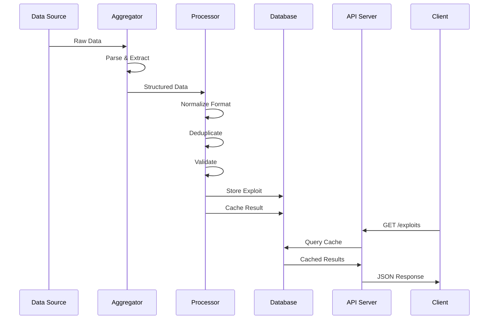
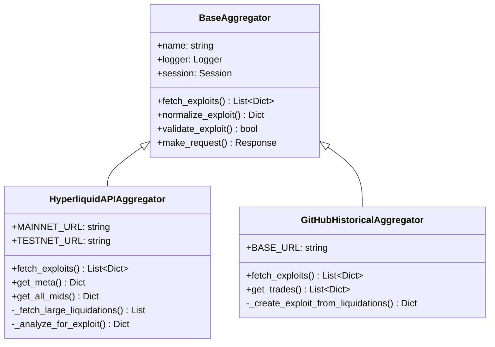
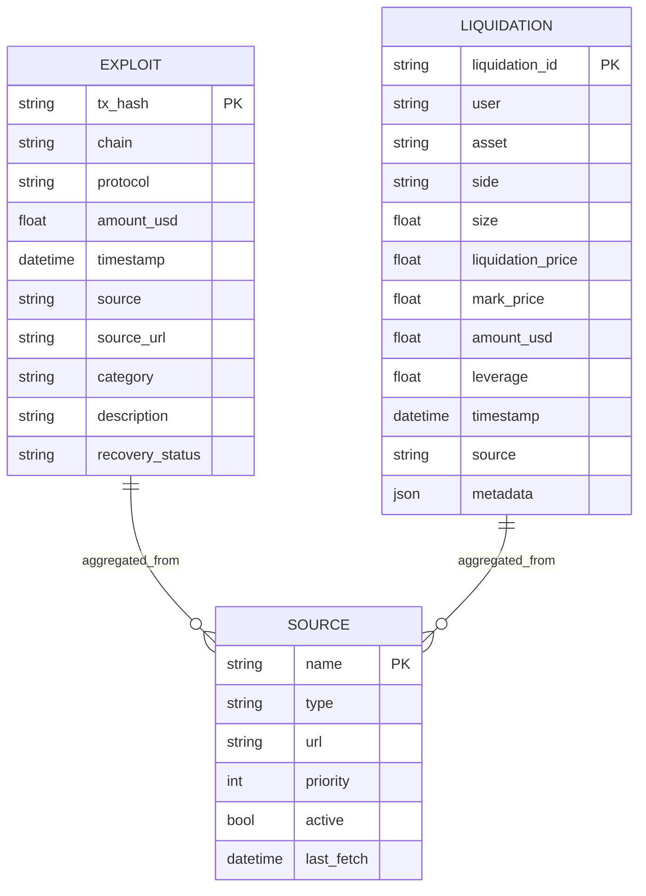
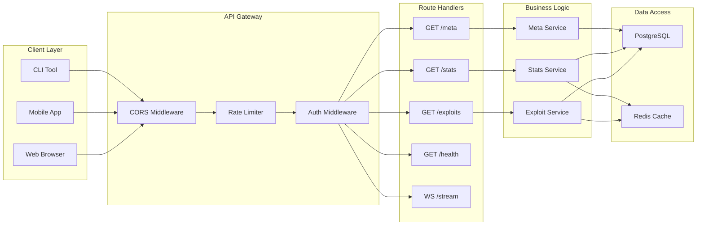
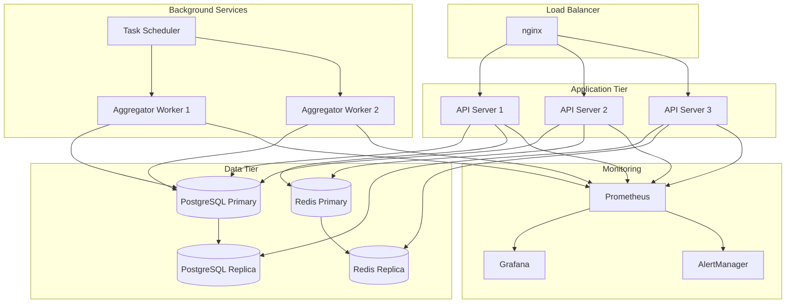
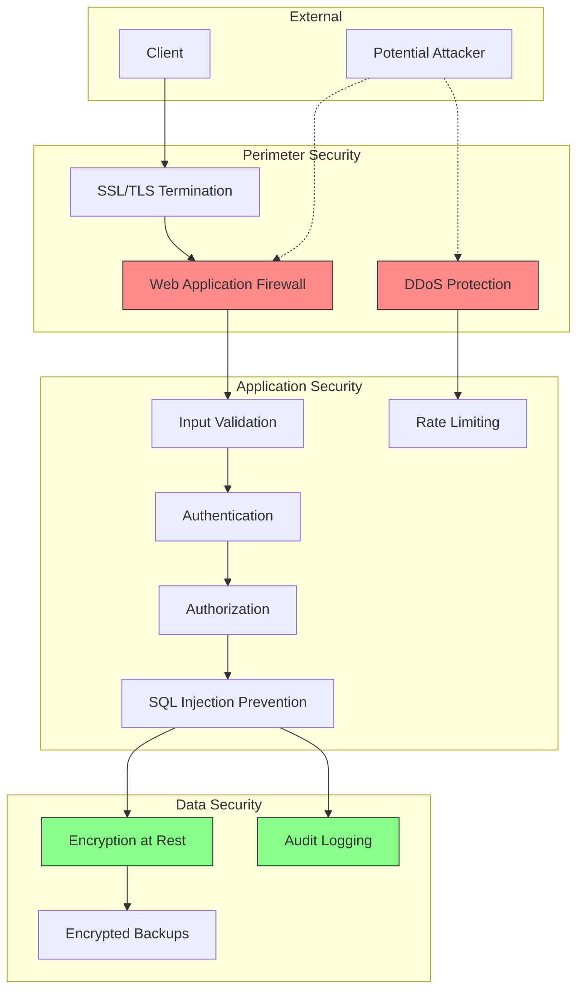
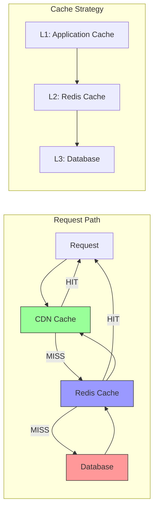
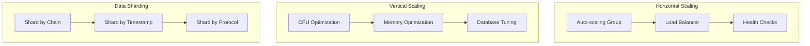

# KAMIYO Hyperliquid Architecture

## System Overview

## Data Flow

## Component Details

### Aggregators

### Data Models

## API Architecture

## Deployment Architecture

## Security Architecture

## Performance Optimization

## Scaling Strategy

